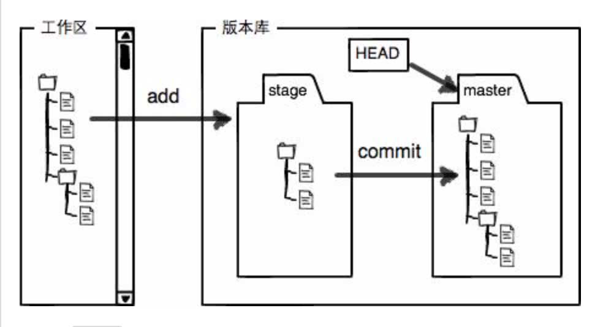
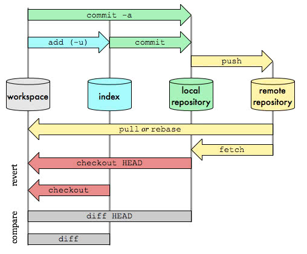
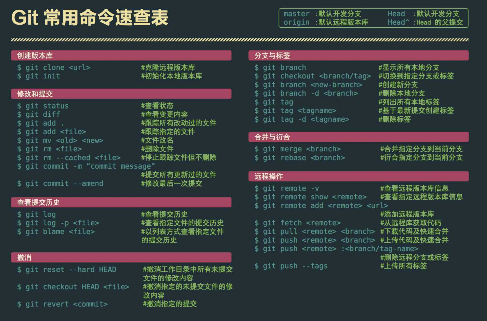
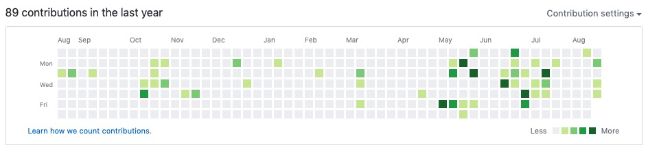
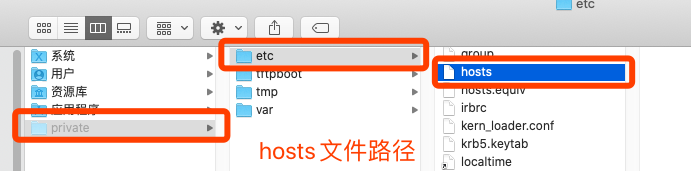

[GitHub官网 - 帮助](https://help.github.com/cn/github)

[廖雪峰git教程](https://www.liaoxuefeng.com/wiki/896043488029600)

[菜鸟教程 - Git 教程](https://www.runoob.com/git/git-tutorial.html)


## 基本原理图


- **工作区Workspace：**就是你在电脑里能看到的目录。
- **暂存区Index / Stage：**英文叫stage, 或index。一般存放在 ".git目录下" 下的index文件（.git/index）中，所以我们把暂存区有时也叫作索引（index）。
- **版本库Repository：**工作区有一个隐藏目录.git，这个不算工作区，而是Git的版本库。
- **远程仓库Remote：**远程仓库








```
* 查看本地分支：$ git branch
* 查看远程分支：$ git branch -r
* 查看所有(本地+远程)分支：$ git branch -a
* 查看远程库信息： $ git remote -v
* 查看当前分支版本控制记录：$ git log
* 查看当前分支版本控制记录（精简版）：git log --oneline
* 查看分支合并图：$ git log --graph


* 创建分支：$ git branch <name>
* 切换分支：$ git checkout <name>
* 创建+切换分支：$ git checkout -b <name>
* 合并某分支到当前分支：$ git merge <name>
* 删除分支：$ git branch -d <name>
* 强行删除：$ git branch -D <name>

合并分支强制禁用Fast forward模式：
$ git merge --no-ff -m "merge with no-ff" dev
```


## 一、拉取master

### 1.1、从远程库克隆（先有远程库，后克隆本地库）

```
// 默认拉取master分支到本地
$ git clone ....

$ git branch
* master
```

### 1.2、本地仓库关联远程仓库（先有本地库，后有远程库）

-- [廖雪峰-添加远程库](https://www.liaoxuefeng.com/wiki/896043488029600/898732864121440)


## 二、分支拉取与切换

### 2.1、拉取远程分支到本地

```
// 之前最好先更新远程仓库信息
$ git fetch origin

// 创建本地dev分支
$ git checkout -b dev origin/dev
```

若失败， 可查看[类似问题](https://blog.csdn.net/qq_40720919/article/details/86748967)

```
// 后续在dev分支上开发
$ git add env.txt
$ git commit -m "add env"
$ git push origin dev
```

### 2.2、本地切换分支并推送远程仓库

```
// 在本地master分支切换新分支feature/justtest
$ git branch            /// 查看本地分支

$ git branch feature/justtest     /// 本地创建feature/justtest分支
$ git checkout feature/justtest   /// 从master分支切换到feature/justtest分支

// 等价于 创建+切换分支
$ git checkout -b feature/justtest
```

```
// 将本地新分支推送到远程仓库
// 方法一：
$ git push origin feature/justtest      /// 远程仓库会创建对应的分支

// 方法二：
$ git push        /// 提示我们远程仓库没有feature/justtest分支上游分支
fatal: The current branch feature/justtest has no upstream branch.
To push the current branch and set the remote as upstream, use

    git push --set-upstream origin feature/justtest
$ git push --set-upstream origin feature/justtest
```


## 三、合并Merge

保证合并的两个分支最新；

将 `feature/acrossContainer` 分支合并到 `feature/ViewAugIteration` 分支，

跳转到`feature/ViewAugIteration` 分支下，

```
➜  IOS git:(feature/ViewAugIteration) git merge feature/acrossContainer 
```

然后 `git status` 查看具体合并细节，解决冲突。 


## 四、撤销

### 4.1、若仅仅是本地修改，未commit

```
➜  IOS git:(feature/ViewAugIteration) git reset --hard
```

### 4.2、若本地commit了

* 解决方法一：

1、`$ git reset HEAD~` 此时，移除了commit，但是修改已经存在，

2、可执行`$ git reset --hard` 撤销修改

* 解决方法二：

1、 `git log`查看提交记录，确认想回退的 commit_id

2、 回退到commit_id指向的版本`$ git reset --hard <commit_id>`

3、 强制提交：`$ git push origin HEAD --force`

再查看，commit_id之后指向的提交记录全不见了 ， 仓库中也不见了，成功！

### 4.3、撤销merge

回退到指定commit_id，但merge后修改的代码依旧存在，此时需要 `$ git reset --hard` 撤销修改。

```
// 具体步骤如下
$ git log

$ git reset 06a82b26cd0a3c3131d1e40dba2420dbeb859e6c

$ git reset --hard
```

### 4.4、git 撤销某个文件

`$ git checkout -- file`

* 一种是`file`自修改后还没有被放到暂存区，现在，撤销修改就回到和版本库一模一样的状态；

* 一种是readme.txt已经添加到暂存区后，又作了修改，现在，撤销修改就回到添加到暂存区后的状态。

总之，就是让这个文件回到最近一次`git commit`或`git add`时的状态。


## 五、删除远程/本地分支

### 5.1、先删除远程分支

```
$ git push origin --delete hotfix/ViewFilterBug 
```

[git已经删除了远程分支，本地仍然能看到](https://blog.csdn.net/weixin_37999256/article/details/82117048)

**解决方案**

1. 使用 `git branch -a` 命令可以查看所有本地分支和远程分支，发现很多在远程仓库已经删除的分支在本地依然可以看到。

2. 使用命令 `git remote show origin` 可以查看remote地址，远程分支，还有本地分支与之相对应关系等信息。

3. 此时我们可以看到哪些远程仓库已经不存在的分支，根据提示，使用 `git remote prune origin` 命令：这样就能成功在本地删除远程不存在的分支。

### 5.2、再删除本地分支

```
删除分支：git branch -d <name>
强行删除：git branch -D <name>

$ git branch -d hotfix/ViewFilterBug
```


## 六、Git远程仓库地址变更，本地如何修改

> 最终目的：修改本地仓库.git配置文件中的[remote "origin"]中的url

### 方法一：可以直接修改配置文件

进入仓库根目录，再进入 `.git/config` 文件，修改 [remote “origin”]下面的url即可。

```
[core]
        repositoryformatversion = 0
        filemode = true
        bare = false
        logallrefupdates = true
        ignorecase = true
        precomposeunicode = true
[remote "origin"]
        url = https://github.com/lionsom/XiOS.git
        fetch = +refs/heads/*:refs/remotes/origin/*
[branch "master"]
        remote = origin
        merge = refs/heads/master
```

### 方法二：可以通过命令行来修改配置文件

```
$ git remote set-url origin new_url
```


## 七、Github打Tag

```
/// 查看tag
$ git tag

/// 创建tag
// 第一步：切换到需要打标签的分支上：
$ git branch
* dev
  master
$ git checkout master
Switched to branch 'master'

// 第二步：直接打tag && 带标签的tag
$ git tag v1.0
$ git tag -a <tagname> -m "blablabla..."

// 第三步：push单个tag，命令格式为：
$ git push origin tag_20170908

// push所有tag，命令格式为：
$ git push --tags  /  $ git push origin --tags

// 第四步：查看所有tag
$ git tag
v1.0

/// 从tag拉取一个新分支，进行修改，原tag是不变的，不能修改。
$ git checkout -b chuanhua V7.12.0
```


## 八、GitHub提交无法添加统计到Contribution图

**问题**

当我用公司电脑提交github后，无法添加统计到Contribution图



**后来发现了原因：**

本地Git的设置中 邮件是GitHub账户中绑定的邮箱地址是必要的。

本地Git的用户名需指定为GitHub上Profile上的用户名

**解决**

先查看本地git配置信息

```
$ git config --list
```

设置git本地用户名和邮箱

```
设置或者修改用户名及邮箱
$ git config --global user.name "***"
$ git config –-global user.email "***"
```


## 九、`.DS_Store`文件冲突

> **解决方法：.配置全局的.gitignore**
>
> Github有一个项目 [**gitignore**](https://github.com/github/gitignore) 可进行参考！！

**1、用`touch .gitignore_global`创建~/.gitignore_global文件，把需要全局忽略的文件类型塞到这个文件里。**

```
# .gitignore_global

####################################
######## OS generated files ########
####################################
.DS_Store
.DS_Store?
*.swp
._*
.Spotlight-V100
.Trashes
Icon?
ehthumbs.db
Thumbs.db

####################################
############# packages #############
####################################
*.7z  
*.dmg
*.gz
*.iso
*.jar
*.rar
*.tar
*.zip
```

**2、在~/.gitconfig中引入.gitignore_global**

这是我的.gitconfig文件:

```csharp
[user]
	email = lionsom_lin@qq.com
	name = lionsom
[core]
	excludesfile = /Users/lionsom/.gitignore_global
[difftool "sourcetree"]
	cmd = opendiff \"$LOCAL\" \"$REMOTE\"
	path = 
[mergetool "sourcetree"]
	cmd = /Applications/SourceTree.app/Contents/Resources/opendiff-w.sh \"$LOCAL\" \"$REMOTE\" -ancestor \"$BASE\" -merge \"$MERGED\"
	trustExitCode = true
```

**3、移除冲突文件**

* 移除本地 .DS_Store

  ```
  $ rm .DS_Store
  ```

* 移除暂存区.DS_Store

  ```
  $ git rm .DS_Store
  ```

**4、坑**

*这个坑一定要记住，一定要在一开始就配置忽略文件（在第一次次push之前），如果忘记配置那么到后期远程仓库就会跟踪你的*.DS_Store*，那么你就总会出现这种情况了；*
`error: Your local changes to the following files would be overwritten by merge: .DS_Store`
*或：*
`both modified: .DS_Store`
*反正就是各种不能如愿的和小伙伴pull、push*
*如果一开始的时候忘记配置了忽略文件的话，也不要怕，通过以下方法来做更改：*
`git rm -r --cached .DS_Store`
*这句代码的意思就是解除跟踪，清一清缓存；然后在配好忽略文件就好OK了！*


## 十、git clone 失败

```
error: RPC failed; curl 18 transfer closed with outstanding read data remaining
fatal: the remote end hung up unexpectedly
fatal: early EOF
fatal: index-pack failed
```

### 方法一：将http:// 改为 git://

### 方法二：修改curl的postBuffer的默认值

查看配置 终端输入：

```
$ git config --list
```

这里我们把postBuffer的值配置成500M。可以根据自己需要下载的文件大小，将postBuffer值配置成合适的大小：

```
// 524288000 的单位代表 B，524288000B 也就是 500MB。
// 这个值的大小，可自行酌情设置。
$ git config --global http.postBuffer 524288000
```


## 十一、打开GitHub官网慢

**4.1、修改mac hosts文件**

1.打开[DNS检测|DNS查询 - 站长工具](http://tool.chinaz.com/dns/)

2.在检测输入栏中输入[https://github.com](http://github.com/)官网

3.把检测列表里的TTL值最小的IP输入到hosts里，并对应写上github官网域名。

```
##
# Host Database
#
# localhost is used to configure the loopback interface
# when the system is booting.  Do not change this entry.
##
127.0.0.1	localhost
255.255.255.255	broadcasthost
::1             localhost
13.229.188.59 	https://github.com/
```

**4.2、将hosts文件复制一份进行修改，再拖入替换**

