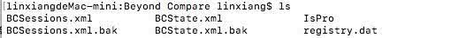
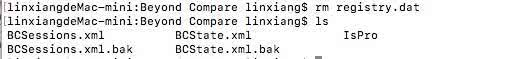

# 一、Homebrew

> Homebrew是Mac OS 不可或缺的套件管理器。

* [Homebrew 官网](https://brew.sh/)


## 1、brew 与 brew cask 区别

> HomeBrew是通过源码的方式来安装软件，但是有时候我们安装的软件是GUI程序应用宝(.dmg/.pkg)，这个时候我们就不能使用HomeBrew了。所以有了HomeBrew Cask的出现
>
> brew cask 是在brew 的基础上一个增强的工具，用来安装Mac上的Gui程序应用包（.dmg/.pkg）, 比如qq、chrome等。它先下载解压到统一的目录中（/opt/homebrew-cask/Caskroom），省掉了自己去下载、解压、拖拽（安装）等步骤，同样，卸载相当容易与干净。然后再软链到~/Applications/目录下, 非常方便，而且还包含很多在 AppStore 里没有的常用软件。

* brew cask的官网是：[caskroom.io](http://caskroom.io)

* github地址是：[https://github.com/Homebrew/homebrew-cask](https://github.com/caskroom/homebrew-cask)


## 2、常用命令

```
➜ ~ which brew			// 展示brew的位置
/usr/local/bin/brew

➜ ~ brew search 										// 列出brew支持的软件
➜ ~ brew search <package_name>      // 搜索

➜ ~ brew install <package_name>     // 安装软件
➜ ~ brew uninstall <package_name>   //  卸载软件

➜ ~ brew list							 // 查看你安装过的包列表
➜ ~ brew list --versions   // 查看你安装过的包列表（包括版本号）

➜ ~ brew update                     // 从服务器上拉取，并更新本地 brew 的包目录
➜ ~ brew upgrade <package_name>     // 更新软件
➜ ~ brew outdated                   // 查看你的软件中哪些有新版本可用
➜ ~ brew cleanup                    // 清理老版本
```


# 二、终端工具

## 1、unrar

> 解压

```
➜ ~ brew install unrar  // 安装

➜ ~ unrar x test.rar		// 解压text.rar文件到当前目录
```


## 2、guetzli

> 图片压缩

* [GitHub - guetzli](https://github.com/google/guetzli)

```
➜ ~ brew install guetzli		// 安装，自动安装依赖Installing guetzli dependency: libpng

// 使用
➜ ~ guetzli [--quality Q] [--verbose] original.png output.jpg
➜ ~ guetzli [--quality Q] [--verbose] original.jpg output.jpg
// 实战
➜ ~ guetzli --quality 85 --verbose 005.png 010.png

// 说明
--quality	指的是质量，取值100~85，默认为95。
--verbose	加此参数后 在执行压缩时会在控制台输出过程。
original.jpg	输入的图片路径
output.jpg	输出的图片路径
```


## 3、CheatSheet

> 显示快捷键，默认按command。

```
➜ ~ brew cask install cheatsheet
```


## 4、Alfred

> Mac 用户不用鼠标键盘的必备神器，配合大量 Workflows，习惯之后可以大大减少操作时间。

* [教程 - 5分钟上手Mac效率神器Alfred以及Alfred常用操作](https://www.jianshu.com/p/e9f3352c785f)


## 5、lastpass-cli

> LastPass 是管理密码的工具，支持二次验证。它提供 命令行 的版本，可以直接通过 brew 安装。
>
> lastpass-cli 是LastPass的命令行版本。

* [GitHub - lastpass-cli](https://github.com/lastpass/lastpass-cli)

```
➜ ~ brew install lastpass-cli		// 安装

➜ ~ lpass help			// 获取帮助

➜ ~ lpass login lionsom.linx@gmail.com		// 登录

➜ ~ lpass show XXX 	// 显示密码记录的详情
```


## 6、oh-my-zsh

> 它是Shell，代替原生bash
>
> 详情请看文档：《Zsh.md》


## 7、zsh-git快捷键

> git是Zsh的插件，就是git命令行的快捷键。
>
> gl  === git pull
>
> gp  ===  git push


## 8、zsh-autosuggestions

> autosuggestions是Zsh的插件，自动补全，详情请查看《Zsh.md》


## 9、autojump

xxx


# 三、工具安装（包含破解）

## 1、MySQL

* [MySQL官网下载：https://dev.mysql.com/downloads/](https://dev.mysql.com/downloads/)

* 教程：[【MySQL安装（Mac版）】](https://juejin.im/post/5cc2a52ce51d456e7079f27f)

> 本地MySQL
>
> 账户：Root
>
> 密码：12345678


## 2、Navicat Premium

> Navicat Premium是一款可视化数据库管理软件。

* [Navicat Premium官网下载：https://www.navicat.com/en/products](https://www.navicat.com/en/products)

* [吾爱破解 - Navicat Premium 12.0.24 for mac已破解](https://www.52pojie.cn/thread-727433-1-1.html)


## 3、Dash

> Dash是一个API文档浏览器和代码片段管理器。

* [Dash User Guide](https://kapeli.com/dash_guide)


## 4、Typora

> Typora是一款MarkDown编辑器。


## 5、Mounty for NTFS（推荐）

* [Mounty for NTFS](https://mounty.app)


## 6、Lookin

> Lookin：免费好用的 iOS UI 调试软件。

* [Lookin](https://lookin.work/)


## 7、LICEcap || GIPHY Capture

> LICEcap || GIPHY Capture 是一款Mac gif录屏软件。

* [LICEcap](https://www.cockos.com/licecap/)

* [GIPHY Capture](https://giphy.com/apps/giphycapture) install in AppStore


## 8、iTerm2

> iTerm2是一款终端。

* [iTerm2](https://www.iterm2.com/)


## 9、Beyond Compare

* [Beyond Compare Download](https://www.scootersoftware.com/download.php)
* [Beyond Compare for Mac 无限试用方法](https://www.seidea.com/2017/03/23/beyond-compare-for-mac-无限试用方法/)

### 9.1、破解原理

> `BCompare` 是应用程序启动的程序，只要在在启动的时候**删除 registry.dat**(`Library/Application Support/Beyond Compare/registry.dat`)注册信息就好了。


* #### registry.dat所在目录：`Library/Application Support/Beyond Compare`

  


* #### 移除 registry.dat：`rm registry.dat`

  

* #### 重启程序即可


## 10、XMind

[吾爱破解 - 思维导图 Xmind Zen](https://www.52pojie.cn/thread-1064432-1-1.html)


# 四、GitHub工具

[谷粒-Chrome插件英雄榜 ChromeAppHeroes](https://github.com/zhaoolee/ChromeAppHeroes)

[让你纵横 GitHub 的五大神器](https://mp.weixin.qq.com/s/NCNcf2RS0c6Gjp0kMwjo_w)

## 1、Octotree

目录一览

## 2、Sourcegraph

快速查看资源

## 3、Enhanced GitHub

下载指定文件

## 4、GitHub Dark Theme

暗黑