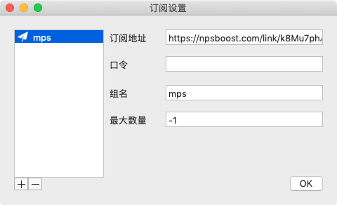

### 前期可先使用蓝灯翻墙

[lantern](https://github.com/getlantern/lantern)

### 真正官网

[shadowsocks真正官网](https://shadowsocks.org/en/index.html)

[shadowsocks客户端下载地址](https://shadowsocks.org/en/download/clients.html)

[GitHub - shadowsocks](https://github.com/shadowsocks)

### 购买使用

本站（[Shadowsocks.com](https://shadowsocks.com/)）由澳洲公司运营，与 [Shadowsocks](https://github.com/shadowsocks) 开发者并无任何关係，并非 Shadowsocks 官网。

[购买 - shadowsocks](https://order.shadowsocks.website)

[GitHub - Shadowsocks-Wiki](https://github.com/Shadowsocks-Wiki)

### 额外阅读

[自用SS/SSR机场体验及吐槽](http://backu9.blogspot.com/2018/09/ssssr_18.html)

https://github.com/xieyushi/blog/wiki/

https://leaderliang.coding.me/1829.html

### 新推荐 - 喵帕斯（稳定，比较贵）

[https://喵帕斯.com](https://xn--i2ru8q2qg.com)

注册：http://zoohotelforever.blogspot.com/2019/03/blog-post_13.html

前期订阅地址：

https://npsboost.com/link/BQ9LW92gDBTJVThs?mu=1&filter_offline=1

[推荐手机端SS的APP（iOS、安卓）]([http://www.shuangjiuhengyi.com/blog/2018/07/18/%e6%8e%a8%e8%8d%90%e6%89%8b%e6%9c%ba%e7%ab%afss%e7%9a%84app%ef%bc%88ios%e3%80%81%e5%ae%89%e5%8d%93%ef%bc%89/](http://www.shuangjiuhengyi.com/blog/2018/07/18/推荐手机端ss的app（ios、安卓）/)）

