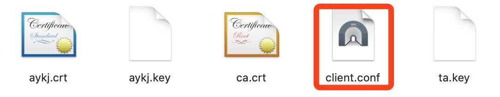
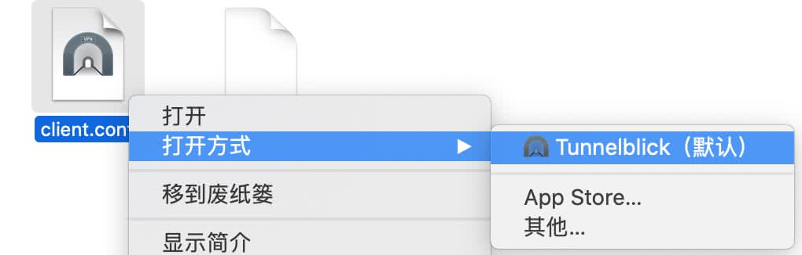
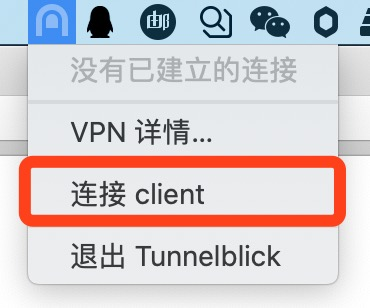
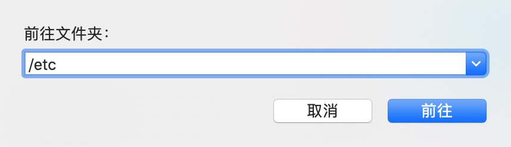
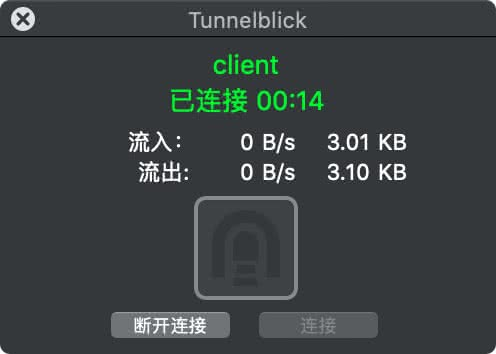

## VPN日常

### 一、什么是VPN？

[VPN维基](https://zh.wikipedia.org/wiki/虛擬私人網路)

**虚拟私人网络**（英语：**V**irtual **P**rivate **N**etwork，缩写：**VPN**）

VPN是一种常用于连接中、大型企业或团体与团体间的私人网络的通讯方法。

### 二、VPN连接—MAC版

#### 2.1、背景

​		由于2020武汉新型冠状病毒导致公司延迟上班时间，但又有实际的需要连接公司内部网络，在家进行办公。所以公司提供了VPN供员工使用。

#### 2.2、VPN客户端

1. [**Shimo**](https://www.shimovpn.com/)是Mac上最强大的多协议VPN客户端，它比其他VPN应用支持更多的协议，支持CiscoVPN, AnyConnect Cisco VPN，IPSec，OpenVPN，PPTP/L2TP，Nortel，Juniper，SSH 等协议，支持自动建立连接，可以快速的添加和连接各种VPN，很好用！（缺点：收费）

2. [**Tunnelblick**](https://tunnelblick.net/) 是免费、开源的VPN客户端。

#### 2.3、mac端安装VPN

1. 公司提供软件是Tunnelblick：

   

2. 公司还提供了配置文件，我们只用到`client.conf`，其他客户端用不到：

   

3. 将`client.conf` 添加到`Tunnelblick`中即可！

   

4. 在`Tunnelblick`查看到已经添加的`Client`，连接：

   

5. 【重要】此处需要修改Mac本地hosts文件，

   > Finder -> 前往 -> 前往文件夹 -> /etc -> hosts文件

   

   此处hosts文件夹由于权限问题无法直接修改，可自行Google，

   我使用的方法是：拷贝一份hosts文件进行修改，然后替换原hosts文件。

6. 在`Tunnelblick`中连接`Client`，显示连接成功，

   

7. 最后打开内部网络进行验证。