# 文档

* [fastlane官网](https://fastlane.tools/)

* [fastlane docs](https://docs.fastlane.tools/)


# 名词

* **Ruby** 是一种[面向对象](https://zh.wikipedia.org/wiki/面向对象的程序设计)、[命令式](https://zh.wikipedia.org/wiki/命令式编程)、[函数式](https://zh.wikipedia.org/wiki/函數程式語言)、[动态](https://zh.wikipedia.org/wiki/动态语言)的[通用编程语言](https://zh.wikipedia.org/wiki/通用编程语言)。在20世纪90年代中期由[日本](https://zh.wikipedia.org/wiki/日本)[计算机科学家](https://zh.wikipedia.org/wiki/電腦科學家)[松本行弘](https://zh.wikipedia.org/wiki/松本行弘)（Matz）设计并开发。

* RubyGems 是 Ruby 的一个包管理器，它提供一个分发 Ruby 程序和库的标准格式，还提供一个管理程序包安装的工具。

* Bundler - [Bundler 的作用及原理](https://ruby-china.org/topics/25530)

* gym 是 fastlane 下的一个工具，针对于 iOS 编译打包生成 ipa 文件，


# 一、前期准备

## 1. 安装 Xcode 命令行工具

```
➜ xcode-select --install
```

## 2. 安装fastlane

### 方式一：Homebrew

```
// 安装
➜ brew install fastlane

// 查看版本
➜ fastlane --version
fastlane installation at path:
/Library/Ruby/Gems/2.6.0/gems/fastlane-2.156.1/bin/fastlane
-----------------------------
[✔] 🚀

// 更新
➜ brew upgrade fastlane
.......
```

### 方式二：RubyGems

```
➜ sudo gem install fastlane -NV

// 若失败
1、查看源: gem sources
2、删除源: gem sources --remove https://gems.ruby-china.org/
3、更换源: gem sources -a https://gems.ruby-china.com
```


# 二、fastlane实践

## 1. Setting up fastlane

**【重要】终端进入工程主目录，输入：**

```
➜ fastlane init
```

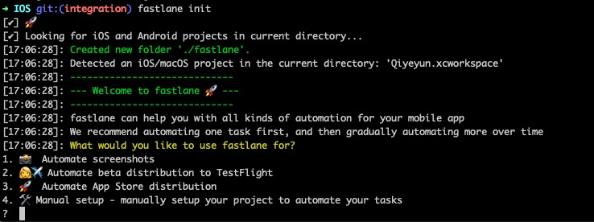

```
1. 📸  Automate screenshots
2. 👩‍✈️  Automate beta distribution to TestFlight
3. 🚀  Automate App Store distribution
4. 🛠  Manual setup - manually setup your project to automate your tasks

1、代表app市场图片素材；
2、发布到TestFlight进行测试；
3、发布到App Store；
4、自定义。

这边我选 4 自定义
```


## 2. 安装插件 - 蒲公英

[使用 Fastlane 上传 App 到蒲公英](https://www.pgyer.com/doc/view/fastlane)

**【注意】：在项目目录下安装：**

```
➜ fastlane add_plugin pgyer
```

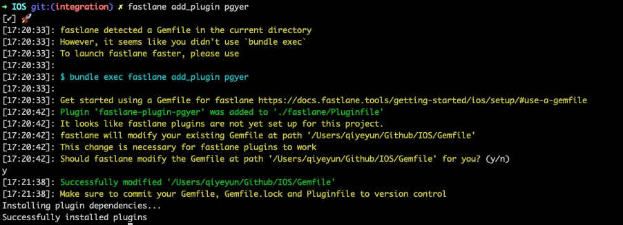


## 3. 文件介绍

上述两步骤完成后，工程主目录下会多出几个文件夹：

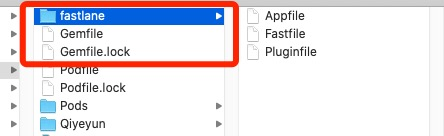

* **文件夹fastlane** ，里面包含 `Appfile` 和 `Fastfile`。
  * Appfile ： 里面包含App相关信息；
  * Fastfile ：包含fastlane相关配置信息，后续也是在此处理；

  * Pluginfile ：包含插件相关信息；

* `Gemfile` 与 `Gemfile.lock` 类比于 `Podfile` 与 `Podfile.lock` 


## 4. Appfile配置

```
app_identifier("cn.com.ay.xxxx") 	# The bundle identifier of your app
apple_id("mobile@xxxx.com.cn") 		# Your Apple email address

# For more information about the Appfile, see:
#     https://docs.fastlane.tools/advanced/#appfile
```


## 5. Fastfile配置

```
# This file contains the fastlane.tools configuration
# You can find the documentation at https://docs.fastlane.tools
#
# For a list of all available actions, check out
#
#     https://docs.fastlane.tools/actions
#
# For a list of all available plugins, check out
#
#     https://docs.fastlane.tools/plugins/available-plugins
#

# Uncomment the line if you want fastlane to automatically update itself
# update_fastlane

default_platform(:ios)

platform :ios do
  desc "Description of what the lane does"

  lane :custom_lane do   								# 函数名称

    time = Time.new.strftime("%Y%m%d") 	# 获取时间格式
    version = get_version_number#获取版本号
    ipaName = "Debug_#{version}_#{time}.ipa" 		# eg: Debug_1.0_20200921

    # add actions here: https://docs.fastlane.tools/actions
    # 打包
    gym(scheme: "FastLaneDemo",   			# 项目名称
    		configuration: "Debug",					# 模式，默认Release，还有Debug
    		export_method: "development",		# 打包的类型
    		silent: true,  									# 隐藏没有必要的信息
        clean: true,  									# 在构建前先clean
				output_name:"#{ipaName}",				# 输出的包名
        output_directory: "../App",			# 输出包的位置
    )

    # 上传蒲公英
    pgyer(api_key: "c2ee006efdc4ade0085921e8b0xxxxxx", 
          user_key: "f6a62972d4f3f6d0d02a8ff7bfxxxxxx", 
          update_description: "update by fastlane",
          password: "111111",
          install_type: "2",
    )
  end
end
```


## 6. 证书

本机电脑中存在证书，直接运行即可！

若无证书，未知。


## 7. 开始运行

```
➜ fastlane custom_build
```

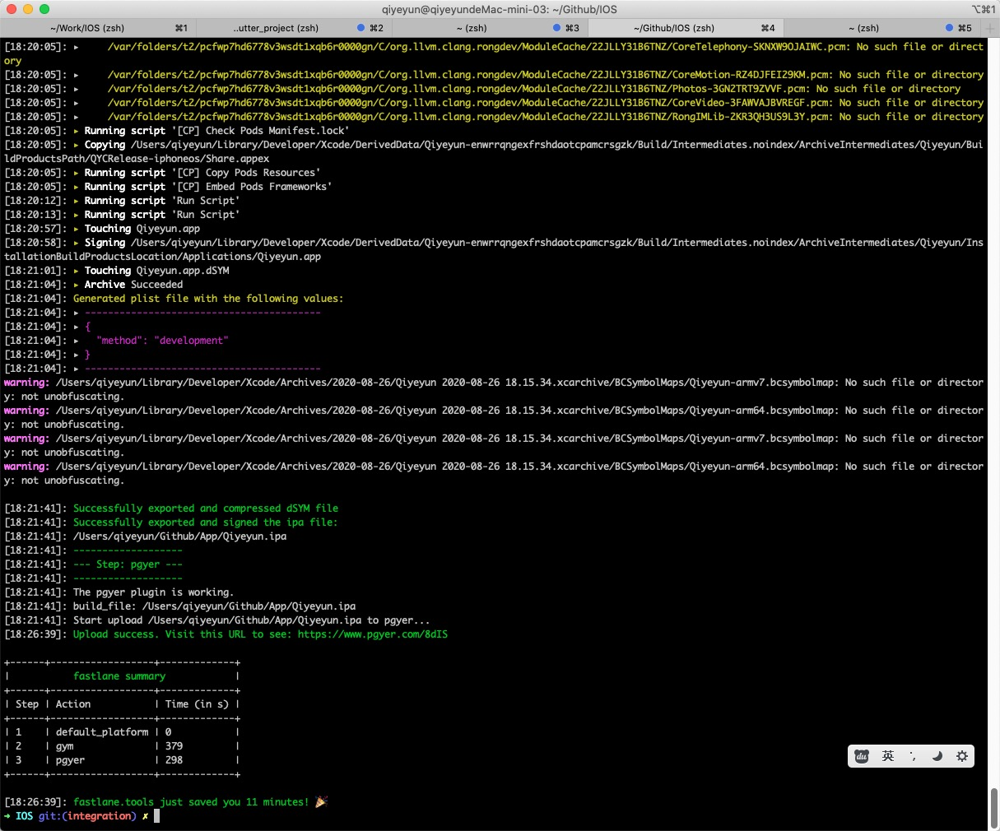


又多出两个文件

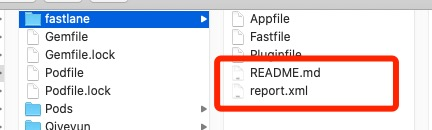


`README.md` 如下：

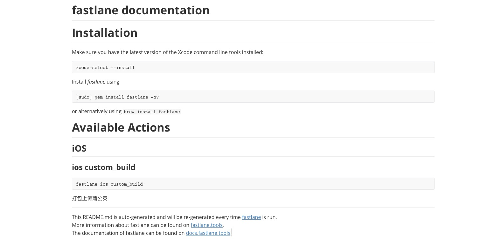

`Report.xml` 包含了运行过程用时报告，如下：

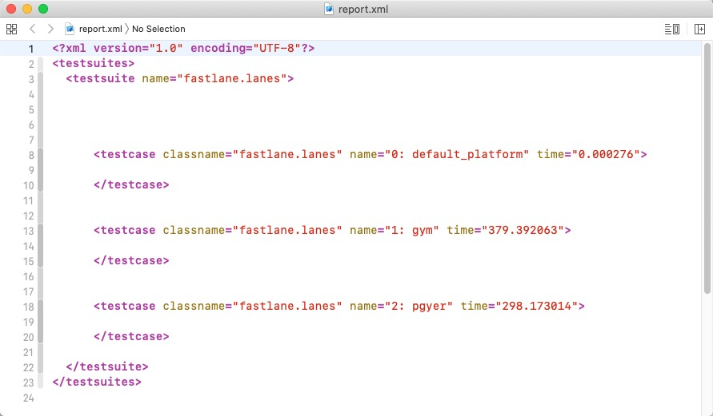


## 8. 成功上传蒲公英

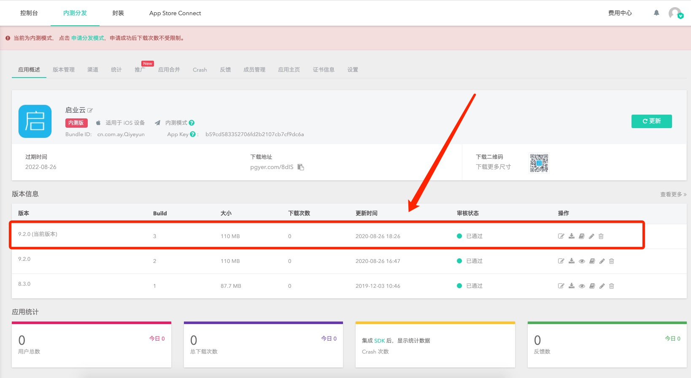


## 8. 安装包

 真机扫一扫蒲公英二维码，成功！！！


# 三、尝试免证书打包

## 3.1. 前提

>  由于个人开发者没有购买$99的苹果账号，所以我尝试用自己的Apple Id进行免证书打包，并通过fastlane自动化打包。


## 3.2. 手动免证书编译运行

### 1. Apple ID 配置

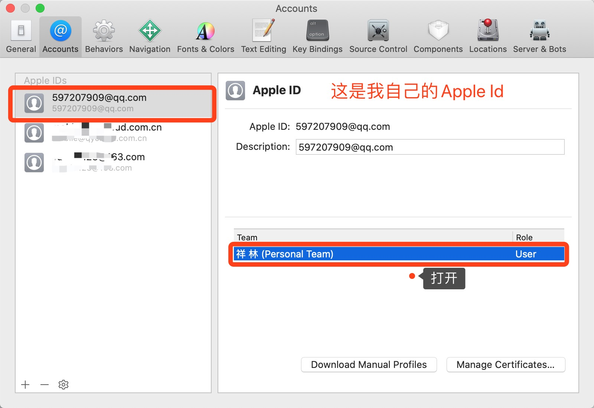

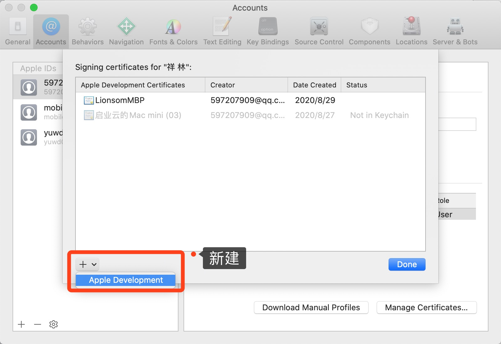

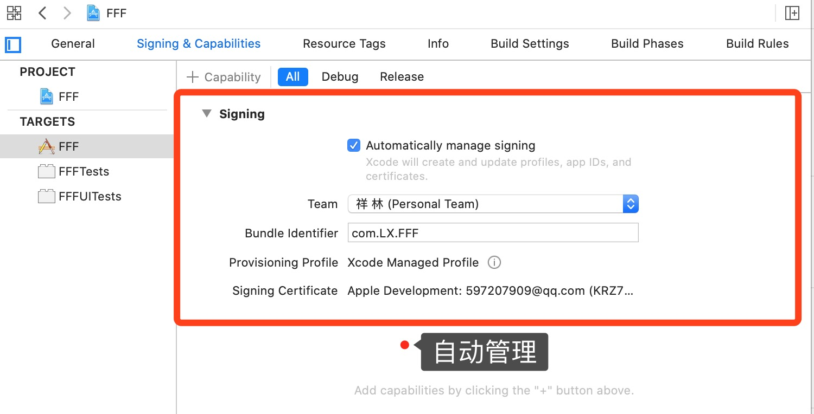

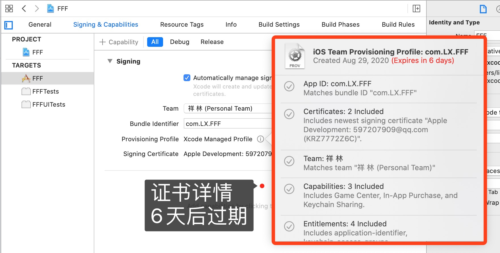


### 2. 真机运行

安装成功！但不能运行？？？

原来需要我们信任一下证书即可。


## 3.3. fastlane免证书打包

### 1. Fastfile 配置如下：

```
default_platform(:ios)

platform :ios do
  desc "Description of what the lane does"
  lane :custom_lane do
    # add actions here: https://docs.fastlane.tools/actions
gym(scheme: "FFF", 
        configuration: "Debug",
        export_method: "development",
        silent: true,  # 隐藏没有必要的信息
        clean: true,  # 在构建前先clean
        output_directory: "../App" # Destination directory. Defaults to current directory.
    )
pgyer(api_key: "c2ee006efdc4ade0085921e8b05xxxxxx", 
          user_key: "f6a62972d4f3f6d0d02a8ff7bfxxxxxx", 
          update_description: "update by fastlane",
          password: "111111",
          install_type: "2")
  end
end
```


### 2. 打包成功，并成功上传蒲公英分发

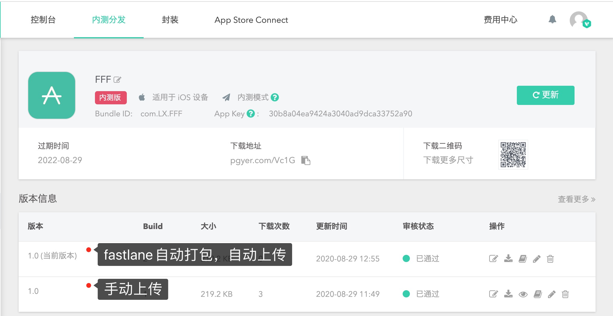


## 3.4 真机安装免证书ipa包 - 失败！！

### 1. iTools Pro 安装ipa

>  由于证书问题，真机安装！！！

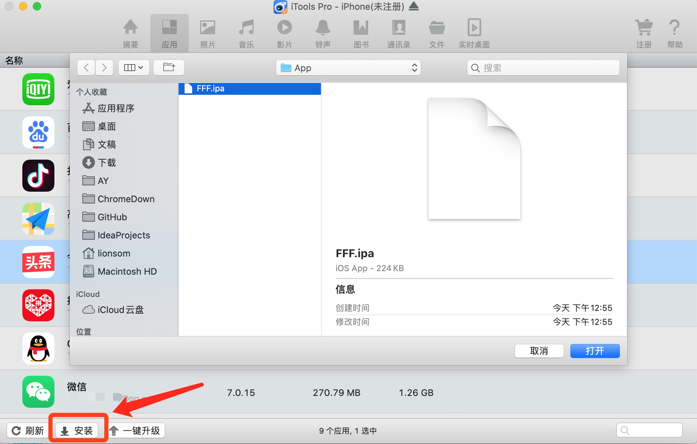

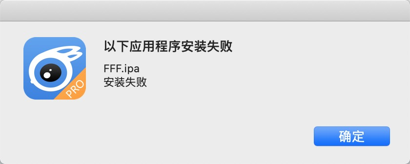


### 2. 安装蒲公英分发包

> 由于证书问题，真机无法下载安装！！！


# 四、踩坑

## 1. 无法上传到蒲公英

```
Could not find action, lane or variable 'pgyer'. Check out the documentation for more details: https://docs.fastlane.tools/actions
```

【原因】：`fastlane add_plugin pgyer` 蒲公英插件安装目录错了，应该在项目目录下。


