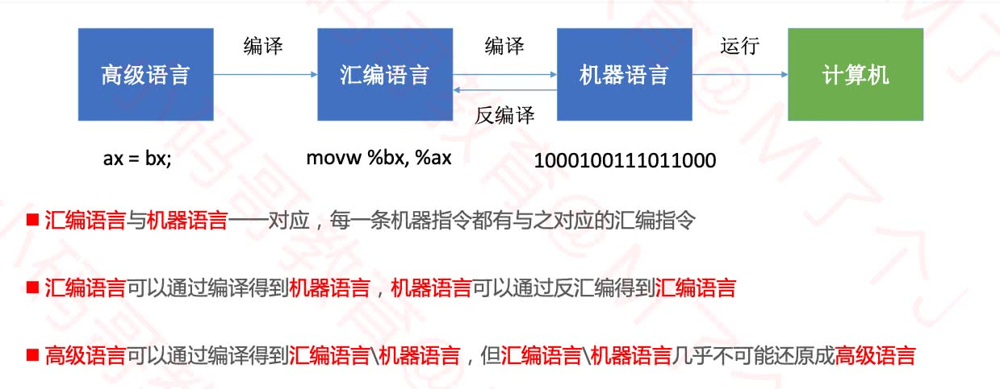

# 一、『编译型』和『解释型』语言

* 计算机高级语言主要有『编译型』和『解释型』；

* 如Objective C、C++等都是`编译语言`。编译语言在执行的时候，必须先通过`编译器`生成机器码，机器码可以直接在CPU上执行，所以执行效率较高；

* 如JavaScript、Python都是`直译式语言`。直译式语言不需要经过编译的过程，而是在执行的时候通过一个中间的`解释器`将代码解释为CPU可以执行的代码。所以，较编译语言来说，直译式语言效率低一些，但是编写的更灵活，也就是为啥JS大法好；

* Java语言是这两种的结合

  ```
  源文件(*.java) -> Java编译器(javac) -> 字节码文件(*.class) -> JRE[类装载器 -> 字节码校验 -> 解释器] -> 系统平台
  ```


## 1.1、编译过程

* **预处理阶段**。预处理器（cpp）根据以字符#开头的命令，修改原始的C程序。比如hello.c中第一行的#include<stdio.h>命令告诉预处理器读取系统头文件stdio.h的内容，并把它直接插入程序文本中，结果就得到了另一个C程序，通常是以.i作为文件扩展名。

* **编译阶段**。编译器（ccl）将文本文件hello.i翻译成文本文件hello.s，它包含一个汇编语言程序。汇编语言程序中的每条语句都以一种标准的文本格式确切的描述了一条低级机器语言指令。

* **汇编阶段**。汇编器（as）将hello.s翻译成机器语言指令，把这些指令打包成一种可重定位目标程序的格式，并将结果保存在目标文件hello.o中。hello.o文件是一个二进制文件，它的字节编码是机器语言指令而不是字符，如果我们在文本文件中打开hello.o文件，看到的将是一堆乱码。

* **链接阶段**。链接器（ld）负责处理合并目标代码，生成一个可执行目标文件，可以被加载到内存中，由系统执行。




## 1.2、编译器

> 把一种编程语言(原始语言)转换为另一种编程语言(目标语言)的程序叫做[编译器](https://en.wikipedia.org/wiki/Compiler)。
>
> 主要是把 高级编程语言 转向 低级语言。


# 二、GCC + Clang + LLVM

[GCC - Wiki](https://zh.wikipedia.org/wiki/GCC)

[Clang - Wiki](https://zh.wikipedia.org/wiki/Clang)

[LLVM - Wiki](https://zh.wikipedia.org/wiki/LLVM)

[LLDB - Org](https://lldb.llvm.org/use/tutorial.html)


## 2.1、历史

* 老版本Xcode中

  

* 新版本Xcode中

  

* 历史总览

  


## 2.2、GCC

GCC（GNU Compiler Collection，GNU编译器套装），是一套由 GNU 开发的编程语言编译器。它是一套以 GPL 及 LGPL 许可证所发行的自由软件，也是 GNU计划的关键部分，亦是自由的类Unix及苹果电脑 Mac OS X 操作系统的标准编译器。
GCC 原名为 GNU C 语言编译器，因为它原本只能处理 C语言。GCC 很快地扩展，变得可处理 C++。之后也变得可处理 Fortran、Pascal、Objective-C、Java, 以及 Ada与其他语言。


## 2.3、LLVM
LLVM 是 **底层虚拟机**（Low Level Virtual Machine）的简称，这个库提供了与编译器相关的支持，能够进行程序语言的编译期优化、链接优化、在线编译优化、代码生成。简而言之，可以作为多种语言编译器的后台来使用。如果这样还比较抽象的话，介绍下 Clang 就知道了：Clang 是一个 C++ 编写、基于 LLVM、发布于 LLVM BSD 许可证下的 C/C++/Objective C/Objective C++ 编译器，其目标（之一）就是超越 GCC。


## 2.4、Clang

**Clang** 是一个[C](https://zh.wikipedia.org/wiki/C語言)、[C++](https://zh.wikipedia.org/wiki/C%2B%2B)、[Objective-C](https://zh.wikipedia.org/wiki/Objective-C)和[Objective-C++](https://zh.wikipedia.org/wiki/Objective-C%2B%2B)编程语言的[编译器](https://zh.wikipedia.org/wiki/編譯器)前端。它采用了[LLVM](https://zh.wikipedia.org/wiki/LLVM)作为其后端。它的目标是提供一个[GNU编译器套装](https://zh.wikipedia.org/wiki/GCC)（GCC）的替代品，支持了GNU编译器大多数的编译设置以及非官方语言的扩展。Clang项目包括Clang前端和Clang静态分析器等。

这个软件项目在2005年由[苹果电脑](https://zh.wikipedia.org/wiki/蘋果電腦)发起，是[LLVM](https://zh.wikipedia.org/wiki/LLVM)编译器工具集的前端（front-end），目的是输出代码对应的抽象语法树（Abstract Syntax Tree, AST），并将代码编译成LLVM Bitcode。接着在后端（back-end）使用LLVM编译成平台相关的[机器语言](https://zh.wikipedia.org/wiki/機器語言) 。Clang支持C、C++、Objective C。


## 2.5、LLDB

GCC有个强大的诊断工具——GDB，相对应的Clang下纠错工具就是LLDB。对于LLDB大家应该都不陌生，它继承了GDB的优点，弥补GDB的不足。iOS开发者从gbd过渡到lldb没有任何不适应感，最直白的原因就是lldb和gdb常用的命令很多都是一样的，例如常用的po等。


## 2.6、相互关系

基于LLVM，又衍生出了一些强大的子项目，其中iOS开发者耳熟能详的是：[Clang](http://clang.llvm.org/)和[LLDB](http://lldb.llvm.org/)。


# 三、Xcode编译

大多数编译器由两部分组成：前端和后端。

- 前端（Frontend）：负责 `词法分析`、`语法分析`、`生成中间代码(intermediate representation, IR)`，在这个过程中，会进行类型检查，如果发现错误或者警告会标注出来在哪一行；
- 优化器（Optimizer）：以中间代码（IR）作为输入，对中间代码进行架构无关的优化，提高运行效率，减少代码体积，例如删除 if (0) 无效分支；
-  后端（Backend）：根据不同的系统架构把中间代码（IR）转换成目标平台的机器码。 

> 前后端依赖统一格式的中间代码(IR)，使得前后端可以独立的变化。新增一门语言只需要修改前端，而新增一个CPU架构只需要修改后端即可。

Objective C/C/C++使用的编译器前端是[clang](https://clang.llvm.org/docs/index.html)，swift是[swift](https://swift.org/compiler-stdlib/#compiler-architecture)，后端都是[LLVM](https://llvm.org/)。


**Clang 的编译过程有这几个阶段：**

>  ➜  clang -ccc-print-phases main.m 
>
> 0: input, "main.m", objective-c 
>
> 1: preprocessor, {0}, objective-c-cpp-output 
>
> 2: compiler, {1}, ir 
>
> 3: backend, {2}, assembler 
>
> 4: assembler, {3}, object 
>
> 5: linker, {4}, image 
>
> 6: bind-arch, "x86_64", {5}, image 

***1）预处理：***

这阶段的工作主要是头文件导入，宏展开/替换，预编译指令处理，以及注释的去除。

***2）编译：***

这阶段做的事情比较多，主要有：

>  a. 词法分析（Lexical Analysis）：将代码转换成一系列 token，如大中小括号 paren'()' square'[]' brace'{}'、标识符 identifier、字符串 string_literal、数字常量 numeric_constant 等等； 
>
> b. 语法分析（Semantic Analysis）：将 token 流组成抽象语法树 AST；
>
> c. 静态分析（Static Analysis）：检查代码错误，例如参数类型是否错误，调用对象方法是否有实现； 
>
> d. 中间代码生成（Code Generation）：将语法树自顶向下遍历逐步翻译成 LLVM IR。 

***3）生成汇编代码：***

LLVM 将 LLVM IR 生成当前平台的汇编代码，期间 LLVM 根据编译设置的优化级别 Optimization Level 做对应的优化（Optimize），例如 Debug 的 -O0 不需要优化，而 Release 的 -Os 是尽可能优化代码效率并减少体积。

***4）生成目标文件：***

汇编器（Assembler）将汇编代码转换为机器代码，它会创建一个目标对象文件，以 .o 结尾。

***5）链接：***

链接器（Linker）把若干个目标文件链接在一起，生成可执行文件。


## 3.1、流程图


**后端：LVVM优化器会进行BitCode的生成，链接期优化等等**。


**后端：LLVM机器码生成器会针对不同的架构，比如arm64等生成不同的机器码**。


# 四、编译优化 - 详见《iOS编译优化》


# 五、获取耗时报告

国外大神 Aras Pranckevičius 已经在 LLVM 项目提交了 rL357340 修改：clang 增加 -ftime-trace 选项，编译时生成 Chrome（chrome://tracing） JSON 格式的耗时报告，列出所有阶段的耗时。 Clang 9.0 以后已经集成。

### 5.1. 下载LLVM

使用brew安装

```
➜ brew install llvm
.....
==> llvm
To use the bundled libc++ please add the following LDFLAGS:
  LDFLAGS="-L/usr/local/opt/llvm/lib -Wl,-rpath,/usr/local/opt/llvm/lib"

llvm is keg-only, which means it was not symlinked into /usr/local,
because macOS already provides this software and installing another version in
parallel can cause all kinds of trouble.

If you need to have llvm first in your PATH run:
  echo 'export PATH="/usr/local/opt/llvm/bin:$PATH"' >> ~/.zshrc

For compilers to find llvm you may need to set:
  export LDFLAGS="-L/usr/local/opt/llvm/lib"
  export CPPFLAGS="-I/usr/local/opt/llvm/include"
  
  
  
// llvm安装路径
/usr/local/opt/llvm

// 查看clang版本
➜ ~ /usr/local/opt/llvm/bin/clang --version
clang version 10.0.0
Target: x86_64-apple-darwin19.5.0
Thread model: posix
InstalledDir: /usr/local/opt/llvm/bin
```

### 5.2. 使用Clang -ftime-trace扩展获取编译耗时报告

[XCode 分析編譯耗時之我見]([https://medium.com/@SunXiaoShan/llvm-%E7%B7%A8%E8%AD%AF%E8%80%97%E6%99%82%E4%B9%8B%E6%88%91%E8%A6%8B-eabb3fb3817e](https://medium.com/@SunXiaoShan/llvm-編譯耗時之我見-eabb3fb3817e))

> 打开Xcode，配置使用自己下载的Clang，扩展-ftime-trace，然后进行编译，获取耗时报告（JOSN文件），拖动到 **chrome://tracing** 显示。


### 5.3. chrome://tracing 显示耗时报告


# 六、LLDB使用 - 详见《iOS调试》

