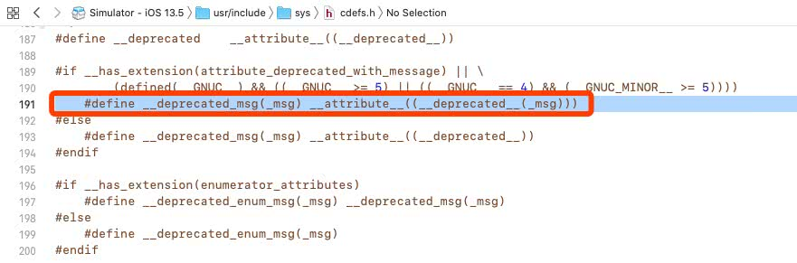
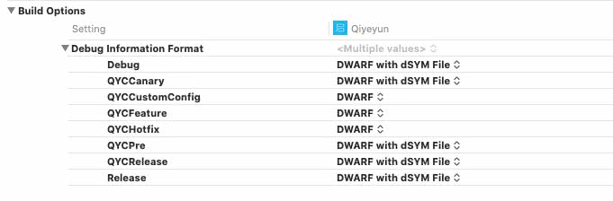
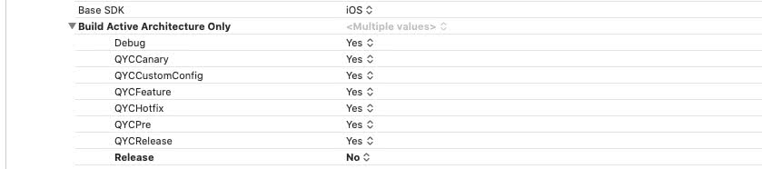
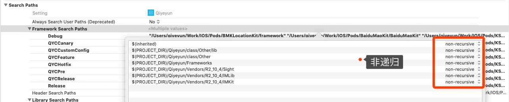

# 参考

[微信 - iOS 微信编译速度优化分享](https://mp.weixin.qq.com/s/-wgBhE11xEXDS7Hqgq3FjA)

[网易 - iOS 安装包瘦身 （上篇）](https://dun.163.com/news/p/2c569a69cc08403c8a386964aa2fb1b9)

[网易 - iOS 安装包瘦身（下篇）](https://dun.163.com/news/p/d577f6bb51f74fe5ad108a72c266fbca)


# 编译优化实战

## 一. 显示Xcode编译耗时

关闭Xcode，执行以下命令显示编译时间，然后重启Xcode即可

```
$ defaults write com.apple.dt.Xcode ShowBuildOperationDuration YES
```


## 二. `__attribute__` 、`__deprecated` 的使用

> `__attribtue__` 是一个高级的的编译器指令，它允许开发者指定更更多的编译检查和一些高级的编译期优化。
>
> 分为三种：
>
> - 函数属性 （Function Attribute）
> - 类型属性 (Variable Attribute )
> - 变量属性 (Type Attribute )


搜索项目中的 `__attribute__`，发现了如下使用：

```
@property (nonatomic, copy) NSString *appKey __attribute__((deprecated("此属性已被弃用，替换方式请参考最新 https://www.dokit.cn/ 的使用手册")));
```


在三方库中最常见的，声明一个属性或者方法在当前版本弃用了

```
// SDWebImage库中
@property (nonatomic, assign) BOOL shouldUseCredentialStorage __deprecated_msg("Property deprecated. Does nothing. Kept only for backwards compatibility");
```

进入 `__deprecated_msg` 发现，是对 `__attribute__` 的封装。




列举几个常用

```
//弃用API，用作API更新
#define __deprecated	__attribute__((deprecated)) 

//带描述信息的弃用
#define __deprecated_msg(_msg) __attribute__((deprecated(_msg)))

//遇到__unavailable的变量/方法，编译器直接抛出Error
#define __unavailable	__attribute__((unavailable))

//告诉编译器，即使这个变量/方法 没被使用，也不要抛出警告
#define __unused	__attribute__((unused))

//和__unused相反
#define __used		__attribute__((used))

//如果不使用方法的返回值，进行警告
#define __result_use_check __attribute__((__warn_unused_result__))

//OC方法在Swift中不可用
#define __swift_unavailable(_msg)	__attribute__((__availability__(swift, unavailable, message=_msg)))
```


## 三. Clang警告处理

```objective-c
#pragma clang diagnostic push
#pragma clang diagnostic ignored "-Wundeclared-selector"
///代码
#pragma clang diagnostic pop

// 这段代码作用
1.对当前编译环境进行压栈
2.忽略-Wundeclared-selector（未声明的）Selector警告
3.编译代码
4.对编译环境进行出栈

// 常用举例
-Wdeprecated-declarations - retain cycle
-Wincompatible-pointer-types - 不兼容指针类型
-Wdeprecated-declarations - 方法启用告警
--Wunused-variable - 未使用变量
-Wundeclared-selector - sel中使用了不存在的方法名
```


## 四. Xcode工程配置


### 4.1 将 Debug Information Format 改为 DWARF

Debug 时是不需要生成符号表（dsym文件），可以检查一下子工程（尤其开源库）有没有设置正确。



### 4.2 将 Build Active Architecture Only 改为 Yes

Debug 时是不需要生成全架构，可以检查一下子工程（尤其开源库）有没有设置正确。

这样做，可以只编译当前的版本，比如arm7/arm64等等。这个选项在高版本的XCode中自动开启了。



### 4.3 优化头文件搜索路径

避免工程 `Header Search Paths` 设置了路径递归引用：




### 4.4 将 Enable Index-While-Building Functionality 改为 NO

这选项无意中找到的（Xcode 9 的新特性？），默认打开，作用是 Xcode 编译时会顺带建立代码索引，但影响编译速度。关闭后整体编译速度快 80s（Xcode 会换回以前的方式，在空闲时间建立代码索引）。


### 4.5. Optimization Level 编译器优化

#### 1. 编译器

Objective C/C/C++使用的编译器前端是 [Clang](https://clang.llvm.org/docs/index.html)，swift是 [Swift](https://swift.org/compiler-stdlib/#compiler-architecture)，后端都是[LLVM](https://llvm.org/)。


#### 2. OC - Clang

Xcode 是使用 [Clang](http://clang.llvm.org/) 来编译 Objective-C 语言的。

Clang 的优化选项在其文档 [Clang - Code Generation Options](https://clang.llvm.org/docs/CommandGuide/clang.html) 中可以查阅得到。

我们的 IDE-Xcode 只提供给我们 6 个等级的编译选项，在 `Xcode -> Build Setting -> Apple Clang - Code Generation -> Optimization Level` 中进行设置，每个等级的说明，可以参考 [官方文档](http://help.apple.com/xcode/mac/current/#/itcaec37c2a6)：


- None[-O0]：编译器不会优化代码，意味着更快的编译速度和更多的调试信息，默认在 Debug 模式下开启。
- Fast[-O,O1]：编译器会优化代码性能并且最小限度影响编译时间，此选项在编译时会占用更多的内存。
- Faster[-O2]：编译器会开启不依赖[空间/时间折衷](https://simple.wikipedia.org/wiki/Space-time_tradeoff)所有优化选项。在此，编译器不会展开循环或者函数内联。此选项会增加编译时间并且提高代码执行效率。
- Fastest[-O3]：编译器会开启所有的优化选项来提升代码执行效率。此模式编译器会执行函数内联使得生成的可执行文件会变得更大。一般不推荐使用此模式。
- Fastest Smallest[-Os]：编译器会开启除了会明显增加包大小以外的所有优化选项。默认在 Release 模式下开启。
- Fastest, Aggressive Optimization[-Ofast]：启动 -O3 中的所有优化，可能会开启一些违反语言标准的一些优化选项。一般不推荐使用此模式。


默认Debug模式下，使用None[-O0]；Release 下默认选择 Fastest Smallest[-Os] 选项。


#### 3. Swift - Swift Complier

```
Xcode -> Build Setting -> Swift Complier - Code Generation
```


##### Compilation Mode

[Compilation Mode 参考](https://flexiple.com/ios/xcode-build-optimization-a-definitive-guide/#compilation-mode)

“Compilation Mode”告诉编译器是生成项目中的所有文件还是仅生成修改后的文件。 “Incremental”表示仅编译已修改的文件，“Whole module”表示不考虑所做的更改来构建项目中的所有文件。


你可能会震惊地看到这里的反作用。是的，在这样一个小项目中，最好选择"Whole module"选项（尽管它不会产生任何巨大差异）。由于编译器将省略内部检测更改文件的整个过程，因此最终会节省一些时间。但在依赖性很重的项目中，"Incremental"是最佳选择。


##### Optimization Level

- No optimization[-Onone]：不进行优化，能保证较快的编译速度。
- Optimize for Speed[-O]：编译器将会对代码的执行效率进行优化，一定程度上会增加包大小。
- Optimize for Size[-Osize]：编译器会尽可能减少包的大小并且最小限度影响代码的执行效率。


Optimization Level 日常配置：

- Debug：No optimization[-Onone]
- Release：Optimize for Speed[-O]
- In the Xcode 10, that is **“Optimize for Size[-Osize]”** can be used to check the code size.


## 五. 代码优化

### 5.1 清理无用代码

具体：[网易 - iOS 安装包瘦身（下篇） -- **2.4. 清理无用代码**](https://dun.163.com/news/p/d577f6bb51f74fe5ad108a72c266fbca)


### 5.1 forward declaration

所谓`forward declaration`，就是`@class CLASSNAME`，而不是`#import CLASSNAME.h`。这样，编译器能大大提高#import的替换速度。


### 5.2 常用头文件放到预编译文件里

XCode的pch文件是预编译文件，这里的内容在执行XCode build之前就已经被预编译，并且引入到每一个.m文件里了。


### 5.3 对常用的工具类进行打包二进制


