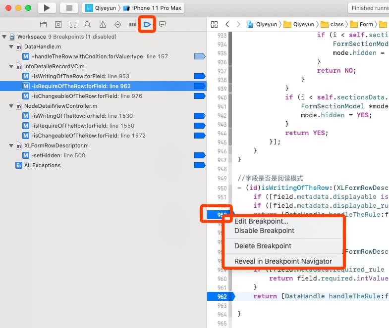
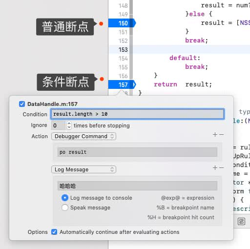
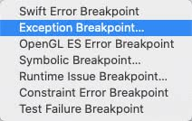
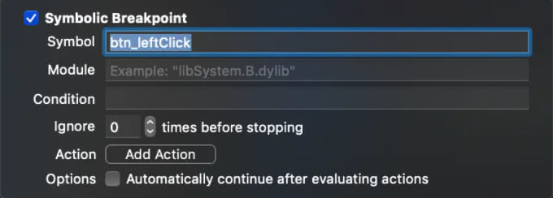
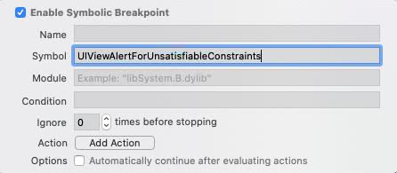
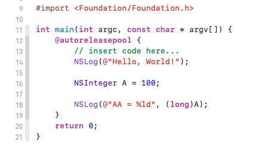
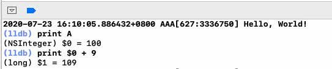
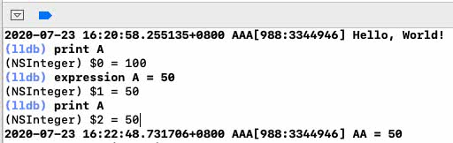
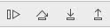

## 文档

[ObjC中国 -  **调试：案例学习**](https://objccn.io/issue-19-1/)

[ObjC中国 -  **与调试器共舞 - LLDB 的华尔兹**](https://objccn.io/issue-19-2/)

[Chisel-LLDB命令插件，让调试更Easy](https://blog.cnbluebox.com/blog/2015/03/05/chisel/)

### 

# 一、LLDB使用

## 1、断点

### 1.1、普通断点



### 1.2、条件断点



### 1.3、全局断点



#### a. Swift Error Breakpoint

​		Swift 全局断点，和 Exception Breakpoint 断点类似。

#### b. Exception Breakpoint

​		Objective-C 全局断点。

#### c. OpenGL ES Error Breakpoint

​		OpenGL是用于2D/3D图形编程的一套基于C语言的统一接口，在桌面windows，Mac，Linux/Unix上均可兼容。OpenGL ES是在OpenGL嵌入式设备上面的版本，也就是安卓/iPhone，其他嵌入式等移动设备的编程规范。（除此之外，在web上也有相应的WebGL）

​		现在在iOS平台上目前支持的OpenGL版本有 `OpenGL1.0/OpenGL2.0/OpenGL3.0`，在使用 cocoa 框架中 OpenGL 类库绘制 2D/3D 图像时，可以使用该选项添加断点。

#### d. Symbolic Breakpoint

​		符号断点（Symbolic Breakpoint）是全局断点，可以针对某一个方法（函数）设置断点。开发者可以很方便地创建一个符号断点，如下图：



​		在项目中所有名称为 `btn_leftClick` 的函数处， 将会自动添加断点。

**实战**：处理Masonry警告：[LayoutConstraints] Unable to simultaneously satisfy constraints. 



#### e. Constraint Error Breakpoint

​		添加断点之后，使用 Autolayout 故意设置约束冲突，没有打印任何效果。这种断点类型，使用较少。

#### f. Test Failure Breakpoint

​		单元测试全局断点。添加后，在单元测试 XCAssert 断言失败时，停留在函数处。此时可以用 lldb 命令 p 强制修改条件满足断言后，继续调试运行。


## 2、Console(lldb 命令)

[ObjC中国 -  **调试：案例学习**](https://objccn.io/issue-19-1/)

[ObjC中国 -  **与调试器共舞 - LLDB 的华尔兹**](https://objccn.io/issue-19-2/)



### 1. help / h

```
// 列举出所有的命令
(lldb) help

// 了解更多print命令细节
(lldb) help print
```

### 2. print / p

你可能还注意到了，结果中有个 `$0`。实际上你可以使用它来指向这个结果。试试 `print $0 + 7`，你会看到 `106`。任何以美元符开头的东西都是存在于 LLDB 的命名空间的，它们是为了帮助你进行调试而存在的。



### 3. expression / e

如果想改变一个值怎么办？你或许会猜 *modify*。其实这时候我们要用到的是 `expression` 这个方便的命令。

这不仅会改变调试器中的值，实际上它改变了程序中的值。这时候继续执行程序，将会打印 `AA = 50`。神奇吧。



### 4. print 与 expression 关系

```
(lldb) help print
......
'print' is an abbreviation for 'expression --'
```

### 5. print object / po 打印对象 

先`print`打印对象，发现打印数组时，我们想查看数组元素？？

```
(lldb) print B
(__NSCFConstantString *) $0 = 0x0000000100001030 @"haha WAWA"

(lldb) p @[ @"foo", @"bar" ]
(__NSArrayI *) $1 = 0x00000001005074c0 @"2 elements"
```

实际上，我们想看的是对象的 `description` 方法的结果。我么需要使用 `-O` (字母 O，而不是数字 0) 标志告诉 `expression` 命令以 `对象` (Object) 的方式来打印结果。

```
(lldb) p @[ @"foo", @"bar" ]
(__NSArrayI *) $1 = 0x00000001005074c0 @"2 elements"
(lldb) e -o -- $1
<__NSArrayI 0x1005074c0>(
foo,
bar
)
```

幸运的是，`e -o --` 有也有个别名，那就是 `po` (**p**rint **o**bject 的缩写)，我们可以使用它来进行简化：

```
(lldb) po $1
<__NSArrayI 0x1005074c0>(
foo,
bar
)
```

### 6. po 与 expression 关系

```
(lldb) help po
......
'po' is an abbreviation for 'expression -O  --'
```

### 7. 声明变量

```
// 变量必须以 **美元符** 开头。
(lldb) e int $a = 2
(lldb) print $a
(int) $a = 2
```

### 8. 打印变量

[完整清单](https://sourceware.org/gdb/onlinedocs/gdb/Output-Formats.html)

```
// 默认十进制
(lldb) p 16
(int) $2 = 16

// 十六进制
(lldb) p/x 16
(int) $3 = 0x00000010

// 二进制 (t 代表 two)
(lldb) p/t 16
(int) $4 = 0b00000000000000000000000000010000
```

### 9. 断点流程控制



从左到右，四个按钮分别是：continue，step over，step into，step out。

第一个，continue 按钮，会取消程序的暂停，允许程序正常执行 (要么一直执行下去，要么到达下一个断点)。在 LLDB 中，你可以使用 `process continue` 命令来达到同样的效果，它的别名为 `continue`，或者也可以缩写为 `c`。

第二个，step over 按钮，会以黑盒的方式执行一行代码。如果所在这行代码是一个函数调用，那么就**不会**跳进这个函数，而是会执行这个函数，然后继续。LLDB 则可以使用 `thread step-over`，`next`，或者 `n` 命令。

如果你确实想跳进一个函数调用来调试或者检查程序的执行情况，那就用第三个按钮，step in，或者在LLDB中使用 `thread step in`，`step`，或者 `s` 命令。注意，当前行不是函数调用时，`next` 和 `step` 效果是一样的。

大多数人知道 `c`，`n` 和 `s`，但是其实还有第四个按钮，step out。如果你曾经不小心跳进一个函数，但实际上你想跳过它，常见的反应是重复的运行 `n` 直到函数返回。其实这种情况，step out 按钮是你的救世主。它会继续执行到下一个返回语句 (直到一个堆栈帧结束) 然后再次停止。

### 10 . 检查视图层次结构

* `po [[UIWindow keyWindow] recursiveDescription];`

```
(lldb) po [[UIWindow keyWindow] recursiveDescription];
<UIWindow: 0x7f912540fff0; frame = (0 0; 414 896); gestureRecognizers = <NSArray: 0x6000002a3060>; layer = <UIWindowLayer: 0x600000c86320>>
   | <UITransitionView: 0x7f9127220430; frame = (0 0; 414 896); autoresize = W+H; layer = <CALayer: 0x600000c4a9a0>>
   |    | <UIDropShadowView: 0x7f9127220bd0; frame = (0 0; 414 896); clipsToBounds = YES; autoresize = W+H; layer = <CALayer: 0x600000c4ad60>>
   |    |    | <UILayoutContainerView: 0x7f9127105d80; frame = (0 0; 414 896); autoresize = W+H; layer = <CALayer: 0x600000c8dc40>>
   |    |    |    | <UITransitionView: 0x7f912540d7d0; frame = (0 0; 414 896); clipsToBounds = YES; autoresize = W+H; layer = <CALayer: 0x600000c1d900>>
   |    |    |    |    | <UIViewControllerWrapperView: 0x7f912711c460; frame = (0 0; 414 896); autoresize = W+H; layer = <CALayer: 0x6000006584c0>>
   |    |    |    |    |    | <UILayoutContainerView: 0x7f9125408280; frame = (0 0; 414 896); clipsToBounds = YES; autoresize = W+H; gestureRecognizers = <NSArray: 0x6000002d0000>; layer = <CALayer: 0x600000ca9180>>
   |    |    |    |    |    |    | <UINavigationTransitionView: 0x7f9125715f60; frame = (0 0; 414 896); clipsToBounds = YES; autoresize = W+H; layer = <CALayer: 0x600000c950c0>>
   |    |    |    |    |    |    |    | <UIViewControllerWrapperView: 0x7f9127169fb0; frame = (0 0; 414 896); autoresize = W+H; layer = <CALayer: 0x600000658160>>
   |    |    |    |    |    |    |    |    | <UIView: 0x7f9125441070; frame = (0 0; 414 896); autoresize = W+H; layer = <CALayer: 0x600000c75540>>
   |    |    |    |    |    |    |    |    |    | <UITableView: 0x7f912589c000; frame = (0 0; 414 896); clipsToBounds = YES; gestureRecognizers = <NSArray: 0x6000002c8ab0>; layer = <CALayer: 0x600000c77e40>; contentOffset: {0, -88}; contentSize: {414, 70.000100000000003}; adjustedContentInset: {88, 0, 83, 0}; dataSource: <DiscoverViewController: 0x7f912571c530>>
   |    |    |    |    |    |    |    |    |    |    | <SettingCell: 0x7f9127860800; baseClass = UITableViewCell; frame = (0 0.0001; 414 50); text = '工作圈'; autoresize = W; layer = <CALayer: 0x600000600700>>
   |    |    |    |    |    |    |    |    |    |    |    | <UITableViewCellContentView: 0x7f9127038f20; frame = (0 0; 359 50); gestureRecognizers = <NSArray: 0x600001ef01b0>; layer = <CALayer: 0x600000600bc0>>
   |    |    |    |    |    |    |    |    |    |    |    |    | <UIView: 0x7f9127007fa0; frame = (0 50; 414 0.333333); layer = <CALayer: 0x600000600f40>>
   |    |    |    |    |    |    |    |    |    |    |    |    | <UIView: 0x7f9127034d10; frame = (0 0; 414 0.333333); layer = <CALayer: 0x600000601040>>
   |    |    |    |    |    |    |    |    |    |    |    |    | <UIImageView: 0x7f9127043380; frame = (10 10; 30 30); opaque = NO; userInteractionEnabled = NO; layer = <CALayer: 0x6000006011a0>>
   |    |    |    |    |    |    |    |    |    |    |    |    | <UITableViewLabel: 0x7f9127005e10; frame = (57 14.8333; 52 20.3333); text = '工作圈'; userInteractionEnabled = NO; layer = <_UILabelLayer: 0x600002c34000>>
   |    |    |    |    |    |    |    |    |    |    |    |    |    | <_UILabelContentLayer: 0x600000602760> (layer)
   |    |    |    |    |    |    |    |    |    |    |    |    | <UIImageView: 0x7f9127011d30; frame = (329 5; 50 50);
.......
.......
```


* `po [[[UIWindow keyWindow] rootViewController] _printHierarchy];`

类似于检查视图层次，我们也可以用 `po [[[UIWindow keyWindow] rootViewController] _printHierarchy];` 来检查视图控制器。这是一个苹果默默在 iOS 8 中为 `UIViewController` 添加的[私有辅助方法](https://github.com/nst/iOS-Runtime-Headers/blob/a8f9f7eb4882c9dfc87166d876c547b75a24c5bb/Frameworks/UIKit.framework/UIViewController.h#L365) 。

```
(lldb) po [[[UIWindow keyWindow] rootViewController] _printHierarchy];
<TabBarController 0x7f9125838c00>, state: appeared, view: <UILayoutContainerView 0x7f9127105d80>
   | <NavigationViewController 0x7f9128883c00>, state: disappeared, view: <UILayoutContainerView 0x7f91270136c0> not in the window
   |    | <ConversationListViewController 0x7f912712e490>, state: disappeared, view: <UIView 0x7f91254b47f0> not in the window
   | <NavigationViewController 0x7f9128049a00>, state: disappeared, view: <UILayoutContainerView 0x7f9127229cc0> not in the window
   |    | <QYCNewAppCenterController 0x7f9127227cc0>, state: disappeared, view: <UIView 0x7f912543c2b0> not in the window
   | <NavigationViewController 0x7f912888ea00>, state: disappeared, view: <UILayoutContainerView 0x7f9127132ea0> not in the window
   |    | <QYCPorTalViewController 0x7f91271326b0>, state: disappeared, view: <UIView 0x7f9127251930> not in the window
   | <NavigationViewController 0x7f9128087800>, state: disappeared, view: <UILayoutContainerView 0x7f912722d960> not in the window
   |    | <QYCPlatformRemindsMessageCenterListVC 0x7f912722cc30>, state: disappeared, view: <UIView 0x7f9127117250> not in the window
   | <NavigationViewController 0x7f912583a600>, state: appeared, view: <UILayoutContainerView 0x7f9125408280>
   |    | <DiscoverViewController 0x7f912571c530>, state: appeared, view: <UIView 0x7f9125441070>
```


LLDB 非常强大并且可以脚本化。 Facebook 发布了一组名为 [Chisel 的 Python 脚本集合](https://github.com/facebook/chisel) 为日常调试提供了非常多的帮助。`pviews` 和 `pvc` 等价于视图和视图控制器的层次打印。Chisel 的视图控制器树和上面方法打印的很类似，但是同时还显示了视图的尺寸。 我通常用它来检查[响应链](https://developer.apple.com/library/ios/documentation/EventHandling/Conceptual/EventHandlingiPhoneOS/event_delivery_responder_chain/event_delivery_responder_chain.html)，虽然你可以对你感兴趣的对象手动循环执行 `nextResponder`，或者[添加一个类别辅助方法](https://gist.github.com/n-b/5420684)，但输入 `presponder object` 依旧是迄今为止最快的方法。


### 11. 更新UI

// 未操作出来

### 12. Push 一个 View Controller

// 未操作出来

### 13. 查找按钮的 target

// 未操作出来


## 3、[facebook - Chisel](https://github.com/facebook/chisel) -- LLDB命令插件

[Chisel-LLDB命令插件，让调试更Easy](https://blog.cnbluebox.com/blog/2015/03/05/chisel/)

### 6.3.1. Installation

```
brew update
brew install chisel
```

brew安装完成会提示

```
==> Caveats
Add the following line to ~/.lldbinit to load chisel when Xcode launches:
  command script import /usr/local/opt/chisel/libexec/fblldb.py
```

if `.lldbinit` file doesn't exist you can create it & open it by tapping on the terminal

```
touch .lldbinit 
open .lldbinit 
```

The commands will be available the next time `Xcode` starts.

### 6.3.2. 重启Xcode，尝试成功

```
(lldb) pvc
<LoginViewController 0x7fa472e1c850>, state: appeared, view: <UIView 0x7fa4749074d0>
```


