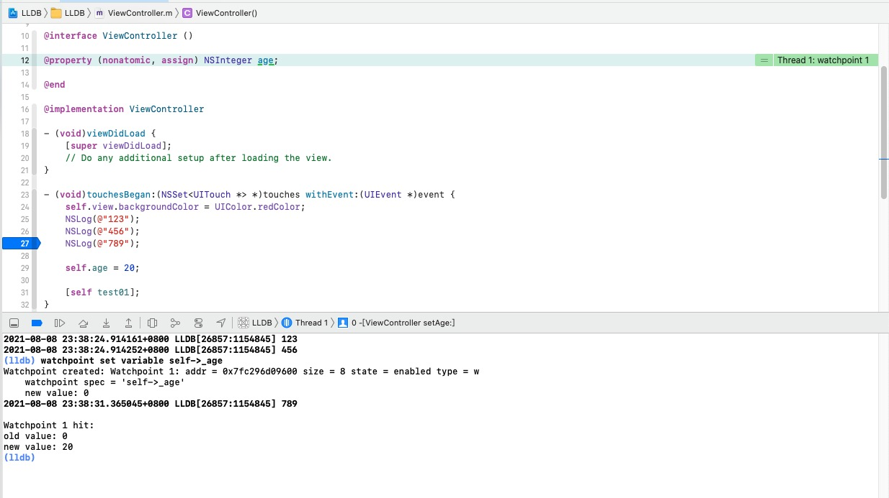

# 常用LLDB指令

## 指令格式

``` shell
# []内容可省
<command> [<subcommand> [<subcommand>...]] <action> [-options [option-value]] [argument [argument...]]
```

* \<command>：命令
* \<subcommand>：子命令
* \<action>：命令操作
* \<options>：命令选项
* \<argument>：命令参数

 

### 简单例子：给test函数设置断点

```shell
breakpoint set -n test01
```

* breakpoint：\<command>
* set：\<subcommand>
* -n：\<options>
* test01：\<argument>


## help \<command>

```shell
help breakpoint
```


查看上例子中的命令

```
help breakpoint set
```


其中截取 -n 含义，表示方法名

> -n 等价于 --name

```shell
	-n <function-name> ( --name <function-name> )
            Set the breakpoint by function name.  Can be repeated multiple
            times to makeone breakpoint for multiple names
```


## expression \<cmd-options> -- \<expr>

* \<cmd-options>：命令选项

* **--** ：命令选项结束符，表示所有的命令选项已经设置完毕，如果没有命令选项，--可省略
* \<expr>：需要执行的表达式

eg：

```shell
# --可省略
expression -O -- self
expression self
```


### expression实战场景：断点时，新增代码运行

>一般新增代码运行，需要重新运行程序
>
>通过expression新增代码，可快速调试
>
>注意：对视图的设置，需要跳过断点，进入下一个runloop刷新

```
(lldb) expression self.view.backgroundColor = UIColor.redColor
```


### 各种输出对比⭐

```shell
# 仅用于打印普通/简单值
expression == e == expression -- == e -- == print == p == call

# 打印对象的工作方式与 NSLog 相同，用于打印对象的值
expression -O -- == e -O -- == po
    
# 拓展
-O 的含义：
	1.(lldb) help expression
	2.-O ( --object-description )
            Display using a language-specific description API, if possible.
```


##  thread


###  thread backtrace

* 打印线程的堆栈信息
* 与指令 **bt** 的效果一样


 

###thread return []

* 让函数直接返回某个值，不会执行断点后面的代码


### frame variable []

* 打印当前栈帧的变量
* 类似于Xcode中的便捷查看变量方式
* 命令行用于逆向


### 断点流程控制


* **thread continue**

    ```shell
    # 程序继续执行
    thread continue == continue == c
    ```

* **thread step-over**

    ```shell
    # 单步执行，把子函数当做整体一步执行
    thread step-over == next == n
    ```

* **thread step-in**

    ```shell
    # 单步执行，遇到子函数会进入子函数
    thread step-in == step == s
    ```

* **thread step-out**

    ```shell
    # 直接执行完当前函数的所有代码，返回到上一个函数
    thread step-out == finish
    ```

* **thread step-inst-over**

    ```shell
    # 汇编指令级别
    thread step-inst-over == nexti == ni
    ```

* **thread step-inst**

    ```shell
    # 汇编指令级别
    thread step-inst == stepi == si
    ```

* **si**、**ni** 与 **s**、**n** 类似
    * s、n 是源码级别（Source Level：源码级别）
    * si、ni 是汇编指令级别（Instruction Level：指令级别）


Xcode设置汇编调试

```shell
Xcode -> Debug -> Debug Workflow -> Always Show Disassembly
```

n VS ni


## breakpoint

### breakpoint set

* **breakpoint set -a 函数地址**

* **breakpoint set -n 函数名**

    * **breakpoint set -n test**
    * **breakpoint set -n touchesBegan:withEvent:**
    * **breakpoint set -n "-[ViewController touchesBegan:withEvent:]"**

* **breakpoint set -r 正则表达式**

    * **breakpoint set -r touchesBegan**

        包含touchesBegan的所有函数都打上断点

        

* **breakpoint set -s 动态库 -n 函数名**

    * **breakpoint set -s libdispatch.dylib -n dispatch_main**

        给动态库libdispatch.dylib的dispatch_main打上断点

        


### breakpoint list

* 列出所有的断点（每个断点都有自己的编号）


### breakpoint disable

* **breakpoint disable 断点编号**：禁用断点


### breakpoint enable

* **breakpoint enable 断点编号**：启用断点


### breakpoint delete

* **breakpoint delete 断点编号**：删除断点


### breakpoint command

* **breakpoint command add 断点编号**
    * 给断点预先设置需要执行的命令，到触发断点时，就会按顺序执行
* **breakpoint command list 断点编号**
    * 查看某个断点设置的命令
* **breakpoint command delete 断点编号**
    * 删除某个断点设置的命令


## watchpoint — 内存断点

> 在内存数据发生改变的时候触发

* **watchpoint set variable 变量**

    * **watchpoint set variable self->_age**

        可以看到 编号:1、内存地址、内存大小、初始值等

        

        

* **watchpoint set expression 地址**
    * **watchpoint set expression &self->_age**
    * **watchpoint set expression 0x00007fc296d09600**
    * **po &self->_age**  ：获取age变量内存地址

* **获取内存断点后，如何查看内存堆栈信息？**

    * **bt 直接查看堆栈信息**

        


* **watchpoint list**
* **watchpoint disable 断点编号**
* **watchpoint enable 断点编号**
* **watchpoint delete 断点编号**
* **watchpoint command add 断点编号**
* **watchpoint command list 断点编号**
* **watchpoint command delete 断点编号**


## image lookup — 模块查找

* **image lookup**

    * **image lookup -t 类型** ：查找某个类型的信息

        * **-t 等价于 --type**

        * **image lookup -t NSInteger**

        * **image lookup -t ViewController**

            

    * **image lookup -a 地址**：根据内存地址查找在模块中的位置

        * 根据崩溃得到内存地址

            

        * **image lookup -a 0x000000010b655d40**：可快速查看崩溃位置

            ```bash
            (lldb) image lookup -a 0x000000010b655d40
                  Address: LLDB[0x0000000100001d40] (LLDB.__TEXT.__text + 512)
                  Summary: LLDB`-[ViewController touchesBegan:withEvent:] + 448 at ViewController.m:30:5
            ```

    * **image lookup -n 符号或者函数名**：查找某个符号或函数的位置

        * **image lookup -n test01**：查看test01函数的位置

            

* **image list**
    * **列出所有加载的模块信息**
    * **image list -O -f**
        * 打印出模块的偏移地址、全路径

