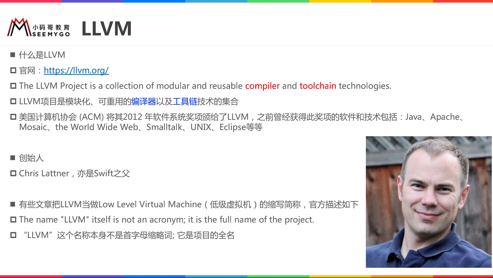

[iOS编译]()

# LLVM

* https://llvm.org
* LLVM 不是 Low Level Virtual Machine

## 传统编译器架构

## LLVM架构

## Clang

## Clang与LLVM

# OC源文件编译过程

* `$ clang -ccc-print-phases main.m`
* `$ clang -E main.m`

## 词法分析

* `$  clang -fmodules -E -Xclang -dump-tokens main.m`

## 语法树 AST

* `$  clang -fmodules -fsyntax-only -Xclang -ast-dump main.m`

## LLVM IR

* 拓展名.ll，`$ clang -S -emit-llvm main.m`

* 拓展名.bc， `$ clang -c -emit-llvm main.m`

* 官方语法参考

    https://llvm.org/docs/LangRef.html

# Swift文件编译过程

# 编译源码 - 请看PDF文档

