# Xcode12问题

* 方案一：[Pod trunk push command Failed with Xcode12 #10065](https://github.com/CocoaPods/CocoaPods/issues/10065)

```
s.pod_target_xcconfig = { 'EXCLUDED_ARCHS[sdk=iphonesimulator*]' => 'arm64' }
s.user_target_xcconfig = { 'EXCLUDED_ARCHS[sdk=iphonesimulator*]' => 'arm64' }
```

* 方案二：修改Xcode默认版本

[官方文档](https://developer.apple.com/library/archive/technotes/tn2339/_index.html)

```shell
# 此处Xcode.app可替换为其他版本，如XcodeBeta.app
$ sudo xcode-select -switch /Applications/Xcode.app
```


# 一、将项目中QYCToast抽离

按照《01.gitlab搭建私有pod》中的步骤创建了一个本地代码库，将项目中的QYCToast拖动到指定目录下

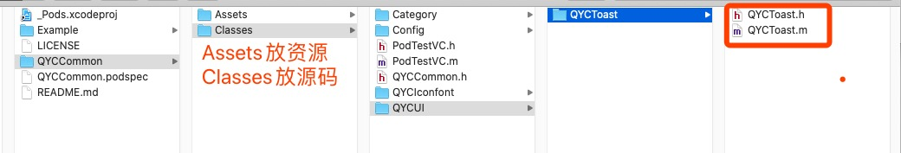


进入Example项目，`pod install` 本地安装，就可以在项目中看到

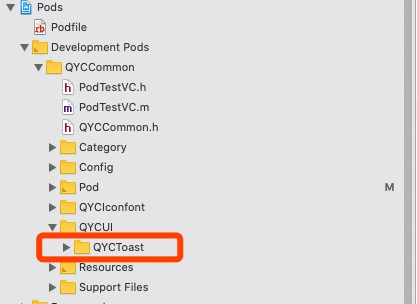


当我们编译时，发现QYCToast中报错，原来是找不到 iconfont 字体库，具体解决看《03.Pod资源》

根据编译过程中发现的各种报错，我们需要导入各种基础方法。


创建

```
➜  pod lib create QYCQRCode
```


每个pod都需要维护一个 `xxx.podspec` 文件

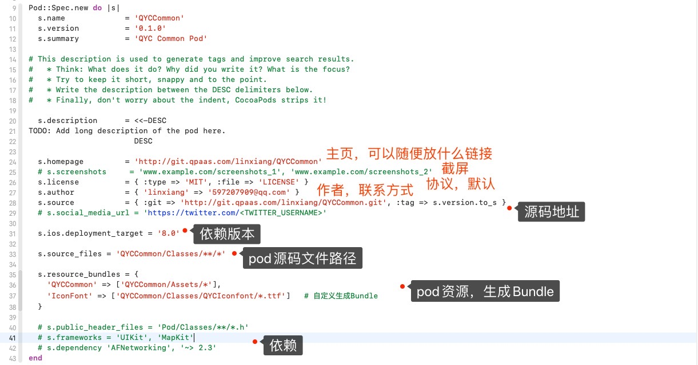


开启本地验证

```
➜  pod lib lint --allow-warnings

// 前往本地仓库路径下，直接验证QYCCommon.podspec文件
➜  pod lib lint QYCCommon.podspec
```


将代码推到远程仓库

```
➜  git remote add origin http://xxxxxxxx/xxx
```


打tag，并推送，不然远程验证找不到对应版本

```
➜  QYCQRCode git:(master) ✗ git tag 1.0.0
➜  QYCQRCode git:(master) ✗ git push --tag
Total 0 (delta 0), reused 0 (delta 0)
To http://git.qpaas.com/linxiang/QYCCommon.git
 * [new tag]         1.0.0 -> 1.0.0
```


验证远程

```
pod spec lint --allow-warnings
```

依赖私有库【查看原因看下面章节】

```
# 配置 `--sources` 下载源。

// 精简版
➜  pod lib lint --allow-warnings --sources='http://git.qpaas.com/PaasPods/PaasSpecs.git,https://github.com/CocoaPods/Specs.git'

// 全版
➜  pod lib lint QYCCommon.podspec --allow-warnings --sources='http://git.qpaas.com/xudongdong/PassPods.git,https://github.com/CocoaPods/Specs.git'

// 远程
➜  pod spec lint --allow-warnings --sources='http://git.qpaas.com/PaasPods/PaasSpecs.git,https://github.com/CocoaPods/Specs.git'
```


本地创建repo关联远程索引库，已经存在索引库

```
➜  pod repo add PaasSpecs http://git.qpaas.com/xudongdong/PassPods.git
Cloning spec repo `QYCSpec` from `http://git.qpaas.com/xudongdong/PassPods.git`
```

查看

```
➜  pod repo
```


将本地的 QYCCommon.podspec 文件推到 索引库 中

```
➜  pod repo push PaasSpecs QYCCommon.podspec --allow-warnings
```


成功后，本地索引库 

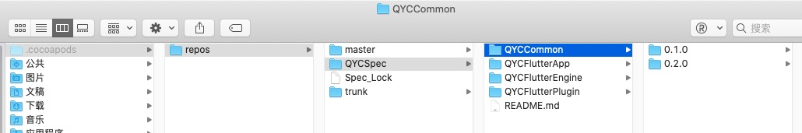


远程索引库

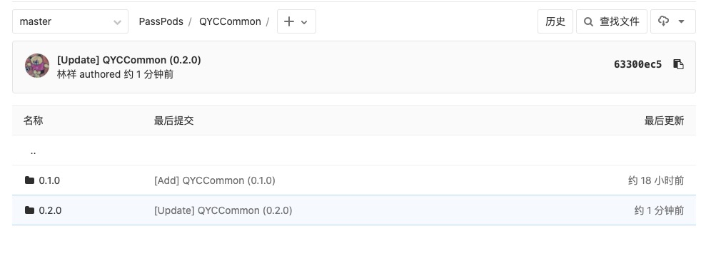

更新索引库

```
➜  pod repo update QYCSpec
```


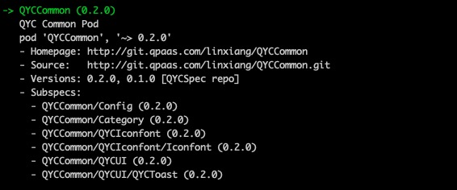

```
➜  pod search QYCCommon

-> QYCCommon (0.1.0)     
   QYC Common Pod										/// .podspec 中的summary
   pod 'QYCCommon', '~> 0.1.0'			/// 安装推荐
   - Homepage: http://git.qpaas.com/xudongdong/PassPods				/// .podspec 中 homepage
   - Source:   http://git.qpaas.com/linxiang/QYCCommon.git		/// .podspec 中 source
   - Versions: 0.1.0 [QYCSpec repo]						/// .podspec 中 verson  &&  所属repo
```


# 三、私有库中分文件夹

## 3.1. 默认配置

若安装默认 `.podspec` 文件中配置，则引入到项目中后发现，文件并没有安装我们设想的分层显示。

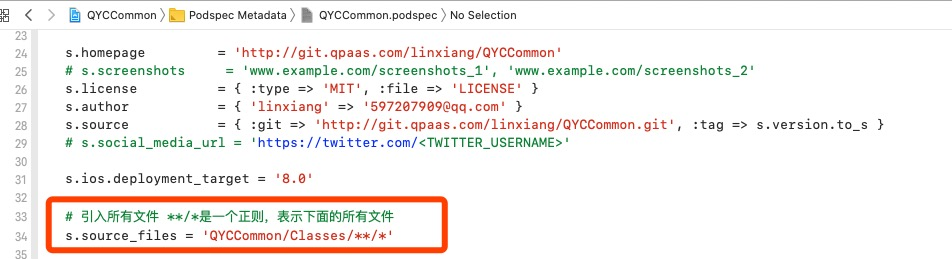

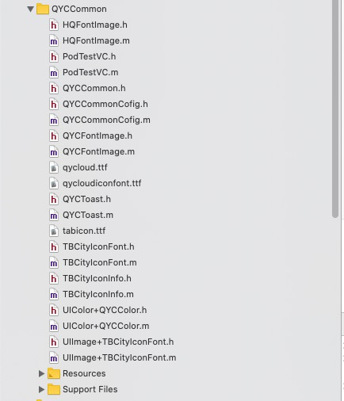


## 3.2. 自定义配置

 `.podspec` 修改后

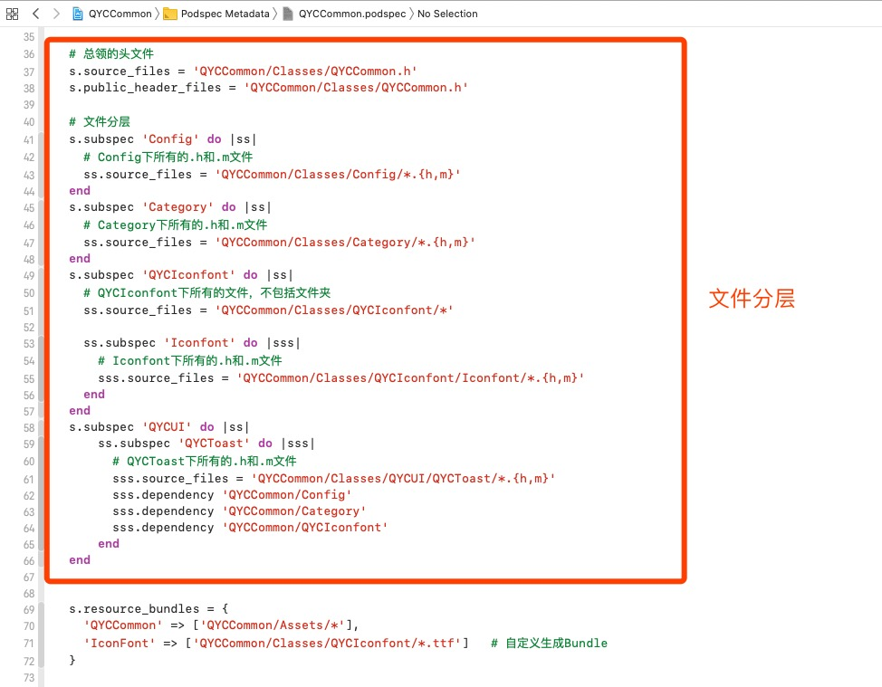

pod install 后，项目中的pod果真按照我们的设想进行分层显示了

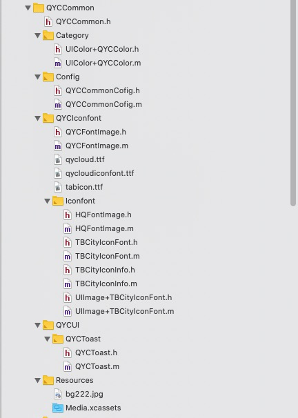


## 3.3. 总头文件

```
  # 总领的头文件
  s.source_files = 'QYCCommon/Classes/QYCCommon.h'
  s.public_header_files = 'QYCCommon/Classes/QYCCommon.h'
```


## 3.4. 文件依赖 `dependency`


### 1. 依赖组件内的私有库

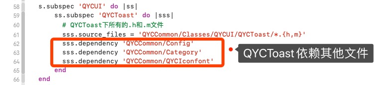


### 2. 依赖github上的三方库

在 `QYCCommon.podspec` 文件中直接添加

```
s.dependency 'AFNetworking', '~> 2.3'
```


### 3. 依赖私有库

1. 在 `podfile` 文件中增加私有库地址，再执行 `pod install` 才能找到私有库。

   ```
   source 'http://git.qpaas.com/xudongdong/PassPods.git'    # 组件化索引库
   ```

2. 若仍然找不到该私有库

   ```
    * out-of-date source repos which you can update with `pod repo update` or with `pod install --repo-update`.
    * 更新本地索引库
    * mistyped the name or version.
    * 查看是否拼写错误
    * not added the source repo that hosts the Podspec to your Podfile.
    * 没有将托管Podspec的源存储库添加到您的Podfile中。（也就是前面所说的添加索引库地址）
   ```

3. 安装成功

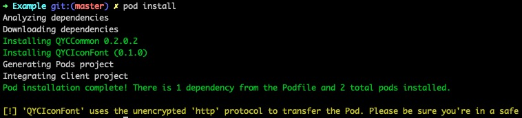


### 4. 【重点】私有库的dependency找不到

`➜  pod lib lint --allow-warnings` 失败！！

> `pod lib lint` 是只从本地验证你的 `pod` 能否通过验证。
>
> `pod spec lint` 是从本地和远程验证你的 `pod` 能否通过验证。

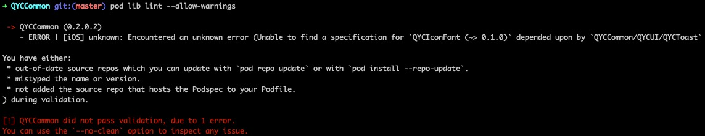


【原因】：

校验podspec文件时会到远程podspec库查找相关依赖，默认只会到官方specs库校验，此时需要指定远程specs库去校验。


【解决方案】：

指定pod spec文件校验地址

```
# 配置 `--sources` 下载源。

// 精简版
➜  pod lib lint --allow-warnings --sources='http://git.qpaas.com/PaasPods/PaasSpecs.git,https://github.com/CocoaPods/Specs.git'

// 全版
➜  pod lib lint QYCCommon.podspec --allow-warnings --sources='http://git.qpaas.com/xudongdong/PassPods.git,https://github.com/CocoaPods/Specs.git'

// 远程
➜  pod spec lint --allow-warnings --sources='http://git.qpaas.com/PaasPods/PaasSpecs.git,https://github.com/CocoaPods/Specs.git'
```


```
# 配置 --use-libraries 解决.h文件引用三方库问题：[-Werror,-Wnon-modular-include-in-framework-module]

➜  pod lib lint --allow-warnings --use-libraries
```


## 3.5. 后续可按需导入

```
  pod 'QYCCommon/Category', '~> 0.2.0'
```

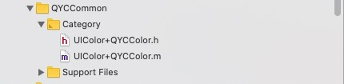


# 四、在原项目中导入

## 问题一：导入成功后直接编译，失败！！

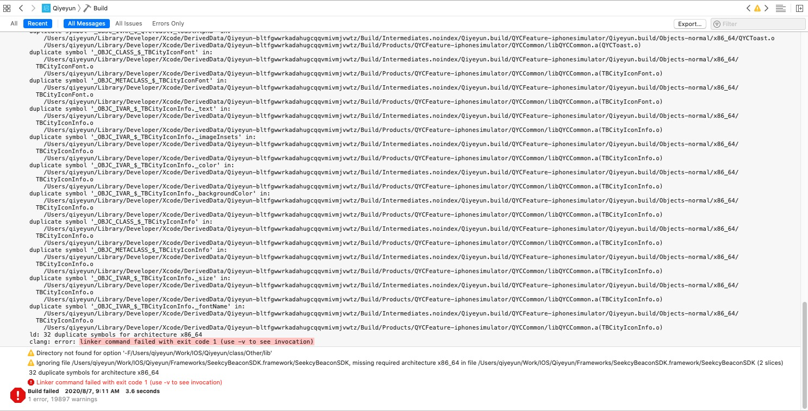


【原因】

> ```
> // 导入pod头文件
> #import <QYCCommon/QYCToast.h>
> 
> // 导入源码头文件
> #import "QYCToast.h"
> ```
>
> 项目源文件中的QYCToast依旧存在，与pod中的QYCToast编译冲突。
>
> 所以如上：
>
> 如果只调用pod中的`QYCToast` 是可以编译通过，因为头文件路径已明确，
>
> 如果调用源码中的`QYCToast`，`#import "QYCToast.h"`  则会产生与pod中的`QYCToast`编译冲突。


【解决方案】

> 删除项目中已经剥离的源文件，编译通过！！


## 问题二：在pod库中文件进行了分层，导入后文件在同一目录下了？？？？

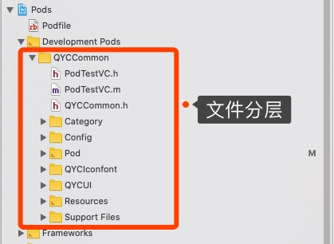


【原因】

在 `QYCCommon.podspec` ，文件引入，`**/*` 是一个正则，表示下面所有的文件

```
  s.source_files = 'QYCCommon/Classes/**/*'
```


【解决方案】

看上面《pod文件分层》


# 五、创建新项目导入

## 1. 编辑 Podfile

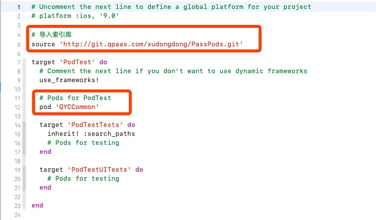

## 2. pod install 成功

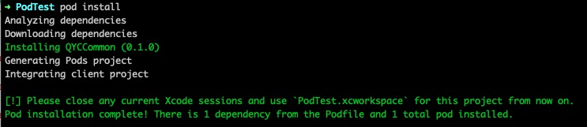


## 3. 调用 QYCToast

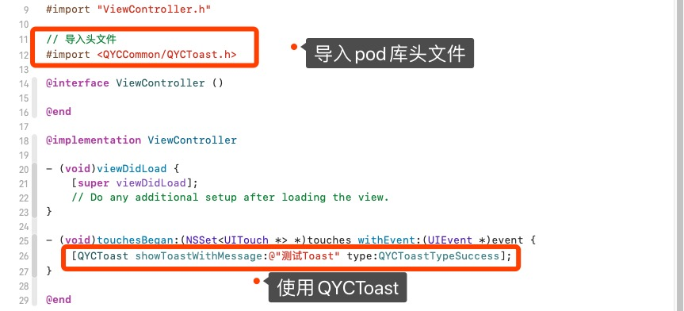

### 3.1. 崩溃

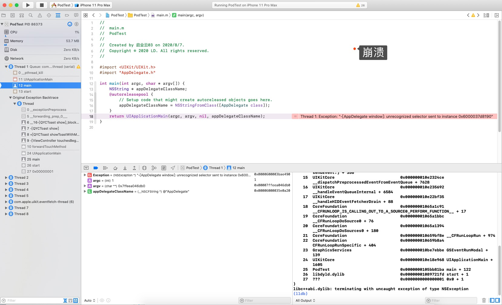


### 3.2. 原因

> ```
> -[AppDelegate window]: unrecognized selector sent to instance 0x6000037d8190
> ```
>
> 由于新建项目中出现了SecneDelegate，以前存在于AppDelegate中的window被放到了SceneDelegate中，
>
> 所以QYCToast中调用了 `[AppDelegate window]` 找不到该方法，导致崩溃！！！


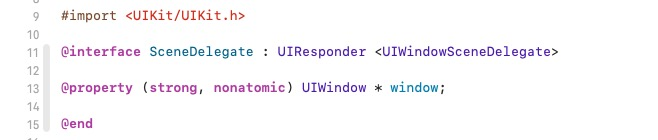

### 3.3.解决方案

#### 1. 项目修改，移除SecneDelegate

将项目中的SecneDelegate移除，并将window手动迁移到AppDelegate中，即可。

#### 2. 修改pod

暂未尝试


## 4. pod install 库冲突

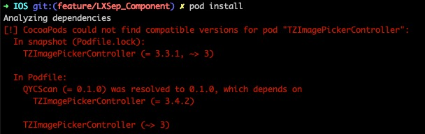

### 4.1. 原因

> QYCScan 私有库中 s.dependency 'TZImagePickerController', '3.4.2'
>
> 项目中 pod 'TZImagePickerController', '~> 3'  ，实际版本 '3.3.1'
>
> 导致的 TZImagePickerController 找不到兼容的版本

### 4.2. 解决

> 将两个依赖库版本统一


# 六、Podfile文件


## 6.1. 方式一：pod 全配置

```
  # 组件化
  pod 'QYCCommon',:tag => '0.2.0',:git => 'http://git.qpaas.com/linxiang/QYCCommon.git',:configurations => ['Debug','QYCFeature','QYCRelease','QYCPre','QYCHotfix','QYCCanary','QYCCustomConfig']
```

直接从 `http://git.qpaas.com/linxiang/QYCCommon.git` 代码仓库获取 `tag => 0.2.0` ，并不会clone索引库

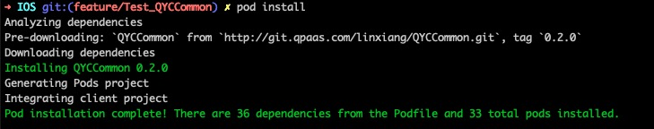


## 6.2. 方式二：引入Specs

```
source 'https://github.com/CocoaPods/Specs.git'
source 'http://git.qpaas.com/xudongdong/PassPods.git'    # 组件化索引库

.....

  # 组件化
  pod 'QYCCommon', '~> 0.2.0'
  
```


`pod install` 后，会将远程索引库clone到本地，本地索引库名字是`qpaas-xudongdong-passpods`，查看`pod repo / pod repo list`

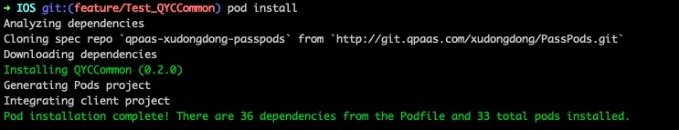

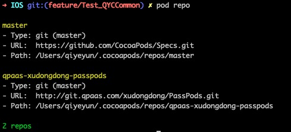


# 七、组件中常用代码

* 十六进制颜色

```
#define mRGBToColor(rgb) [UIColor colorWithRed:((float)((rgb & 0xFF0000) >> 16))/255.0 green:((float)((rgb & 0xFF00) >> 8))/255.0 blue:((float)(rgb & 0xFF))/255.0 alpha:1.0]

#define HexColor(hex) [UIColor colorWithRed:((hex >> 16) & 0xFF)/255.0 green:((hex >> 8) & 0xFF)/255.0 blue:(hex & 0xFF)/255.0 alpha:1.0]

// use
mRGBToColor(0xffffff)
HexColor(0xffffff)
```


* 暗黑

```
// 适配暗黑
- (UIColor *)lightColor:(UIColor *)lightColor darkColor:(UIColor *)darkColor {
    if (@available(iOS 13.0, *)) {
        return [UIColor colorWithDynamicProvider:^UIColor * _Nonnull(UITraitCollection * _Nonnull trainCollection) {
            if ([trainCollection userInterfaceStyle] == UIUserInterfaceStyleLight) {
                return lightColor;
            }
            else {
                return darkColor;
            }
        }];
    }
    else {
        return lightColor ? lightColor : (darkColor ? darkColor : [UIColor clearColor]);
    }
}

// use
[self lightColor:UIColor.whiteColor darkColor:HexColor(0x2F2F2F)];
```


* 常量

```
#define Version @"3.0.1"
```


