# 一、组件暗黑

```
// 颜色适配暗黑
static inline UIColor* QYCColor(UIColor *lightColor, UIColor *darkColor) {
    if (@available(iOS 13.0, *)) {
        return [UIColor colorWithDynamicProvider:^UIColor * _Nonnull(UITraitCollection * _Nonnull trainCollection) {
            if ([trainCollection userInterfaceStyle] == UIUserInterfaceStyleLight) {
                return lightColor;
            }
            else {
                return darkColor;
            }
        }];
    }
    else {
        return lightColor ? lightColor : (darkColor ? darkColor : [UIColor clearColor]);
    }
}

// 十六进制颜色
#define HexColor(hex) [UIColor colorWithRed:((hex >> 16) & 0xFF)/255.0 green:((hex >> 8) & 0xFF)/255.0 blue:(hex & 0xFF)/255.0 alpha:1.0]

// 十六进制颜色
#define HexColorAlpha(hex, al) [UIColor colorWithRed:((hex >> 16) & 0xFF)/255.0 green:((hex >> 8) & 0xFF)/255.0 blue:(hex & 0xFF)/255.0 alpha:al]
```


使用：

```
QYCColor(HexColor(0xFFFFFF), HexColor(0xC4C4C4));
```


# 二、组件国际化

## 1. 在 Example 中查看组件支持国际化语言

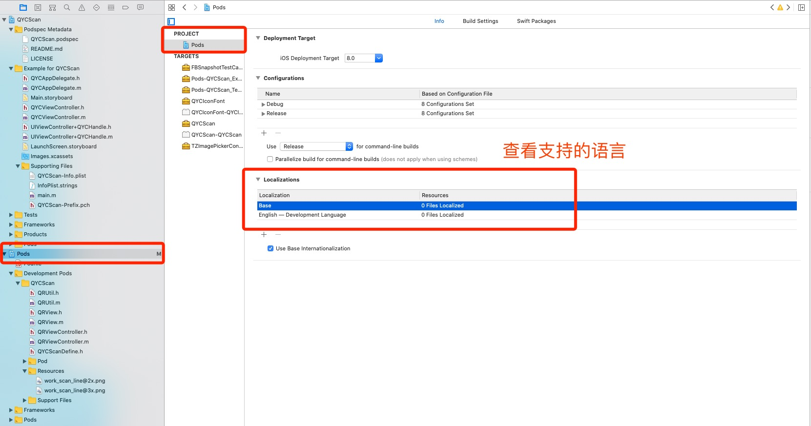


## 2. 可创建多个语言

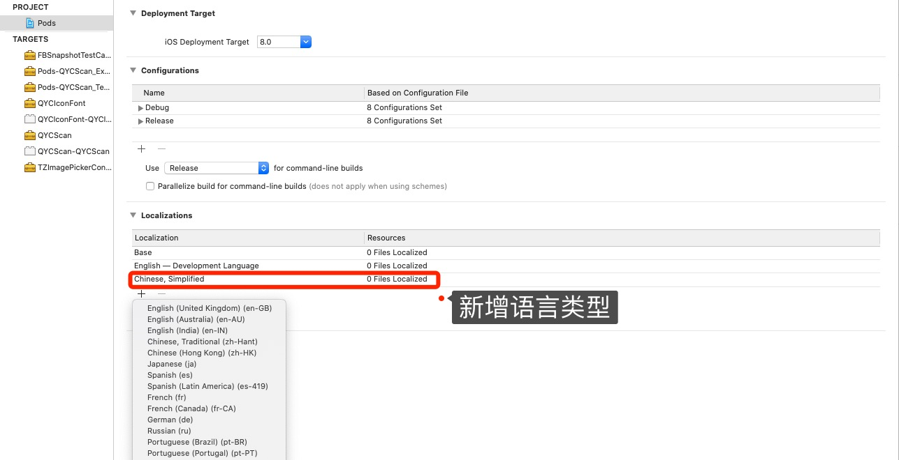


## 3. 先在任意目录下创建 `String File` 


## 4. 将创建好的 `String File` 拖动到 `Assets` 下

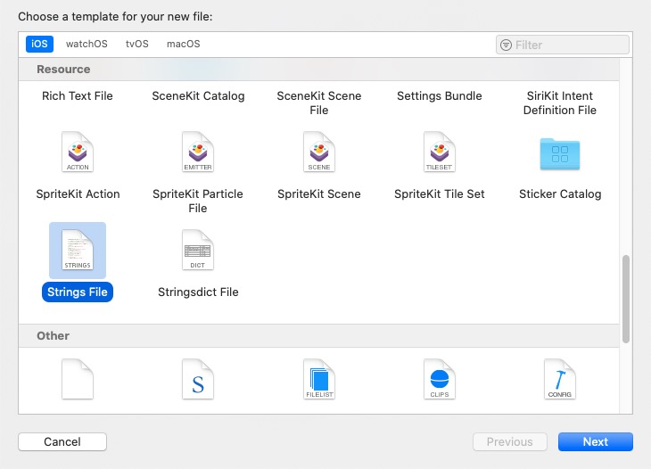


## 5. 终端前往Example 目录下，本地更新库 `pod install` 


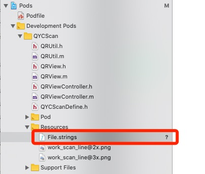


## 6. 点击`String File` 右侧 `Localize...`按钮


## 7. 先随便选择一个语言

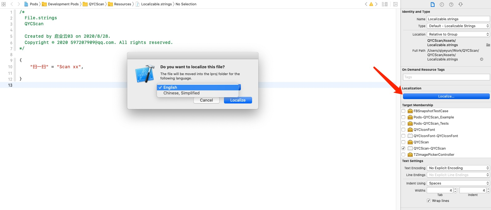


## 8. 勾选多个语言


## 9. 实际物理路径中，`String File` 会变成两个对应语言的文件

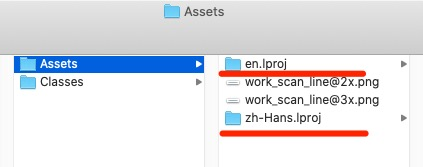


## 10. 重新本地加载 `pod install`


## 11. 库中如何使用？

```
#pragma mark - =========== 国际化 ===========

+ (NSString *)localizedString:(NSString *)key {
    
    NSString *language = [[NSLocale preferredLanguages] firstObject];
    if (language.length == 0) {
        return key;
    }
    NSString *fileNamePrefix = @"zh-Hans";
    if([language hasPrefix:@"en"]) {
        fileNamePrefix = @"en";
    }
    NSBundle *tmpBundle = [NSBundle bundleForClass:[self class]];
    NSURL *url = [tmpBundle URLForResource:@"QYCScan" withExtension:@"bundle"];
    if(!url) return key;
    NSBundle *tmp = [NSBundle bundleWithURL:url];
    
    NSString *path = [tmp pathForResource:fileNamePrefix ofType:@"lproj"];
    NSBundle *bundle = [NSBundle bundleWithPath:path];
    NSString *localizedString = [bundle localizedStringForKey:key value:nil table:@"Localizable"];
    if (!localizedString) {
        localizedString = key;
    }
    return localizedString;
}


// 调用
NSString *AA = [QRUtil localizedString:@"扫一扫"];
```


## 12. 测试数据


## 13.成功


# 三、组件批量国际化 

[语雀 - 文档](https://www.yuque.com/qianlixin/ios/kawl43)

语言国际化又叫做语言本地化。本文主要是记录自己在做国际化的过程中的一些注意点和技巧。

具体的配置网上有一堆教程，就不展开了，随便贴一个[教程](https://cloud.tencent.com/developer/article/1143302)；

## 注意点1

代码部分的国际化，大多数使用到下面的宏或者方法

```objectivec
NSLocalizedString("这里是需要国际化的字符",comment: "这里是注释")

#define NSLocalizedString(key, comment) \
	    [NSBundle.mainBundle localizedStringForKey:(key) value:@"" table:nil]
    
#define NSLocalizedStringFromTable(key, tbl, comment) \
	    [NSBundle.mainBundle localizedStringForKey:(key) value:@"" table:(tbl)]
    
#define NSLocalizedStringFromTableInBundle(key, tbl, bundle, comment) \
	    [bundle localizedStringForKey:(key) value:@"" table:(tbl)]


    ...
/* Method for retrieving localized strings. */
- (NSString *)localizedStringForKey:(NSString *)key 
                              value:(nullable NSString *)value 
                              table:(nullable NSString *)tableName NS_FORMAT_ARGUMENT(1);


// Swift
public func QYYLocalizedString_S(key: String) -> String {
    return NSLocalizedString(key, tableName: "QYYMap", comment: "")
}
```

这里有一个小技巧，不管你是新老项目；你都可以使用正则匹配来查找项目中所有没有国际化的字符：

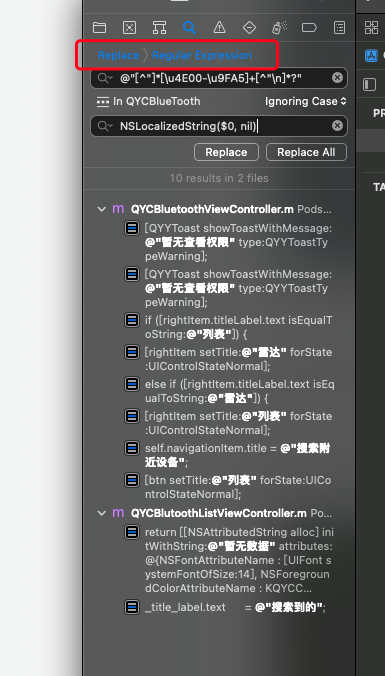

如图：修改项目搜索为替换，选择正则匹配，然后添加

OC

```objectivec
@"[^"]*[\u4E00-\u9FA5]+[^"\n]*?"

NSLocalizedString($0, nil)
```

Swift

```swift
"[^"]*[\u4E00-\u9FA5]+[^"\n]*?"

NSLocalizedString($0, comment: "")
```

NSLocalizedString可以使用你项目中自定义的宏或者其他函数等


## 注意点2

另一种生成Strings File文件的方法（个人比较推荐）

**前提：** **当所有的.m文件都使用** **NSLocalizedString（或者是自定义的宏或者方法）** **修改好之后，就可以动用** **genstrings** **工具了**

1. 启动终端，进入工程所在目录。
2. 新建需要支持的语言.lproj 文件夹，位置默认放在项目根目录下 目录名会作用到Localizable.strings文件对应的语言，所以目录名称不能写错了。

```objectivec
//第一步，创建语.lproj文件夹（下面以创建英文为例，其他语言同样操作）
mkdir en.lproj

// 第二步 查找并生成对应的strings文件
//oc
find ./ -name "*.m" | xargs genstrings -o en.lproj
// swift
find ./ -name "*.swift" | xargs genstrings -o en.lproj

//宏定义或者对NSLocalizedString函数进行了封装的话，需要在命令后面添加上 -s 「宏定义或者封装的函数」
find ./ -name "*.m" | xargs genstrings -o en.lproj -s QYCLocalizedString
```

3、将生成的.Strings 文件整理到对应的目录后，可以拖拽到项目中去（就像拖拽OC文件一样），然后在Xcode右侧勾选上对应的语言

#### 补充

下面是genstrings命名的基本语法：

```
genstrings [-a] [-q] [-o <outputDir>] sourcefile
```

其中参数：

-a  在存在的文件后面追加内容

-q  关闭多个键/值对的警告

-o  指定输出目录

因此如果我们想输出到en.lproj目录，则代码如下：

```
genstrings -o en.lproj  *.m
```

这样就在en.lproj目录下面产生了Localizable.strings文件，需要注意的是上面的命令每次运行的时候都会覆盖Localizable.strings文件，如果内容不想覆盖可以使用-a参数，然后在文件中进行修改。

[
](https://blog.csdn.net/xiaofei125145/article/details/44175379)

## 注意点3

xib国际化也大概有三种方案：

第一种是建立多套xib，各个语言对应一套，注意代码中引用对应的xib（不建议）；

第二种是将xib上的写死文字的控件拖拽至代码区，使用代码进行国际化；

第三种如下：

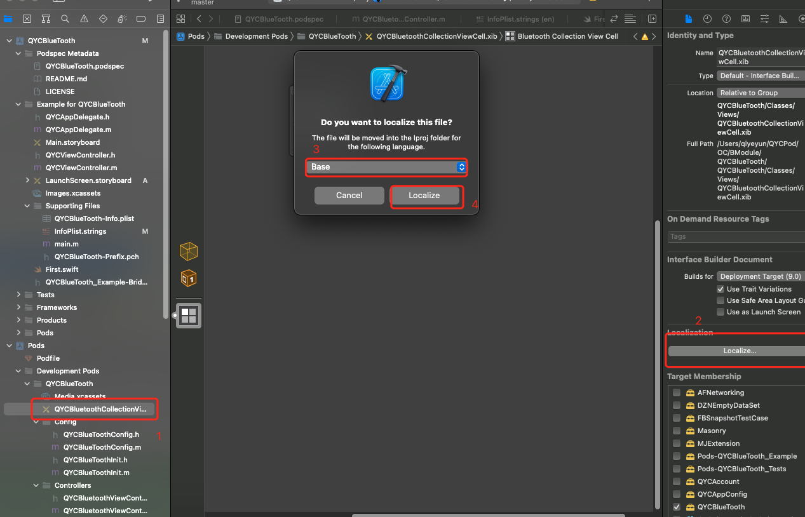

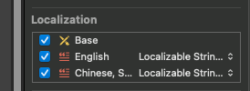

这种方式注意在加载xib时的代码使用:xib的名称需要变为 “语言.lproj/xib名称”：

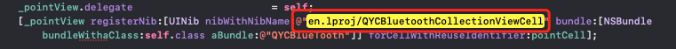

还需要注意的是xib增减文字控件后，对应的strings文件内容不会主动发送变化，需要自己去修改，还好，Xcode为我们提供了ibtool工具来生成Storyboard的strings文件。

```objectivec
ibtool [MyNib].xib --generate-strings-file [MyNib_new.strings]
```

但是ibtool生成的strings文件是BaseStoryboard的strings(默认语言的strings)，且会把我们原来的strings替换掉。所以我们要做的就是把新生成的strings与旧的strings进行冲突处理(新的附加上，删除掉的注释掉)，这一切可以用这个pythoy脚本来实现，见[AutoLocalization](https://github.com/onezens/AutoLocalization)


## 注意点4


本地化字符串参数顺序的问题，尤其是多参数时。

为了使多语言中语法通顺，必须要更改占位符对应的参数顺序，请看下面的例子。句子按照中文语法组织，注意en.lproj中的tip字段。

我们可以在%和@之间，加上1$,2$来指定参数的顺序。顺序是从1开始的。


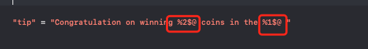


## 注意点5

脚本：

在 使用Xcode提供的正则替换了项目的汉字时，很多情况下时无法直接全部替换的，这就有可能部分没有替换，同时由于不同项目的写法不一样，正则也不一定都能识别出，这个时候可以使用以下脚本检测还有哪些未国际化[📎unLocalizable.py](https://www.yuque.com/attachments/yuque/0/2022/py/1296228/1647571399702-4c737831-d7ea-4fc8-9aa7-232a52360a4d.py)


国际化的时候难免会由于不小心，会出现某个 .strings 文件中存在没有添加的国际化字符串,可以使用以下脚本检测[📎checkLocalizable.py](https://www.yuque.com/attachments/yuque/0/2022/py/1296228/1647571147129-ab2c1351-e708-4dca-b046-a6f29e5714c2.py)


国际化的时候不小心会出现语法错误，如果国际化文件有几千行的时候，那就尴尬了，找死你。可以使用以下脚本定位到报错的代码行[📎localizableError.py](https://www.yuque.com/attachments/yuque/0/2022/py/1296228/1647571116377-3f583b65-3e90-4637-a642-d65baf7c6d87.py)


