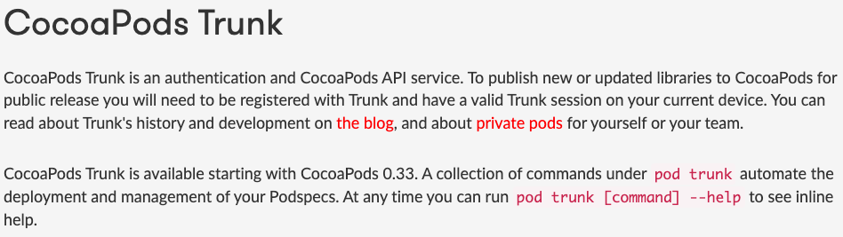
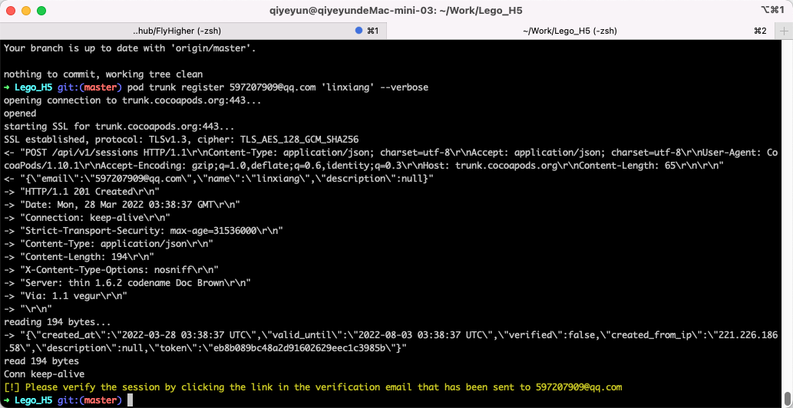
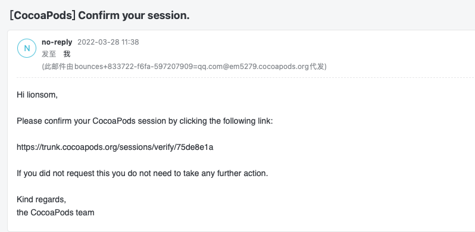
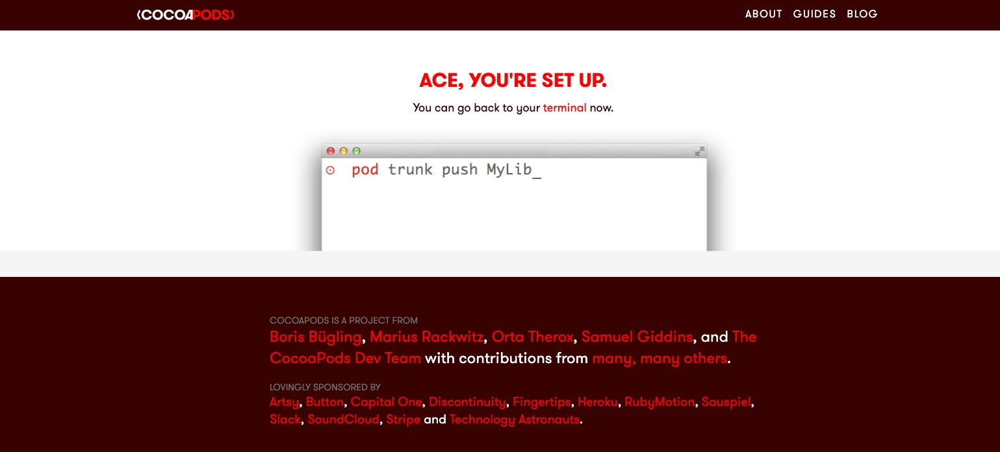

### [Build with CocoaPods](https://guides.cocoapods.org/making/index.html)

- [Making a CocoaPod](https://guides.cocoapods.org/making/making-a-cocoapod.html)
- [Using Pod Lib Create](https://guides.cocoapods.org/making/using-pod-lib-create.html)
- [Getting setup with Trunk](https://guides.cocoapods.org/making/getting-setup-with-trunk.html)
- [Development Pods](https://guides.cocoapods.org/making/development-cocoapods.html)
- [Private Pods](https://guides.cocoapods.org/making/private-cocoapods.html)
- [Specs and the Specs Repo](https://guides.cocoapods.org/making/specs-and-specs-repo.html)


#  CocoaPods Trunk



**什么是`CocoaPods Trunk`?**

> CocoaPods Trunk is an authentication and CocoaPods API service. 
>
> CocoaPods Trunk是一种身份验证和CocoaPods API服务。

**`CocoaPods Trunk`历史**

[CocoaPods Trunk](https://blog.cocoapods.org/CocoaPods-Trunk/)


# 如何发布？

> To publish new or updated libraries to CocoaPods for public release you will need to be registered with Trunk and have a valid Trunk session on your current device.


## 第一步：注册

> First sign up for an account with your email address. This begins a session on your current device.
>
> 首先使用您的电子邮件地址注册一个帐户。这将在当前设备上开始会话。
>
> Trunk accounts do not have passwords, only per-computer session tokens.
>
> Trunk帐户没有密码，只有每台计算机的会话令牌。

```shell
$ pod trunk register 597207909@qq.com 'linxiang' --verbose --description='macbook air'
```




## 第二步：确认session

> You must click a link in an email Trunk sends you to verify the connection between your Trunk account and the current computer. 
>
> 您必须单击 Trunk 发送给您的电子邮件中的链接，以验证您的 Trunk 帐户与当前计算机之间的连接。
>
> You can list your sessions by running `pod trunk me`.



**SUCCESS**




## 第三步：部署

> ### Deploying a library
>
> `pod trunk push [NAME.podspec]` will deploy your Podspec to Trunk and make it publicly available. You can also deploy Podspecs to your own private specs repo with `pod repo push REPO [NAME.podspec]`.
>
> Deploying with `push`:
>
> - Lints your Podspec locally. You can lint at any time with `pod spec lint [NAME.podspec]`
> - A successful lint pushes your Podspec to Trunk or your private specs repo
> - Trunk will publish a canonical JSON representation of your Podspec
>
> Trunk will also post a web hook to other services alerting them of a new CocoaPod, for example [CocoaDocs.org](http://cocoadocs.org/) and [@CocoaPodsFeed](https://twitter.com/cocoapodsfeed).


### 创建.podspec

```shell
# 创建 .podspec文件
$ pod spec create MyLibrary

# 创建 项目
$ pod lib create MyLibrary
```


