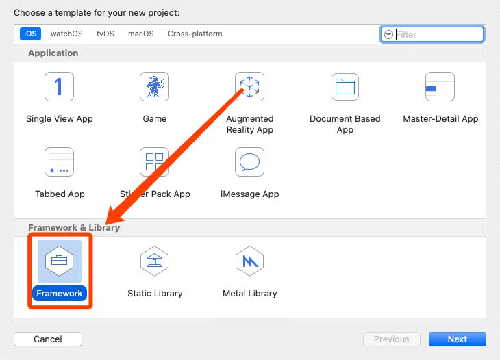
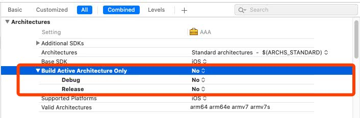
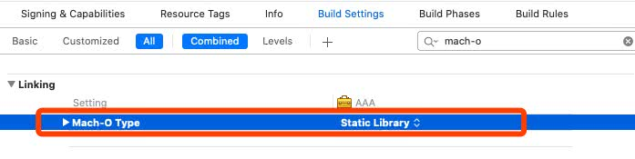
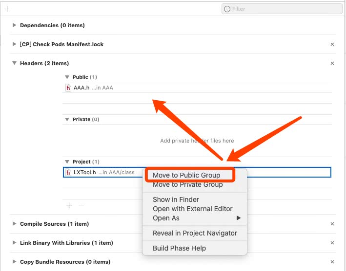
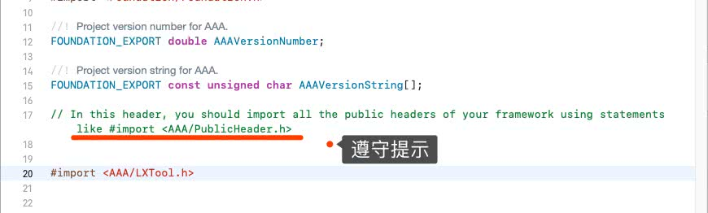
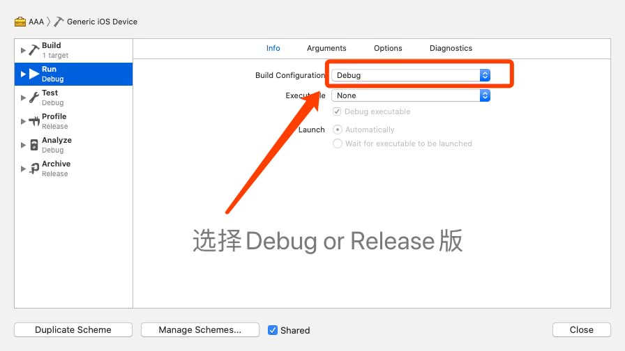
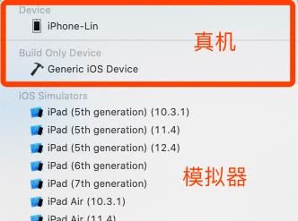
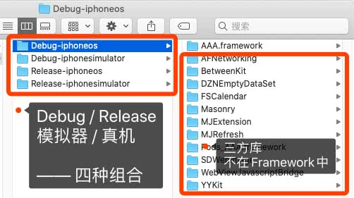
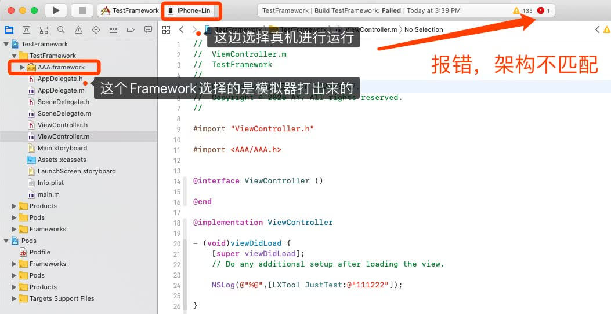

# 前言

- **dynamic_library**：动态库，Xcode 7 之前扩展名为 .dylib， Xcode 7 后是 .tbd ；目前官方环境并不允许为 iOS 平台添加这种类型。
- **static_library**：静态库，扩展名 .a
- **static_framework**：静态库，扩展名 .framework
- **dynamic_framework**：动态库，扩展名 .framework


> .a 与 .framework 的区别是：Framework 是分层目录，它将共享资源（例如动态共享库，nib 文件，图像文件，本地化字符串，头文件和参考文档）封装在一个程序包中。动态库与静态库的区别是：系统根据需要将动态库加载到内存中，可以被多个应用程序同时访问，并在所有可能的应用程序之间共享资源的一份副本。静态库则是链接到某个应用程序的二进制中。


额外补充：

​		iOS8之前，苹果只允许发布静态库，彼时cocoapods只支持静态库，但是在iOS8苹果推出了 [APP Extension](https://developer.apple.com/library/content/documentation/General/Conceptual/ExtensibilityPG/index.html) 的概念,可以对项目进行扩展，因为APP Extension和主项目是两个独立的进程,为了共享代码,苹果允许我们创建动态库,即 `dynamic framework` 。


[细说iOS静态库和动态库](https://juejin.cn/post/6844904031937101838)

区别：


# 一、自制简单的Framework

```
armv6｜armv7｜armv7s｜arm64|arm64e 都是ARM处理器的指令集
i386｜x86_64 是Mac处理器的指令集

指令集对应的机型：
2018 A12芯片arm64e ： iphone XS、 iphone XS Max、 iphoneXR
2017 A11芯片arm64： iPhone 8, iPhone 8 Plus, and iPhone X
2016 A10芯片arm64：iPhone 7 , 7 Plus, iPad (2018)
2015 A9芯片arm64： iPhone 6S , 6S Plus 
2014 A8芯片arm64： iPhone 6 , iPhone 6 Plus
2013 A7芯片arm64： iPhone 5S
armv7s：iPhone5｜iPhone5C｜iPad4(iPad with Retina Display)
armv7：iPhone4｜iPhone4S｜iPad｜iPad2｜iPad3(The New iPad)｜iPad mini｜iPod Touch 3G｜iPod Touch4
armv6: iPhone、iPhone 2、iPhone 3G、iPod Touch(第一代)、iPod Touch(第二代)


模拟器32位处理器测试需要i386架构，
模拟器64位处理器测试需要x86_64架构，
真机32位处理器需要armv7,或者armv7s架构，
真机64位处理器需要arm64架构。
```


### 1.1、创建项目




### 1.2、支持所有模拟器机型 / 真机机型架构

设置 `Build Active Architecture Only 设为 NO`，意思是当前打包的`.framework`支持所有的设备，否则打包时只能用当前版本的模拟器或真机运行。




### 1.3、终端查看静态库所支持的架构

```
$ lipo -info xxx.framework
```


### 1.4、设置Framework为静态库

默认打出来的是动态库




### 1.5、将头文件暴露出去，供外界使用




### 1.6、在头文件中导入所有公开的头文件




### 1.7、选择Debug / Release环境




### 1.8、选择模拟器 / 真机环境




### 1.9、查看导出的Framework




### 2.0、导入新项目测试

由于CocoaPods导入的三方并没有打包到我们的Framework中，所以新项目中，需要使用CocoaPods导入基础库，否则Framework会缺少引用文件。


我们导出的Framework分为模拟器与真机，所以导入到项目里面也只能选择对应的机型。




### 2.1、合并模拟器和真机的Framework

为了解决上述Framework分为模拟器与真机的问题，此处将类进行合并。


