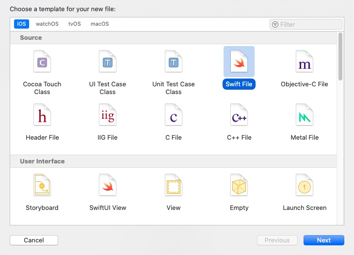
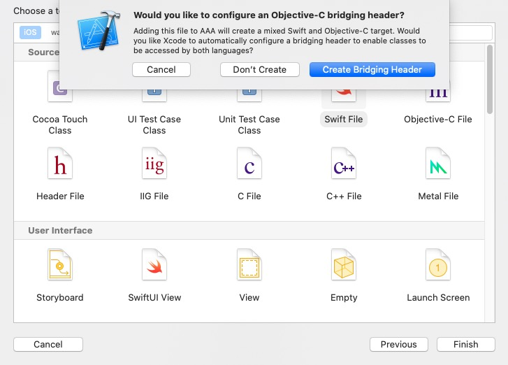
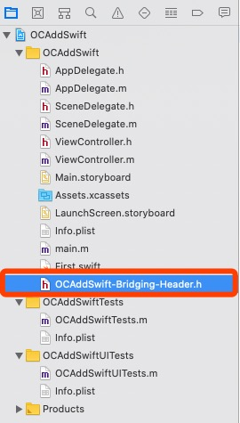
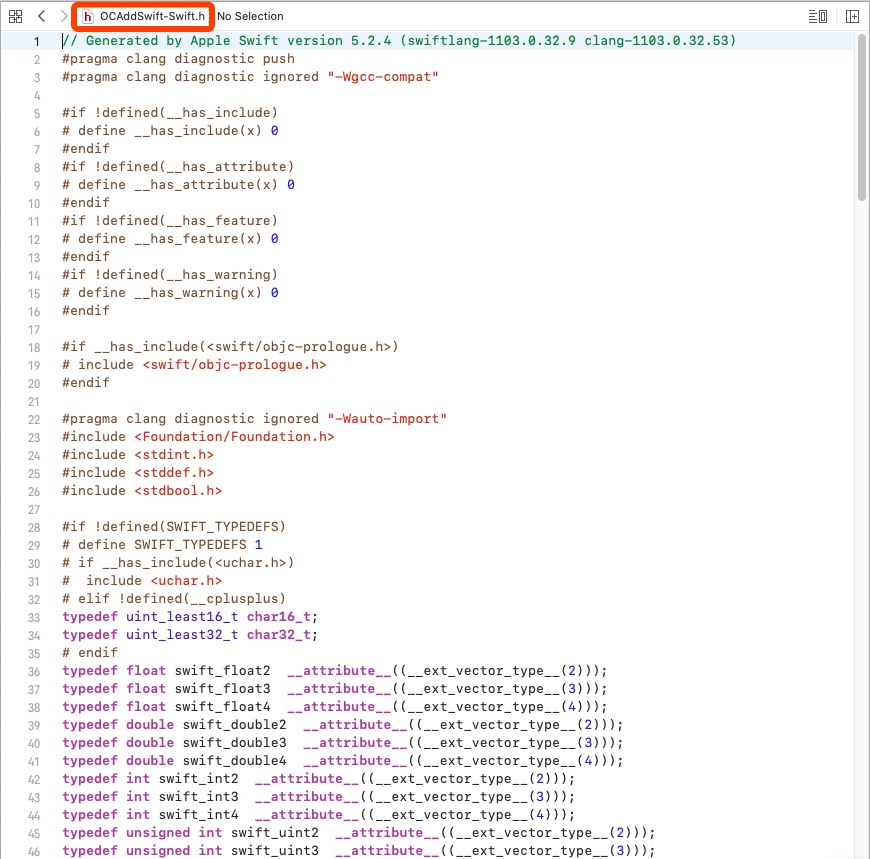
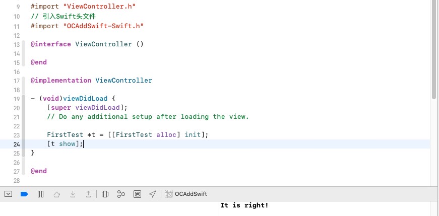
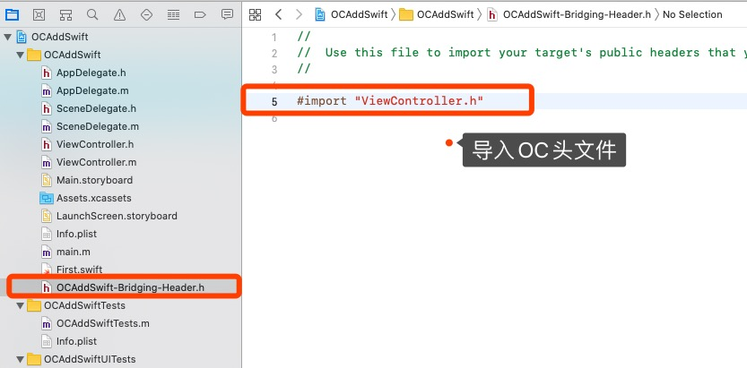

[Swift与OC混编过程中的配置](https://juejin.im/post/5d5a399a6fb9a06af50fca2b)

# 一、OC项目新增Swift

## 1、建立桥接文件

在OC项目中新建Swift文件，会弹出提示，选择 `Create Bridging Header` 建立桥接文件，系统会建立 `“工程名-Bridging-Header.h”`。

## 2、项目配置

首先，在工程的 `Build Settings` 中把 `defines module` 设为 `YES`.

然后，把 `product module name` 设置为**项目工程的名字**。 (系统会自动为我们设置好)

我们再来看一下在这个宿主工程中，OC类中访问Swift，在工程配置的Build Settings中搜索Swift Compiler，可以看到Swift与OC混编的两个配置文件：

**此时系统会为工程创建一个“工程名-Swift.h”的文件(不会显示出来,可以引用)，此文件不可手动创建，必须使用系统创建的** ，此时我们在想要访问Swift方法的OC类中导入ProductName-Swift.h（手动输入没有提示，并且在编译之前报红），然后编译一下，再进入查看源文件：

在想要访问Swift方法的OC类中导入ProductName-Swift.h（手动输入没有提示，并且在编译之前报红），然后编译一下，再进入查看源文件：

## 3、验证

### 1. OC类调用Swift方法

> 1. Swift类中，凡是允许OC访问的方法，方法前都要加@objc；
> 2. Swift类中用public修饰过的方法，才会出现在ProductName-Swift.h文件中；
> 3. 所有Swift类在ProductName-Swift.h文件都会被自动注册，以会自动@interface修饰，ProductName-Swift.h文件会自动更新。

**调用**

### 2. Swift类调用OC方法

**调用**

