[深入浅出iOS编译](https://juejin.im/post/5c22eaf1f265da611b5863b2)

[深入iOS系统底层之静态库](https://juejin.im/post/5c63906ff265da2ddd4a3fc0)


# 一、『编译型』和『解释型』语言

* 计算机高级语言主要有『编译型』和『解释型』；

* 如Objective C、C++等都是`编译语言`。编译语言在执行的时候，必须先通过`编译器`生成机器码，机器码可以直接在CPU上执行，所以执行效率较高；

* 如JavaScript、Python都是`直译式语言`。直译式语言不需要经过编译的过程，而是在执行的时候通过一个中间的`解释器`将代码解释为CPU可以执行的代码。所以，较编译语言来说，直译式语言效率低一些，但是编写的更灵活，也就是为啥JS大法好；

* Java语言是这两种的结合

  ```
  源文件(*.java) -> Java编译器(javac) -> 字节码文件(*.class) -> JRE[类装载器 -> 字节码校验 -> 解释器] -> 系统平台
  ```


## 1.1、编译过程

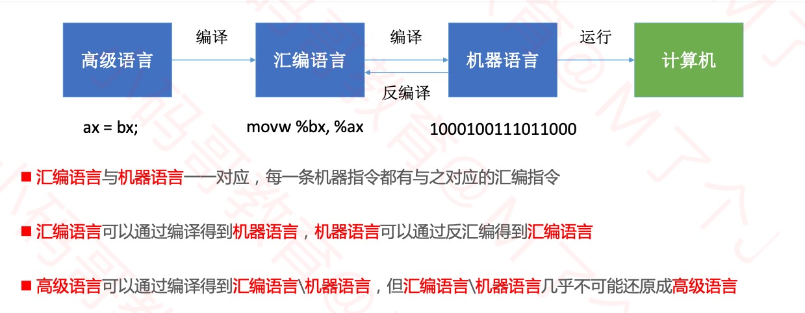


## 1.2、编译器

> 把一种编程语言(原始语言)转换为另一种编程语言(目标语言)的程序叫做[编译器](https://en.wikipedia.org/wiki/Compiler)。
>
> 主要是把 高级编程语言 转向 低级语言。


# 二、GCC + Clang + LLVM

[GCC - Wiki](https://zh.wikipedia.org/wiki/GCC)

[Clang - Wiki](https://zh.wikipedia.org/wiki/Clang)

[LLVM - Wiki](https://zh.wikipedia.org/wiki/LLVM)

[LLDB - Org](https://lldb.llvm.org/use/tutorial.html)


## 2.1、历史

* 老版本Xcode中

  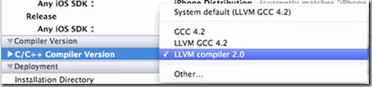

* 新版本Xcode中

  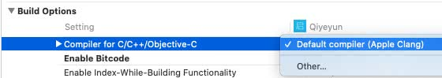

* 历史总览

  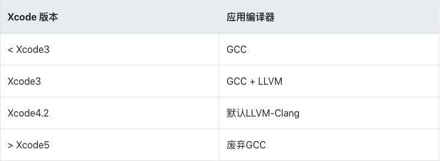


## 2.2、GCC

GCC（GNU Compiler Collection，GNU编译器套装），是一套由 GNU 开发的编程语言编译器。它是一套以 GPL 及 LGPL 许可证所发行的自由软件，也是 GNU计划的关键部分，亦是自由的类Unix及苹果电脑 Mac OS X 操作系统的标准编译器。
GCC 原名为 GNU C 语言编译器，因为它原本只能处理 C语言。GCC 很快地扩展，变得可处理 C++。之后也变得可处理 Fortran、Pascal、Objective-C、Java, 以及 Ada与其他语言。


## 2.3、LLVM
LLVM 是 **底层虚拟机**（Low Level Virtual Machine）的简称，这个库提供了与编译器相关的支持，能够进行程序语言的编译期优化、链接优化、在线编译优化、代码生成。简而言之，可以作为多种语言编译器的后台来使用。如果这样还比较抽象的话，介绍下 Clang 就知道了：Clang 是一个 C++ 编写、基于 LLVM、发布于 LLVM BSD 许可证下的 C/C++/Objective C/Objective C++ 编译器，其目标（之一）就是超越 GCC。


## 2.4、Clang

**Clang** 是一个[C](https://zh.wikipedia.org/wiki/C語言)、[C++](https://zh.wikipedia.org/wiki/C%2B%2B)、[Objective-C](https://zh.wikipedia.org/wiki/Objective-C)和[Objective-C++](https://zh.wikipedia.org/wiki/Objective-C%2B%2B)编程语言的[编译器](https://zh.wikipedia.org/wiki/編譯器)前端。它采用了[LLVM](https://zh.wikipedia.org/wiki/LLVM)作为其后端。它的目标是提供一个[GNU编译器套装](https://zh.wikipedia.org/wiki/GCC)（GCC）的替代品，支持了GNU编译器大多数的编译设置以及非官方语言的扩展。Clang项目包括Clang前端和Clang静态分析器等。

这个软件项目在2005年由[苹果电脑](https://zh.wikipedia.org/wiki/蘋果電腦)发起，是[LLVM](https://zh.wikipedia.org/wiki/LLVM)编译器工具集的前端（front-end），目的是输出代码对应的抽象语法树（Abstract Syntax Tree, AST），并将代码编译成LLVM Bitcode。接着在后端（back-end）使用LLVM编译成平台相关的[机器语言](https://zh.wikipedia.org/wiki/機器語言) 。Clang支持C、C++、Objective C。


## 2.5、LLDB

GCC有个强大的诊断工具——GDB，相对应的Clang下纠错工具就是LLDB。对于LLDB大家应该都不陌生，它继承了GDB的优点，弥补GDB的不足。iOS开发者从gbd过渡到lldb没有任何不适应感，最直白的原因就是lldb和gdb常用的命令很多都是一样的，例如常用的po等。


## 2.6、相互关系

基于LLVM，又衍生出了一些强大的子项目，其中iOS开发者耳熟能详的是：[Clang](http://clang.llvm.org/)和[LLDB](http://lldb.llvm.org/)。


# 三、Xcode编译

大多数编译器由两部分组成：前端和后端。

- 前端（Frontend）：负责 `词法分析`、`语法分析`、`生成中间代码(intermediate representation, IR)`，在这个过程中，会进行类型检查，如果发现错误或者警告会标注出来在哪一行；
- 优化器（Optimizer）：以中间代码（IR）作为输入，对中间代码进行架构无关的优化，提高运行效率，减少代码体积，例如删除 if (0) 无效分支；
-  后端（Backend）：根据不同的系统架构把中间代码（IR）转换成目标平台的机器码。 

> 前后端依赖统一格式的中间代码(IR)，使得前后端可以独立的变化。新增一门语言只需要修改前端，而新增一个CPU架构只需要修改后端即可。

Objective C/C/C++使用的编译器前端是[clang](https://clang.llvm.org/docs/index.html)，swift是[swift](https://swift.org/compiler-stdlib/#compiler-architecture)，后端都是[LLVM](https://llvm.org/)。

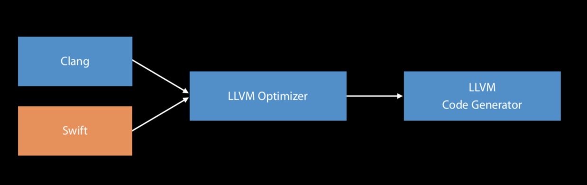


**Clang 的编译过程有这几个阶段：**

>  ➜  clang -ccc-print-phases main.m 
>
> 0: input, "main.m", objective-c 
>
> 1: preprocessor, {0}, objective-c-cpp-output 
>
> 2: compiler, {1}, ir 
>
> 3: backend, {2}, assembler 
>
> 4: assembler, {3}, object 
>
> 5: linker, {4}, image 
>
> 6: bind-arch, "x86_64", {5}, image 

***1）预处理：***

这阶段的工作主要是头文件导入，宏展开/替换，预编译指令处理，以及注释的去除。

***2）编译：***

这阶段做的事情比较多，主要有：

>  a. 词法分析（Lexical Analysis）：将代码转换成一系列 token，如大中小括号 paren'()' square'[]' brace'{}'、标识符 identifier、字符串 string_literal、数字常量 numeric_constant 等等； 
>
> b. 语法分析（Semantic Analysis）：将 token 流组成抽象语法树 AST；
>
> c. 静态分析（Static Analysis）：检查代码错误，例如参数类型是否错误，调用对象方法是否有实现； 
>
> d. 中间代码生成（Code Generation）：将语法树自顶向下遍历逐步翻译成 LLVM IR。 

***3）生成汇编代码：***

LLVM 将 LLVM IR 生成当前平台的汇编代码，期间 LLVM 根据编译设置的优化级别 Optimization Level 做对应的优化（Optimize），例如 Debug 的 -O0 不需要优化，而 Release 的 -Os 是尽可能优化代码效率并减少体积。

***4）生成目标文件：***

汇编器（Assembler）将汇编代码转换为机器代码，它会创建一个目标对象文件，以 .o 结尾。

***5）链接：***

链接器（Linker）把若干个目标文件链接在一起，生成可执行文件。


## 3.1、流程图

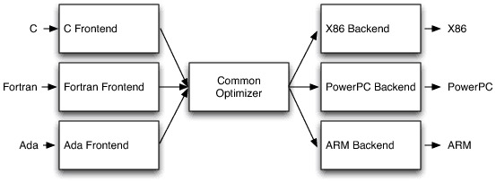

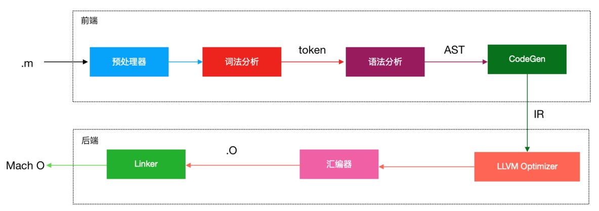


**后端：LVVM优化器会进行BitCode的生成，链接期优化等等**。

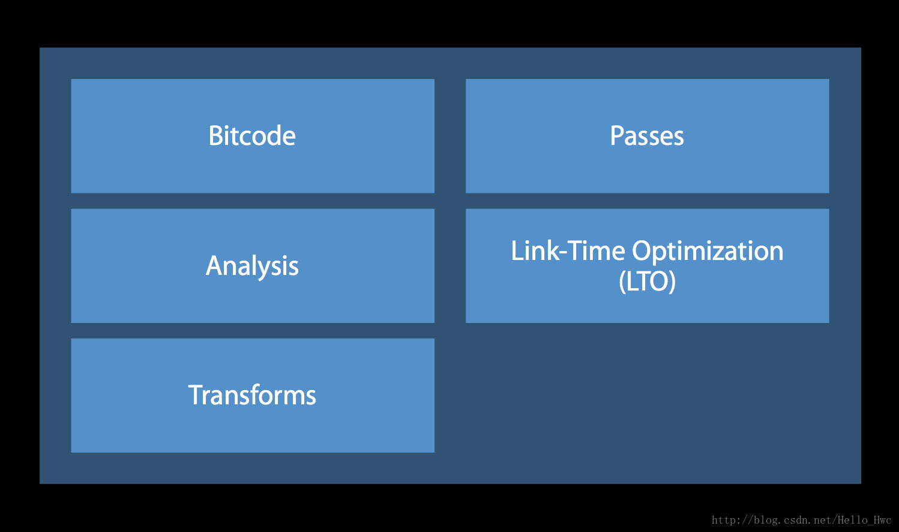

**后端：LLVM机器码生成器会针对不同的架构，比如arm64等生成不同的机器码**。

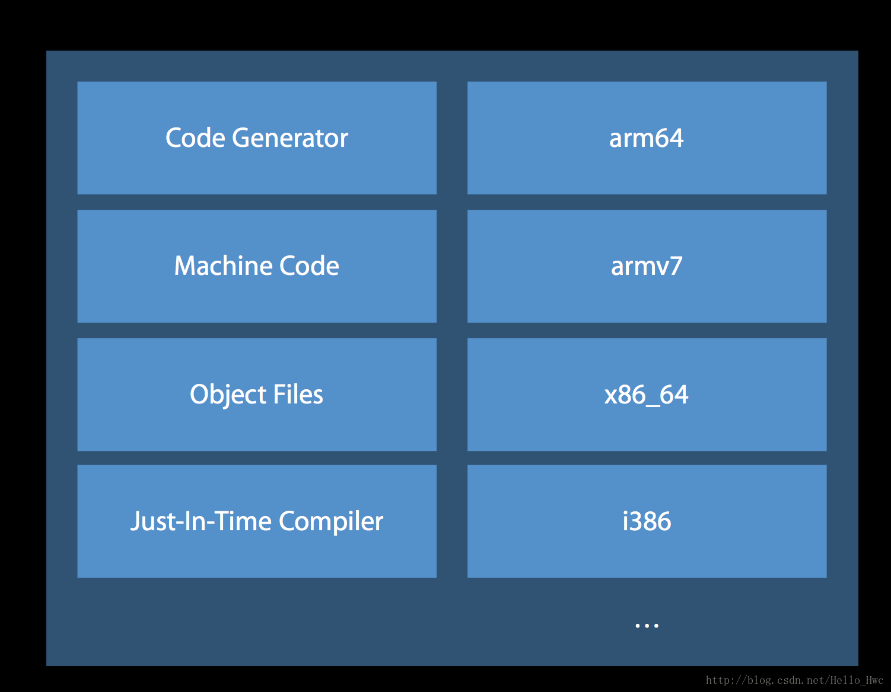


# 四、实战

## 4.1. `__attribute__`

> `__attribtue__` 是一个高级的的编译器指令，它允许开发者指定更更多的编译检查和一些高级的编译期优化。
>
> 分为三种：
>
> - 函数属性 （Function Attribute）
> - 类型属性 (Variable Attribute )
> - 变量属性 (Type Attribute )


搜索项目中的 `__attribute__`，发现了如下使用：

```
@property (nonatomic, copy) NSString *appKey __attribute__((deprecated("此属性已被弃用，替换方式请参考最新 https://www.dokit.cn/ 的使用手册")));
```


在三方库中最常见的，声明一个属性或者方法在当前版本弃用了

```
// SDWebImage库中
@property (nonatomic, assign) BOOL shouldUseCredentialStorage __deprecated_msg("Property deprecated. Does nothing. Kept only for backwards compatibility");
```

进入 `__deprecated_msg` 发现，是对 `__attribute__` 的封装。

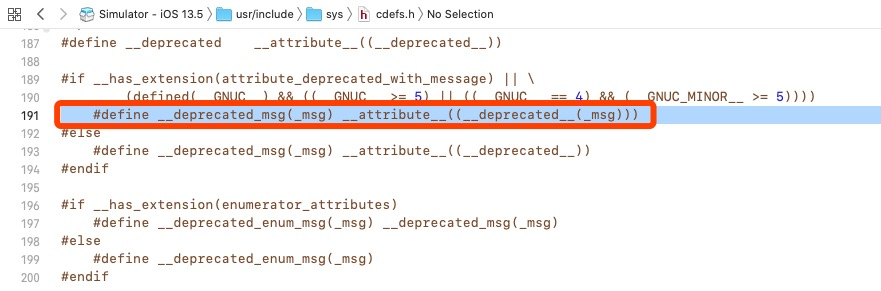


列举几个常用

```
//弃用API，用作API更新
#define __deprecated	__attribute__((deprecated)) 

//带描述信息的弃用
#define __deprecated_msg(_msg) __attribute__((deprecated(_msg)))

//遇到__unavailable的变量/方法，编译器直接抛出Error
#define __unavailable	__attribute__((unavailable))

//告诉编译器，即使这个变量/方法 没被使用，也不要抛出警告
#define __unused	__attribute__((unused))

//和__unused相反
#define __used		__attribute__((used))

//如果不使用方法的返回值，进行警告
#define __result_use_check __attribute__((__warn_unused_result__))

//OC方法在Swift中不可用
#define __swift_unavailable(_msg)	__attribute__((__availability__(swift, unavailable, message=_msg)))
```


## 4.2. Clang警告处理

```
#pragma clang diagnostic push
#pragma clang diagnostic ignored "-Wundeclared-selector"
///代码
#pragma clang diagnostic pop

// 这段代码作用
1.对当前编译环境进行压栈
2.忽略-Wundeclared-selector（未声明的）Selector警告
3.编译代码
4.对编译环境进行出栈

// 常用举例
-Wdeprecated-declarations - retain cycle
-Wincompatible-pointer-types - 不兼容指针类型
-Wdeprecated-declarations - 方法启用告警
--Wunused-variable - 未使用变量
-Wundeclared-selector - sel中使用了不存在的方法名
```


## 4.3. 提高项目编译速度

* forward declaration

  所谓`forward declaration`，就是`@class CLASSNAME`，而不是`#import CLASSNAME.h`。这样，编译器能大大提高#import的替换速度。

* 对常用的工具类进行打包（Framework/.a）

* 常用头文件放到预编译文件里

  XCode的pch文件是预编译文件，这里的内容在执行XCode build之前就已经被预编译，并且引入到每一个.m文件里了。

* Debug模式下，不生成dsym文件

  上文提到了，dysm文件里存储了调试信息，在Debug模式下，我们可以借助XCode和LLDB进行调试。所以，不需要生成额外的dsym文件来降低编译速度。

  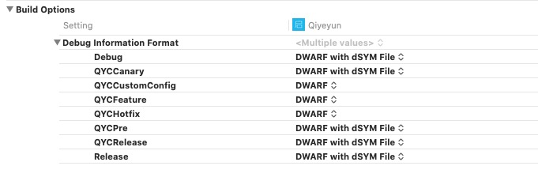

* Debug开启`Build Active Architecture Only`，Debug 时是不需要生成全架构

  在XCode -> Build Settings -> Build Active Architecture Only 改为YES。这样做，可以只编译当前的版本，比如arm7/arm64等等，记得只开启Debug模式。这个选项在高版本的XCode中自动开启了。

  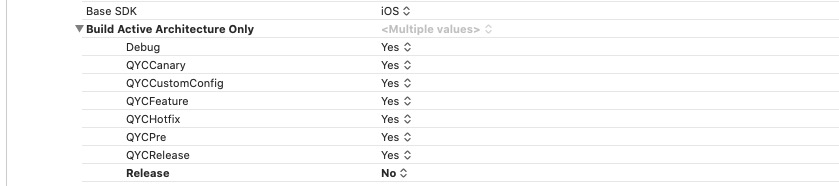

* Debug模式下，关闭编译器优化

  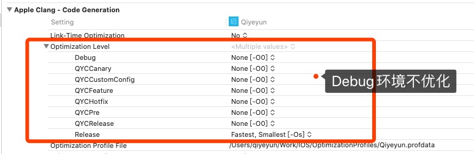

* 优化头文件搜索路径：

  避免工程 Header Search Paths 设置了路径递归引用：

  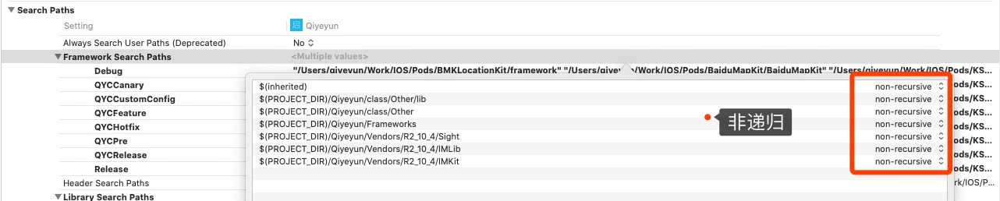


# 五、获取耗时报告

## 5.1. 显示Xcode编译耗时

关闭Xcode，执行以下命令显示编译时间，然后重启Xcode即可

```
$ defaults write com.apple.dt.Xcode ShowBuildOperationDuration YES
```

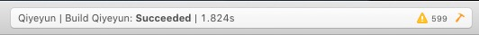


### 5.2、下载LLVM

使用brew安装

```
➜ brew install llvm
.....


```


/usr/local/opt/llvm


# 六、LLDB使用

## 6.1、断点

### 1.1、普通断点

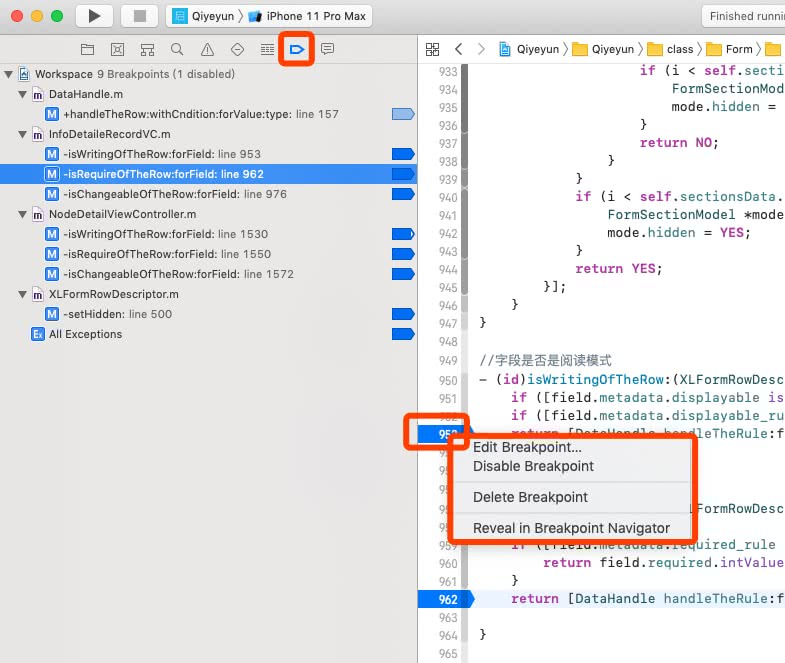

### 1.2、条件断点

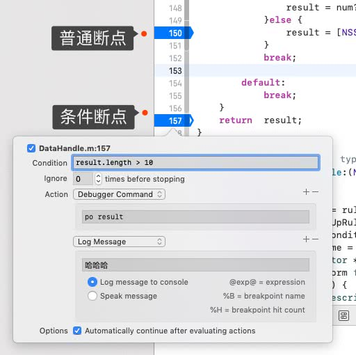

### 1.3、全局断点

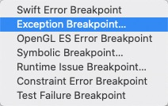

#### 1. Swift Error Breakpoint

​		Swift 全局断点，和 Exception Breakpoint 断点类似。

#### 2. Exception Breakpoint

​		Objective-C 全局断点。

#### 3. OpenGL ES Error Breakpoint

​		OpenGL是用于2D/3D图形编程的一套基于C语言的统一接口，在桌面windows，Mac，Linux/Unix上均可兼容。OpenGL ES是在OpenGL嵌入式设备上面的版本，也就是安卓/iPhone，其他嵌入式等移动设备的编程规范。（除此之外，在web上也有相应的WebGL）

​		现在在iOS平台上目前支持的OpenGL版本有 `OpenGL1.0/OpenGL2.0/OpenGL3.0`，在使用 cocoa 框架中 OpenGL 类库绘制 2D/3D 图像时，可以使用该选项添加断点。

#### 4. Symbolic Breakpoint

​		符号断点（Symbolic Breakpoint）是全局断点，可以针对某一个方法（函数）设置断点。开发者可以很方便地创建一个符号断点，如下图：


​		在项目中所有名称为 `btn_leftClick` 的函数处， 将会自动添加断点。

**实战**：处理Masonry警告：[LayoutConstraints] Unable to simultaneously satisfy constraints. 

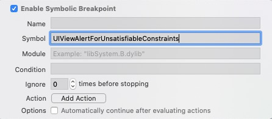

#### 5. Constraint Error Breakpoint

​		添加断点之后，使用 Autolayout 故意设置约束冲突，没有打印任何效果。这种断点类型，使用较少。

#### 6. Test Failure Breakpoint

​		单元测试全局断点。添加后，在单元测试 XCAssert 断言失败时，停留在函数处。此时可以用 lldb 命令 p 强制修改条件满足断言后，继续调试运行。


## 6.2、Console(lldb 命令)

[ObjC中国 -  **调试：案例学习**](https://objccn.io/issue-19-1/)

### 1. 检查视图层次结构

* `po [[UIWindow keyWindow] recursiveDescription];`

```
(lldb) po [[UIWindow keyWindow] recursiveDescription];
<UIWindow: 0x7f912540fff0; frame = (0 0; 414 896); gestureRecognizers = <NSArray: 0x6000002a3060>; layer = <UIWindowLayer: 0x600000c86320>>
   | <UITransitionView: 0x7f9127220430; frame = (0 0; 414 896); autoresize = W+H; layer = <CALayer: 0x600000c4a9a0>>
   |    | <UIDropShadowView: 0x7f9127220bd0; frame = (0 0; 414 896); clipsToBounds = YES; autoresize = W+H; layer = <CALayer: 0x600000c4ad60>>
   |    |    | <UILayoutContainerView: 0x7f9127105d80; frame = (0 0; 414 896); autoresize = W+H; layer = <CALayer: 0x600000c8dc40>>
   |    |    |    | <UITransitionView: 0x7f912540d7d0; frame = (0 0; 414 896); clipsToBounds = YES; autoresize = W+H; layer = <CALayer: 0x600000c1d900>>
   |    |    |    |    | <UIViewControllerWrapperView: 0x7f912711c460; frame = (0 0; 414 896); autoresize = W+H; layer = <CALayer: 0x6000006584c0>>
   |    |    |    |    |    | <UILayoutContainerView: 0x7f9125408280; frame = (0 0; 414 896); clipsToBounds = YES; autoresize = W+H; gestureRecognizers = <NSArray: 0x6000002d0000>; layer = <CALayer: 0x600000ca9180>>
   |    |    |    |    |    |    | <UINavigationTransitionView: 0x7f9125715f60; frame = (0 0; 414 896); clipsToBounds = YES; autoresize = W+H; layer = <CALayer: 0x600000c950c0>>
   |    |    |    |    |    |    |    | <UIViewControllerWrapperView: 0x7f9127169fb0; frame = (0 0; 414 896); autoresize = W+H; layer = <CALayer: 0x600000658160>>
   |    |    |    |    |    |    |    |    | <UIView: 0x7f9125441070; frame = (0 0; 414 896); autoresize = W+H; layer = <CALayer: 0x600000c75540>>
   |    |    |    |    |    |    |    |    |    | <UITableView: 0x7f912589c000; frame = (0 0; 414 896); clipsToBounds = YES; gestureRecognizers = <NSArray: 0x6000002c8ab0>; layer = <CALayer: 0x600000c77e40>; contentOffset: {0, -88}; contentSize: {414, 70.000100000000003}; adjustedContentInset: {88, 0, 83, 0}; dataSource: <DiscoverViewController: 0x7f912571c530>>
   |    |    |    |    |    |    |    |    |    |    | <SettingCell: 0x7f9127860800; baseClass = UITableViewCell; frame = (0 0.0001; 414 50); text = '工作圈'; autoresize = W; layer = <CALayer: 0x600000600700>>
   |    |    |    |    |    |    |    |    |    |    |    | <UITableViewCellContentView: 0x7f9127038f20; frame = (0 0; 359 50); gestureRecognizers = <NSArray: 0x600001ef01b0>; layer = <CALayer: 0x600000600bc0>>
   |    |    |    |    |    |    |    |    |    |    |    |    | <UIView: 0x7f9127007fa0; frame = (0 50; 414 0.333333); layer = <CALayer: 0x600000600f40>>
   |    |    |    |    |    |    |    |    |    |    |    |    | <UIView: 0x7f9127034d10; frame = (0 0; 414 0.333333); layer = <CALayer: 0x600000601040>>
   |    |    |    |    |    |    |    |    |    |    |    |    | <UIImageView: 0x7f9127043380; frame = (10 10; 30 30); opaque = NO; userInteractionEnabled = NO; layer = <CALayer: 0x6000006011a0>>
   |    |    |    |    |    |    |    |    |    |    |    |    | <UITableViewLabel: 0x7f9127005e10; frame = (57 14.8333; 52 20.3333); text = '工作圈'; userInteractionEnabled = NO; layer = <_UILabelLayer: 0x600002c34000>>
   |    |    |    |    |    |    |    |    |    |    |    |    |    | <_UILabelContentLayer: 0x600000602760> (layer)
   |    |    |    |    |    |    |    |    |    |    |    |    | <UIImageView: 0x7f9127011d30; frame = (329 5; 50 50);
.......
.......
```


* `po [[[UIWindow keyWindow] rootViewController] _printHierarchy];`

类似于检查视图层次，我们也可以用 `po [[[UIWindow keyWindow] rootViewController] _printHierarchy];` 来检查视图控制器。这是一个苹果默默在 iOS 8 中为 `UIViewController` 添加的[私有辅助方法](https://github.com/nst/iOS-Runtime-Headers/blob/a8f9f7eb4882c9dfc87166d876c547b75a24c5bb/Frameworks/UIKit.framework/UIViewController.h#L365) 。

```
(lldb) po [[[UIWindow keyWindow] rootViewController] _printHierarchy];
<TabBarController 0x7f9125838c00>, state: appeared, view: <UILayoutContainerView 0x7f9127105d80>
   | <NavigationViewController 0x7f9128883c00>, state: disappeared, view: <UILayoutContainerView 0x7f91270136c0> not in the window
   |    | <ConversationListViewController 0x7f912712e490>, state: disappeared, view: <UIView 0x7f91254b47f0> not in the window
   | <NavigationViewController 0x7f9128049a00>, state: disappeared, view: <UILayoutContainerView 0x7f9127229cc0> not in the window
   |    | <QYCNewAppCenterController 0x7f9127227cc0>, state: disappeared, view: <UIView 0x7f912543c2b0> not in the window
   | <NavigationViewController 0x7f912888ea00>, state: disappeared, view: <UILayoutContainerView 0x7f9127132ea0> not in the window
   |    | <QYCPorTalViewController 0x7f91271326b0>, state: disappeared, view: <UIView 0x7f9127251930> not in the window
   | <NavigationViewController 0x7f9128087800>, state: disappeared, view: <UILayoutContainerView 0x7f912722d960> not in the window
   |    | <QYCPlatformRemindsMessageCenterListVC 0x7f912722cc30>, state: disappeared, view: <UIView 0x7f9127117250> not in the window
   | <NavigationViewController 0x7f912583a600>, state: appeared, view: <UILayoutContainerView 0x7f9125408280>
   |    | <DiscoverViewController 0x7f912571c530>, state: appeared, view: <UIView 0x7f9125441070>
```


LLDB 非常强大并且可以脚本化。 Facebook 发布了一组名为 [Chisel 的 Python 脚本集合](https://github.com/facebook/chisel) 为日常调试提供了非常多的帮助。`pviews` 和 `pvc` 等价于视图和视图控制器的层次打印。Chisel 的视图控制器树和上面方法打印的很类似，但是同时还显示了视图的尺寸。 我通常用它来检查[响应链](https://developer.apple.com/library/ios/documentation/EventHandling/Conceptual/EventHandlingiPhoneOS/event_delivery_responder_chain/event_delivery_responder_chain.html)，虽然你可以对你感兴趣的对象手动循环执行 `nextResponder`，或者[添加一个类别辅助方法](https://gist.github.com/n-b/5420684)，但输入 `presponder object` 依旧是迄今为止最快的方法。


## 6.3、[facebook - Chisel](https://github.com/facebook/chisel) -- LLDB命令插件

### 6.3.1. Installation

```
brew update
brew install chisel
```

if `.lldbinit` file doesn't exist you can create it & open it by tapping on the terminal

```
touch .lldbinit 
open .lldbinit 
```

Then add the following line to your `~/.lldbinit` file.

```
# ~/.lldbinit
...
command script import /usr/local/opt/chisel/libexec/fbchisellldb.py
```

Alternatively, download chisel and add the following line to your *~/.lldbinit* file.

```
# ~/.lldbinit
...
command script import /path/to/fbchisellldb.py
```

The commands will be available the next time `Xcode` starts.


