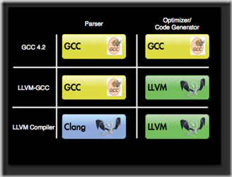

[深入浅出iOS编译](https://juejin.im/post/5c22eaf1f265da611b5863b2)


[深入iOS系统底层之静态库](https://juejin.im/post/5c63906ff265da2ddd4a3fc0)


# 一、『编译型』和『解释型』语言

* 计算机高级语言主要有『编译型』和『解释型』；

* 如Objective C、C++等都是`编译语言`。编译语言在执行的时候，必须先通过`编译器`生成机器码，机器码可以直接在CPU上执行，所以执行效率较高；

* 如JavaScript、Python都是`直译式语言`。直译式语言不需要经过编译的过程，而是在执行的时候通过一个中间的`解释器`将代码解释为CPU可以执行的代码。所以，较编译语言来说，直译式语言效率低一些，但是编写的更灵活，也就是为啥JS大法好；

* Java语言是这两种的结合

  ```
  源文件(*.java) -> Java编译器(javac) -> 字节码文件(*.class) -> JRE[类装载器 -> 字节码校验 -> 解释器] -> 系统平台
  ```


## 1.1、编译过程


## 1.2、编译器

> 把一种编程语言(原始语言)转换为另一种编程语言(目标语言)的程序叫做[编译器](https://en.wikipedia.org/wiki/Compiler)。
>
> 主要是把 高级编程语言 转向 低级语言。


# 二、GCC + Clang + LLVM

[GCC - Wiki](https://zh.wikipedia.org/wiki/GCC)

[Clang - Wiki](https://zh.wikipedia.org/wiki/Clang)

[LLVM - Wiki](https://zh.wikipedia.org/wiki/LLVM)

[LLDB - Org](https://lldb.llvm.org/use/tutorial.html)


## 2.1、历史

* 老版本Xcode中

  

* 新版本Xcode中

  

* 历史总览

  


## 2.2、GCC

GCC（GNU Compiler Collection，GNU编译器套装），是一套由 GNU 开发的编程语言编译器。它是一套以 GPL 及 LGPL 许可证所发行的自由软件，也是 GNU计划的关键部分，亦是自由的类Unix及苹果电脑 Mac OS X 操作系统的标准编译器。
GCC 原名为 GNU C 语言编译器，因为它原本只能处理 C语言。GCC 很快地扩展，变得可处理 C++。之后也变得可处理 Fortran、Pascal、Objective-C、Java, 以及 Ada与其他语言。


## 2.3、LLVM
LLVM 是 **底层虚拟机**（Low Level Virtual Machine）的简称，这个库提供了与编译器相关的支持，能够进行程序语言的编译期优化、链接优化、在线编译优化、代码生成。简而言之，可以作为多种语言编译器的后台来使用。如果这样还比较抽象的话，介绍下 Clang 就知道了：Clang 是一个 C++ 编写、基于 LLVM、发布于 LLVM BSD 许可证下的 C/C++/Objective C/Objective C++ 编译器，其目标（之一）就是超越 GCC。


## 2.4、Clang

**Clang** 是一个[C](https://zh.wikipedia.org/wiki/C語言)、[C++](https://zh.wikipedia.org/wiki/C%2B%2B)、[Objective-C](https://zh.wikipedia.org/wiki/Objective-C)和[Objective-C++](https://zh.wikipedia.org/wiki/Objective-C%2B%2B)编程语言的[编译器](https://zh.wikipedia.org/wiki/編譯器)前端。它采用了[LLVM](https://zh.wikipedia.org/wiki/LLVM)作为其后端。它的目标是提供一个[GNU编译器套装](https://zh.wikipedia.org/wiki/GCC)（GCC）的替代品，支持了GNU编译器大多数的编译设置以及非官方语言的扩展。Clang项目包括Clang前端和Clang静态分析器等。

这个软件项目在2005年由[苹果电脑](https://zh.wikipedia.org/wiki/蘋果電腦)发起，是[LLVM](https://zh.wikipedia.org/wiki/LLVM)编译器工具集的前端（front-end），目的是输出代码对应的抽象语法树（Abstract Syntax Tree, AST），并将代码编译成LLVM Bitcode。接着在后端（back-end）使用LLVM编译成平台相关的[机器语言](https://zh.wikipedia.org/wiki/機器語言) 。Clang支持C、C++、Objective C。


## 2.5、LLDB

GCC有个强大的诊断工具——GDB，相对应的Clang下纠错工具就是LLDB。对于LLDB大家应该都不陌生，它继承了GDB的优点，弥补GDB的不足。iOS开发者从gbd过渡到lldb没有任何不适应感，最直白的原因就是lldb和gdb常用的命令很多都是一样的，例如常用的po等。


## 2.6、相互关系

基于LLVM，又衍生出了一些强大的子项目，其中iOS开发者耳熟能详的是：[Clang](http://clang.llvm.org/)和[LLDB](http://lldb.llvm.org/)。


# 三、Xcode编译

大多数编译器由两部分组成：前端和后端。

- 前端负责 `词法分析`、`语法分析`、`生成中间代码(intermediate representation, IR)`，在这个过程中，会进行类型检查，如果发现错误或者警告会标注出来在哪一行；
- 后端以中间代码（IR）作为输入，进行机器无关的代码优化，生成机器语言，并且进行机器相关的代码优化，根据不同的系统架构生成不同的机器码。

> 前后端依赖统一格式的中间代码(IR)，使得前后端可以独立的变化。新增一门语言只需要修改前端，而新增一个CPU架构只需要修改后端即可。

Objective C/C/C++使用的编译器前端是[clang](https://clang.llvm.org/docs/index.html)，swift是[swift](https://swift.org/compiler-stdlib/#compiler-architecture)，后端都是[LLVM](https://llvm.org/)。


## 3.1、流程图


**后端：LVVM优化器会进行BitCode的生成，链接期优化等等**。


**后端：LLVM机器码生成器会针对不同的架构，比如arm64等生成不同的机器码**。


# 四、实战

## 4.1. `__attribute__`

> `__attribtue__` 是一个高级的的编译器指令，它允许开发者指定更更多的编译检查和一些高级的编译期优化。
>
> 分为三种：
>
> - 函数属性 （Function Attribute）
> - 类型属性 (Variable Attribute )
> - 变量属性 (Type Attribute )


搜索项目中的 `__attribute__`，发现了如下使用：

```
@property (nonatomic, copy) NSString *appKey __attribute__((deprecated("此属性已被弃用，替换方式请参考最新 https://www.dokit.cn/ 的使用手册")));
```


在三方库中最常见的，声明一个属性或者方法在当前版本弃用了

```
// SDWebImage库中
@property (nonatomic, assign) BOOL shouldUseCredentialStorage __deprecated_msg("Property deprecated. Does nothing. Kept only for backwards compatibility");
```

进入 `__deprecated_msg` 发现，是对 `__attribute__` 的封装。


列举几个常用

```
//弃用API，用作API更新
#define __deprecated	__attribute__((deprecated)) 

//带描述信息的弃用
#define __deprecated_msg(_msg) __attribute__((deprecated(_msg)))

//遇到__unavailable的变量/方法，编译器直接抛出Error
#define __unavailable	__attribute__((unavailable))

//告诉编译器，即使这个变量/方法 没被使用，也不要抛出警告
#define __unused	__attribute__((unused))

//和__unused相反
#define __used		__attribute__((used))

//如果不使用方法的返回值，进行警告
#define __result_use_check __attribute__((__warn_unused_result__))

//OC方法在Swift中不可用
#define __swift_unavailable(_msg)	__attribute__((__availability__(swift, unavailable, message=_msg)))
```


## 4.2. Clang警告处理

```
#pragma clang diagnostic push
#pragma clang diagnostic ignored "-Wundeclared-selector"
///代码
#pragma clang diagnostic pop

// 这段代码作用
1.对当前编译环境进行压栈
2.忽略-Wundeclared-selector（未声明的）Selector警告
3.编译代码
4.对编译环境进行出栈

// 常用举例
-Wdeprecated-declarations - retain cycle
-Wincompatible-pointer-types - 不兼容指针类型
-Wdeprecated-declarations - 方法启用告警
--Wunused-variable - 未使用变量
-Wundeclared-selector - sel中使用了不存在的方法名
```


## 4.3. 提高项目编译速度

* forward declaration

  所谓`forward declaration`，就是`@class CLASSNAME`，而不是`#import CLASSNAME.h`。这样，编译器能大大提高#import的替换速度。

* 对常用的工具类进行打包（Framework/.a）

* 常用头文件放到预编译文件里

  XCode的pch文件是预编译文件，这里的内容在执行XCode build之前就已经被预编译，并且引入到每一个.m文件里了。

* Debug模式下，不生成dsym文件

  上文提到了，dysm文件里存储了调试信息，在Debug模式下，我们可以借助XCode和LLDB进行调试。所以，不需要生成额外的dsym文件来降低编译速度。

* Debug开启`Build Active Architecture Only`

  在XCode -> Build Settings -> Build Active Architecture Only 改为YES。这样做，可以只编译当前的版本，比如arm7/arm64等等，记得只开启Debug模式。这个选项在高版本的XCode中自动开启了。

* Debug模式下，关闭编译器优化

  