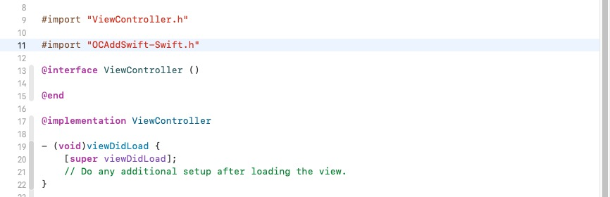
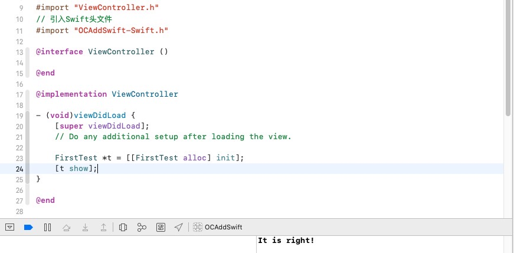
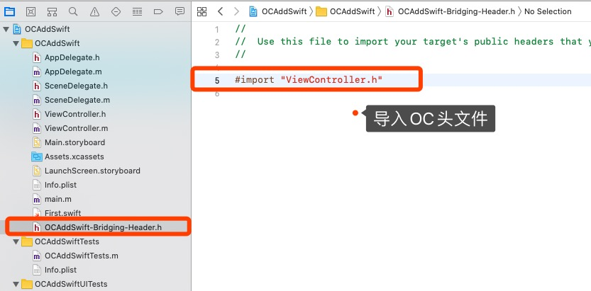

# 参考

[iOS 静态库和动态库](https://www.cnblogs.com/dins/p/ios-jing-tai-ku-he-dong-tai-ku.html)

[Swift与OC混编过程中的配置](https://juejin.im/post/5d5a399a6fb9a06af50fca2b)

[CocoaPods 1.5.0 — Swift Static Libraries](https://blog.cocoapods.org/CocoaPods-1.5.0/)


[京东App Swift 混编及组件化落地](https://segmentfault.com/a/1190000039193067)

[Swift 和 Objective-C 混编在有赞移动的实践](https://www.infoq.cn/article/havxxniyngjqg5ss0qtd)

[如何在模块化/组件化项目中实现 ObjC-Swift 混编？](https://shannonchenchn.github.io/2020/06/08/how-to-mix-objc-and-swift-in-a-modular-project/)


[百度App Objective-C/Swift 组件化混编之路（一）](https://mp.weixin.qq.com/s/Vk6KNT_Ca_0se2eckYRuBg)

[百度App Objective-C/Swift 组件化混编之路（二）- 工程化](https://mp.weixin.qq.com/s/xA3g0GdNvfKNgfvG6imEvw)

[百度App Objective-C/Swift 组件化混编之路（三）- 实践篇](https://mp.weixin.qq.com/s/-rBtXtkelcPQBMjQhwu07w)


[如何在模块化/组件化项目中实现 ObjC-Swift 混编？](https://shannonchenchn.github.io/2020/06/08/how-to-mix-objc-and-swift-in-a-modular-project/)


# 引入：混编场景举例

同一Targe内混编

* Project内混编：
  * OC Project中 OC、Swift混编
  * Swift Project中 OC、Swift混编

* Pod内混编
  * OC Pod中 OC、Swift混编
  * Swift Pod中 OC、Swift混编

不同target间混编：

* Project
  * OC Project 调用 Swift Pod
  * Swift Project 调用 OC Pod
* Pod
  * OC Pod 调用 Swift Pod
  * Swift Pod 调用 OC Pod


# 一、OC Project 新增 Swift


## 1、建立桥接文件

在OC项目中新建Swift文件，会弹出提示，选择 `Create Bridging Header` 建立桥接文件，系统会建立 `“工程名-Bridging-Header.h”`。


## 2、项目配置

首先，在工程的 `Build Settings` 中把 `defines module` 设为 `YES`。混编必须使用Module，不论OC调用Swift还是Swift调用OC。


然后，把 `product module name` 设置为**项目工程的名字**。 (系统会自动为我们设置好)


我们再来看一下在这个宿主工程中，OC类中访问Swift，在工程配置的Build Settings中搜索Swift Compiler，可以看到Swift与OC混编的两个配置文件：


**此时系统会为工程创建一个“工程名-Swift.h”的文件(不会显示出来,可以引用)，此文件不可手动创建，必须使用系统创建的** ，此时我们在想要访问Swift方法的OC类中导入ProductName-Swift.h（手动输入没有提示，并且在编译之前报红），然后编译一下，再进入查看源文件：

在想要访问Swift方法的OC类中导入ProductName-Swift.h（手动输入没有提示，并且在编译之前报红），然后编译一下，再进入查看源文件：




## 3、创建Swift类

### 1. OC类调用Swift方法

> 1. Swift类中，凡是允许OC访问的方法，方法前都要加@objc；
> 2. Swift类中用public修饰过的方法，才会出现在ProductName-Swift.h文件中；
> 3. 所有Swift类在ProductName-Swift.h文件都会被自动注册，以会自动@interface修饰，ProductName-Swift.h文件会自动更新。


**调用**




### 2. Swift类调用OC方法




**调用**


# 二、Swift Project 新增 OC

> 待后续.....


# 三、⭐OC Pod 新增 Swift

## 1. OC Pod 新增 Swift

> 参考：QYCH5组件新增 .swift 文件  branch : feature/LXApr_Mix , tag : 0.0.1.T.3

注意点：

```objective-c
1、Example项目工程中新建Swift文件和桥接文件；
2、Example的Podfile 中 使用 use_frameworks!   【可商榷，未确定】
3、.podspec中新增s.swift_version = '5.0'
4、若有静态库，还需新增s.static_framework = true  
  				    	与  s.pod_target_xcconfig = { 'VALID_ARCHS' => 'x86_64 armv7 arm64' }
5、验证时 pod lib lint 不使用 --use-libraries
```


组件验证：OC组件含Swift

```shell
pod lib lint --allow-warnings --sources='https://github.com/lionsom/LXSpecs.git,https://github.com/CocoaPods/Specs.git' --verbose --no-clean

pod spec lint --allow-warnings --sources='https://github.com/lionsom/LXSpecs.git,https://github.com/CocoaPods/Specs.git' --verbose --no-clean

pod repo push LXSpecs OCAddSwiftDemo.podspec --allow-warnings --skip-import-validation --sources='https://github.com/lionsom/LXSpecs.git,https://github.com/CocoaPods/Specs.git' --verbose 
```

组件验证：纯OC【对比】

```shell
# 本地验证
~ pod lib lint --allow-warnings --sources='https://github.com/CocoaPods/Specs.git' --use-libraries --verbose --no-clean

# 远程验证
~ pod spec lint --allow-warnings --sources='https://github.com/CocoaPods/Specs.git' --use-libraries --verbose --no-clean

# 更新
~ pod repo push LXSpecs OnlyOCDemo.podspec --allow-warnings --use-libraries
```


## 2. ⭐OC Pod中OC与Swift相互调用


## 3. ⭐OC Pod含Swift 集成到 OC Project

> 参考：QYCH5集成到启业云，项目分支：feature/LXApr_Mix， QYCH5  tag: 0.0.1.T.3

* https://www.codeleading.com/article/85905061910/
* http://luoxianming.cn/2016/03/27/CocoaPods/

* [Objective-C Swift 混编的模块二进制化 1：基础知识](https://juejin.cn/post/6844903844758077453)

OC Project 注意点：

```objective-c
1、OC主工程新增一个Swift文件与桥接文件 Objective-C Bridging Header = XXX
2、Swift Language Version = 5.0
3、Defines Module = YES;
```


# 四、Swift Pod 新增 OC

> 待后续.......


# 五、⭐OC Project 添加 Swift Pod

> 参考：QYCCuteHand集成到启业云
>
> 【方式一】OC工程Profile中使用 use_frameworks! 
>
> 【方式二】无需任何修改，直接引入Swift组件，安装即可！


```ruby
# Uncomment the next line to define a global platform for your project
# platform :ios, '9.0'

source 'https://github.com/CocoaPods/Specs.git'
source 'http://git.qpaas.com/PaasPods/PaasSpecs.git'    # 组件化索引库


target 'main_OC' do
  # Comment the next line if you don't want to use dynamic frameworks
  use_frameworks!

  # Pods for main_OC
  pod 'QYCH5Module_Swift', '0.1.2'

end
```


**Swift头文件引入**

```swift
@import QYCH5Module_Swift;
```


**调用Swift代码**

```swift
- (void)touchesBegan:(NSSet<UITouch *> *)touches withEvent:(UIEvent *)event {
    // 调用Swift Pod库
    BaseWKWebViewVC *wkVC = [[BaseWKWebViewVC alloc] init];
    [self presentViewController:wkVC animated:YES completion:nil];
}
```


# 六、Swift Project 调用 OC Pod

> 待后续.......


# 七、⭐OC Pod 调用 Swift Pod

> 参考：QYCCuteHand组件 依赖 QYCUtility组件

注意点：

```objective-c
1、Example项目工程中新建Swift文件和桥接文件；
2、Example的Podfile 中 使用 use_frameworks! 【可商榷，未确定】
3、.podspec中新增s.swift_version = '5.0'
4、若有静态库，还需新增s.static_framework = true  
  							与  s.pod_target_xcconfig = { 'VALID_ARCHS' => 'x86_64 armv7 arm64' }
5、验证时 pod lib lint 不使用 --use-libraries
```


# 八、Swift Pod 调用 OC Pod

> QYYScan_Base 调用 QYCIconfont

```swift
1.引入 s.dependency 'QYCIconFont', '~> 1'
2.头文件 import QYCIconFont
3.调用OC方法
 	let off = QYCIconFont.QYCFontImage.icon(withName: "light-off", fontSize: 25, color: _DarkColor(0xFFFFFF, 0xC4C4C4))
```


# 报错参考

## 报错一

安装 QYCCuteHand（含Swift）Pod，运行启业云保错：


解决：

第一步：先修改项目支持的SWIFT_VERSION为组件库支持的最高版本；


第二步：项目中新建一个Swift文件并自动创建桥接文件。


## 报错二

https://www.codeleading.com/article/85905061910/

Objective-C项目中的podfile引入了swift库后编译时报了下面的错误：

```bash
Undefined symbol: static Swift.String.+ infix(Swift.String, Swift.String) -> Swift.String
```

**解决方案：**

在podfile引入的swift库之前加入use_frameworks!

```bash
use_frameworks!

pod 'XXXX'
```

再次执行pod install之后又报了下面的错误： 

```bash
The ‘Pods-XXX‘ target has transitive dependencies that include statically linked binaries:
```

**解决方案：**

在podfile中加入下面的代码：

```bash
pre_install do |installer|
  # workaround for https://github.com/CocoaPods/CocoaPods/issues/3289
  Pod::Installer::Xcode::TargetValidator.send(:define_method, :verify_no_static_framework_transitive_dependencies) {}
end
```


