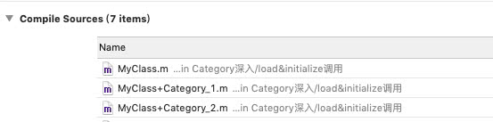
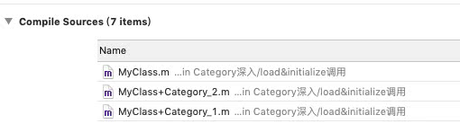
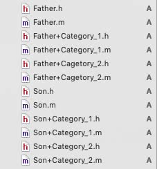
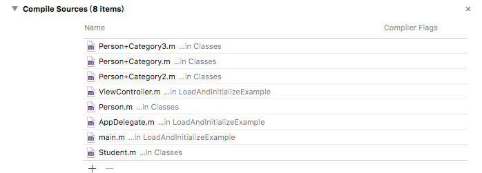
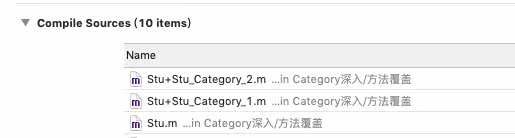

[官网文档 - Category](https://developer.apple.com/library/archive/documentation/General/Conceptual/DevPedia-CocoaCore/Category.html)

[Runtime开源代码](https://github.com/RetVal/objc-runtime)

[美团技术 - 深入理解Objective-C：Category](http://tech.meituan.com/DiveIntoCategory.html)

[Category的本质<一>](https://www.jianshu.com/p/da463f413de7)

[结合 Category 工作原理分析 OC2.0 中的 runtime](https://bestswifter.com/jie-he-category-gong-zuo-yuan-li-fen-xi-oc2-0-zhong-de-runtime/)


## 一、Category简介

### 1.1、什么是Category？

Category是Objective-C 2.0之后添加的语言特性，category的主要作用是为已经存在的类添加方法。除此之外，[apple](https://developer.apple.com/library/archive/documentation/General/Conceptual/DevPedia-CocoaCore/Category.html) 还推荐了category的另外两个使用场景:

> * Distribute the implementation of your own classes into separate source files—for example, you could group the methods of a large class into several categories and put each category in a different file.
>
> * Declare private methods.

大致意思：

> - 可以把类的实现分开在几个不同的文件里面
> - 声明私有方法

不过除了apple推荐的使用场景，广大开发者脑洞大开，还衍生出了category的其他几个使用场景：

>* 模拟多继承
>* 把framework的私有方法公开

### 1.2、Category好处

可以把类的实现分开在几个不同的文件里面。这样做有几个显而易见的好处。

- 可以减少单个文件的体积
- 可以把不同的功能组织到不同的category里
- 可以由多个开发者共同完成一个类
- 可以按需加载想要的category
- 声明私有方法

### 1.3、category特点

- category只能给某个已有的类扩充方法，**不能扩充成员变量。**
- **category中也可以添加属性**，只不过@property只会生成setter和getter的声明，不会生成setter和getter的实现以及成员变量。
- 如果category中的方法和类中原有方法同名，运行时会优先调用category中的方法。也就是，category中的方法会覆盖掉类中原有的方法。所以开发中尽量保证不要让分类中的方法和原有类中的方法名相同。避免出现这种情况的解决方案是给分类的方法名统一添加前缀。比如category_。
- 如果多个category中存在同名的方法，运行时到底调用哪个方法由编译器决定，最后一个参与编译的方法会被调用。

### 1.4、Category应用场景

- 将类的实现分开在几个不同的文件中
- 声明私有方法
- 模拟多继承（另外可以模拟多继承的还有protocol）
- 把framework的私有方法公开

### 1.5、调用优先级

* 在本类和分类有相同的方法时，优先调用分类的方法再调用本类的方法（分类 > 本类 > 父类）。
* 如果有两个分类，他们都实现了相同的方法（+load方法也算，具体看4.1），如何判断谁先执行？分类执行顺序可以通过`targets -> Build Phases -> Complie Source`进行调节，注意执行顺序是从上到下的。（只有两个相同方法名的分类）

注意：category是在运行时加载的，不是在编译时。


## 二、Category在Runtime层的实现原理（编译器的工作）

### 2.1、举个栗子

Person.h (包含Person类 、协议、 Person+DD分类)

```
#import <Foundation/Foundation.h>

@interface Person : NSObject
@property (nonatomic, copy) NSString *name;
@property (nonatomic, assign) NSInteger age;
+(void)eat;
-(void)run;
@end

//==================================================
@protocol MyProtocol <NSObject>
- (void)requiredMethod;
-(void)optionalMethod;
@end

//==================================================
@interface Person (DD) <MyProtocol>
@property (nonatomic, copy) NSString *height;
@property (nonatomic, strong) NSNumber *weight;
+(void)eat_Category;
-(void)run_Category;
@end
```

Person.m

```
#import "Person.h"
#import <objc/runtime.h>

@implementation Person
+(void)eat {
    NSLog(@"本类 类方法：eat");
}
-(void)run {
    NSLog(@"本类 对象方法：run");
}
@end

//==================================================
@implementation Person (DD)

#pragma mark - setter/getter
-(void)setHeight:(NSString *)height {
    objc_setAssociatedObject(self, @selector(height), height, OBJC_ASSOCIATION_COPY_NONATOMIC);
}
-(NSString *)height {
    return objc_getAssociatedObject(self, _cmd);
}
- (void)setWeight:(NSNumber *)weight {
    objc_setAssociatedObject(self, @selector(weight), weight, OBJC_ASSOCIATION_RETAIN_NONATOMIC);
}
-(NSNumber *)weight {
    return objc_getAssociatedObject(self, _cmd);
}

#pragma mark - Method
+(void)eat_Category {
    NSLog(@"分类 类方法：eat_Category");
}

-(void)run_Category {
    NSLog(@"分类 对象方法：run_Category");
}

#pragma mark - Protocol method
-(void)requiredMethod {
    NSLog(@"分类 Protocol requiredMethod");
}
-(void)optionalMethod {
    NSLog(@"分类 Protocol optionalMethod");
}
@end
```


调用

```
  	Person *p = [Person new];
  	
  	// 本类属性
    p.name = @"lin";
    p.age = 20;
    // 分类属性
    p.height = @"60";
    p.weight = [NSNumber numberWithInteger:120];
    
    // 本类方法
    [Person eat];
    [p run];
    
    // 分类新增方法
    [Person eat_Category];
    [p run_Category];
    
    // 分类 协议方法
    [p requiredMethod];
    [p optionalMethod];
```


### 2.2、将Objective-c的代码转化为c++的源码

我们知道，所有的OC类和对象，在runtime层都是用struct表示的，category也不例外，在runtime层，category用结构体category_t（在objc-runtime-new.h中可以找到此定义），它包含了：

```objective-c
struct category_t {
    const char *name;
    classref_t cls;
    struct method_list_t *instanceMethods;
    struct method_list_t *classMethods;
    struct protocol_list_t *protocols;
    struct property_list_t *instanceProperties;
    // Fields below this point are not always present on disk. 
    // 译：此点下方的字段并不总是出现在磁盘上
    struct property_list_t *_classProperties;

    method_list_t *methodsForMeta(bool isMeta) {
        if (isMeta) return classMethods;
        else return instanceMethods;
    }

    property_list_t *propertiesForMeta(bool isMeta, struct header_info *hi);
};
```


我们在分类中新增 `1.对象方法；2.类方法；3.协议；4.属性`

通过将Objective-c的代码转化为c++的源码窥探一下Category的底层结构。在命令行输入`clang -rewrite-objc Person.m`，这样Person.m这个文件就被转化为了c++的源码Person.cpp。

* ##### `struct _category_t` ：该结构体就是每一个分类的结构

```objective-c
struct _category_t {
	const char *name;    //类名
	struct _class_t *cls;  // 类
	const struct _method_list_t *instance_methods;  //实例方法列表
	const struct _method_list_t *class_methods;     //类方法列表
	const struct _protocol_list_t *protocols;       //协议列表
	const struct _prop_list_t *properties;          //属性列表
};
```

> - 1)、类的名字（name）
> - 2)、类（cls）
> - 3)、category中所有给类添加的实例方法的列表（instanceMethods）
> - 4)、category中所有添加的类方法的列表（classMethods）
> - 5)、category实现的所有协议的列表（protocols）
> - 6)、category中添加的所有属性（instanceProperties）

* ##### `_OBJC_$_CATEGORY_Person_$_DD` ：该结构体是 Person+DD分类本身的初始化

```objective-c
static struct _category_t _OBJC_$_CATEGORY_Person_$_DD __attribute__ ((used, section ("__DATA,__objc_const"))) = 
{
	"Person",         //类名  
	0, // &OBJC_CLASS_$_Person,   // 类 cls
	(const struct _method_list_t *)&_OBJC_$_CATEGORY_INSTANCE_METHODS_Person_$_DD, //实例方法列表
	(const struct _method_list_t *)&_OBJC_$_CATEGORY_CLASS_METHODS_Person_$_DD, //类方法列表
	(const struct _protocol_list_t *)&_OBJC_CATEGORY_PROTOCOLS_$_Person_$_DD, //协议列表
	(const struct _prop_list_t *)&_OBJC_$_PROP_LIST_Person_$_DD,  //属性列表
};
```

几个结构体的命名都遵循 **公共前缀+类名+category名字** 的命名方式，需要注意到的事实就是category的名字用来给各种列表以及后面的category结构体本身命名，而且有static来修饰，所以在同一个编译单元里我们的category名不能重复，否则会出现编译错误。（***面试题：同一编译单元Category能否重名？***）

* ##### `_OBJC_$_CATEGORY_INSTANCE_METHODS_Person_$_DD` ：实例方法列表 结构体

```objective-c
static struct /*_method_list_t*/ {
	unsigned int entsize;  // sizeof(struct _objc_method)
	unsigned int method_count;
	struct _objc_method method_list[7];
} _OBJC_$_CATEGORY_INSTANCE_METHODS_Person_$_DD __attribute__ ((used, section ("__DATA,__objc_const"))) = {
	sizeof(_objc_method),
	7,
	{{(struct objc_selector *)"setHeight:", "v24@0:8@16", (void *)_I_Person_DD_setHeight_},
	{(struct objc_selector *)"height", "@16@0:8", (void *)_I_Person_DD_height},
	{(struct objc_selector *)"setWeight:", "v24@0:8@16", (void *)_I_Person_DD_setWeight_},
	{(struct objc_selector *)"weight", "@16@0:8", (void *)_I_Person_DD_weight},
	{(struct objc_selector *)"run_Category", "v16@0:8", (void *)_I_Person_DD_run_Category},
	{(struct objc_selector *)"requiredMethod", "v16@0:8", (void *)_I_Person_DD_requiredMethod},
	{(struct objc_selector *)"optionalMethod", "v16@0:8", (void *)_I_Person_DD_optionalMethod}}
};
```

此处，很容易发现几个熟悉的方法名，都是分类中的 **实例方法+setter/getter+protocol方法**

> 1. 实例方法：`run_Category`
>
> 2. setter/getter：`setHeight:`、`height`、`setWeight:`、`weight`
>
> 3. protocol方法：`requiredMethod`、`optionalMethod`

* ##### `_OBJC_$_CATEGORY_CLASS_METHODS_Person_$_DD` :  类方法列表 结构体

```
static struct /*_method_list_t*/ {
	unsigned int entsize;  // sizeof(struct _objc_method)
	unsigned int method_count;
	struct _objc_method method_list[1];
} _OBJC_$_CATEGORY_CLASS_METHODS_Person_$_DD __attribute__ ((used, section ("__DATA,__objc_const"))) = {
	sizeof(_objc_method),
	1,
	{{(struct objc_selector *)"eat_Category", "v16@0:8", (void *)_C_Person_DD_eat_Category}}
};
```

此处是分类中 **类方法**

> 1. 类方法：`eat_Category`

* ##### `_OBJC_CATEGORY_PROTOCOLS_$_Person_$_DD` : 协议列表 结构体

```
static struct /*_protocol_list_t*/ {
	long protocol_count;  // Note, this is 32/64 bit
	struct _protocol_t *super_protocols[1];
} _OBJC_CATEGORY_PROTOCOLS_$_Person_$_DD __attribute__ ((used, section ("__DATA,__objc_const"))) = {
	1,
	&_OBJC_PROTOCOL_MyProtocol
};
```

此处为 **协议列表结构体**，可以看出当前Category只遵循了 `_OBJC_PROTOCOL_MyProtocol` 协议。

对于`协议列表结构体` 的深入了解。可自行搜索。

* ##### `_OBJC_$_PROP_LIST_Person_$_DD ` ：属性列表 结构体

```
static struct /*_prop_list_t*/ {
	unsigned int entsize;  // sizeof(struct _prop_t)
	unsigned int count_of_properties;
	struct _prop_t prop_list[2];
} _OBJC_$_PROP_LIST_Person_$_DD __attribute__ ((used, section ("__DATA,__objc_const"))) = {
	sizeof(_prop_t),
	2,
	{{"height","T@\"NSString\",C,N"},
	{"weight","T@\"NSNumber\",&,N"}}
};
```

此处是分类中新增的 **属性列表结构体** ，可以看到分类为Person新增的两个属性 `height` 、`weight` 。


## 三、Category如何加载（运行时加载）

[深入理解Objective-C：Category - 4、追本溯源-category如何加载](https://tech.meituan.com/2015/03/03/diveintocategory.html)


我们知道，Objective-C的运行是依赖OC的runtime的，而OC的runtime和其他系统库一样，是OS X和iOS通过dyld动态加载的。

也就是如何将Category中新增的属性与方法在运行时加载到本类中。

想了解更多dyld地同学可以移步这里（[3](https://www.mikeash.com/pyblog/friday-qa-2012-11-09-dyld-dynamic-linking-on-os-x.html)）。


## 四、Category中+load方法、+initialize方法

我们先从几个面试题开始：

> 1)、在类的+load方法调用的时候，我们可以调用category中声明的方法么？
>
> ​		答： 1)、可以调用，因为附加category到类的工作会先于+load方法的执行
>
> 2)、Category中有load方法吗？load方法是什么时候调用？
>
> ​		答：2)、有，+load的执行顺序是先类，后category，而category的+load执行顺序是根据编译顺序决定的。 
>
> 3)、load，initialize的区别是什么？它们在Category中的调用顺序以及出现继承时它们之间的调用过程是怎么样的？


### 4.1、+load方法在Category中的调用顺序

> +load的执行顺序是先类，后category，而category的+load执行顺序是根据编译顺序决定的。 




```
2019-07-29 14:48:38.461856+0800 Category深入[4543:177912] MyClass load
2019-07-29 14:48:38.462248+0800 Category深入[4543:177912] MyClass+Category_1 load
2019-07-29 14:48:38.462303+0800 Category深入[4543:177912] MyClass+Category_2 load
```




```
2019-07-29 14:47:46.286189+0800 Category深入[4526:177145] MyClass load
2019-07-29 14:47:46.286580+0800 Category深入[4526:177145] MyClass+Category_2 load
2019-07-29 14:47:46.286647+0800 Category深入[4526:177145] MyClass+Category_1 load
```


### 4.2、有继承关系的类中，+load调用顺序



> 父类：Father
>
> 父类分类：Father+Category_1 和 Father+Category_2
>
> 子类：Son
>
> 子类分类：Son+Category_1 和 Son+Category_2


```
// 输出
2019-07-29 16:20:57.900182+0800 Category深入[5664:229891] Father load
2019-07-29 16:20:57.900585+0800 Category深入[5664:229891] Son load
2019-07-29 16:20:57.900681+0800 Category深入[5664:229891] Father Cagetory_2 load
2019-07-29 16:20:57.900734+0800 Category深入[5664:229891] Son Category_1 load
2019-07-29 16:20:57.900782+0800 Category深入[5664:229891] Father Category_1 load
2019-07-29 16:20:57.900845+0800 Category深入[5664:229891] Son Category_2 load
```


> 1、父类+load 在 子类之前调用；子类+load在分类之前调用；(修改编译顺序也一样)
>
> 2、当有多个类别(Category)都实现了load方法，这几个load方法都会执行，但执行顺序不确定，执行顺序与其在Compile Sources中出现的顺序一致; 


为什么会这样呢？

细节查看： [Category的本质<二>load，initialize方法 - 有继承关系时load方法的调用顺序](https://www.jianshu.com/p/b5492c40fe8f)


### 4.3、+initialize方法调用顺序

 [Category的本质<二>load，initialize方法](https://www.jianshu.com/p/b5492c40fe8f)

**情况一：只有父类和子类**

```
// NewFather
+(void)initialize {
    NSLog(@"NewFather initialize");
}

// NewSon
+(void)initialize {
    NSLog(@"NewSon initialize");
}


// 测试一：调用父类
[NewFather alloc];
// 输出
2019-08-01 09:03:11.547651+0800 Category深入[1088:16966] NewFather initialize


// 测试二：调用子类
[NewSon alloc];
// 输出
2019-08-01 09:02:30.083591+0800 Category深入[1072:16383] NewFather initialize
2019-08-01 09:02:30.083668+0800 Category深入[1072:16383] NewSon initialize


// 测试三：若子类未实现 +(void)initialize 方法，调用子类
[NewSon alloc];
// 输出
2019-08-01 09:09:22.596737+0800 Category深入[1168:20045] NewFather initialize
2019-08-01 09:09:22.596811+0800 Category深入[1168:20045] NewFather initialize

```


- initialize在类第一次接收到消息时调用，也就是objc_msgSend()。
- 先调用父类的+initialize，再调用子类的initialize。
- 如果子类没有实现+initialize方法，会调用父类的+initialize（所以父类的+initialize方法可能会被调用多次）


**情况二：父类、子类和分类**

```
// NewFather
+(void)initialize {
    NSLog(@"NewFather initialize");
}
// NewFather+Category_1
+(void)initialize {
    NSLog(@"NewFather Category_1 initialize");
}
// NewFather+Category_2
+(void)initialize {
    NSLog(@"NewFather Category_2 initialize");
}

// NewSon
+(void)initialize {
    NSLog(@"NewSon initialize");
}
// NewSon+Category_1
+(void)initialize {
    NSLog(@"NewSon Category_1 initialize");
}
// NewSon+Category_2
+(void)initialize {
    NSLog(@"NewSon Category_2 initialize");
}


// 调用父类
[NewFather alloc];
// 输出
2019-08-01 09:22:06.398530+0800 Category深入[1349:26686] NewFather Category_2 initialize

// 调用子类
[NewSon alloc];
// 输出
2019-08-01 09:25:37.274370+0800 Category深入[1454:29643] NewFather Category_2 initialize
2019-08-01 09:25:37.274441+0800 Category深入[1454:29643] NewSon Category_2 initialize
```


* 如果分类实现了+initialize，会覆盖类本身的+initialize调用；

* 多个分类时，分类执行顺序可以通过`targets -> Build Phases -> Complie Source`进行调节，注意执行顺序是从上到下的；
* 如果子类和子类的分类都不实现+initialize，则显示父类的分类的+initialize方法；


### 4.4、+load与+initialize比较

- [load](https://developer.apple.com/documentation/objectivec/nsobject/1418815-load?language=objc)

  Invoked whenever a class or category is added to the Objective-C runtime; implement this method to perform class-specific behavior upon loading.

- [initialize](https://developer.apple.com/documentation/objectivec/nsobject/1418639-initialize?language=objc)

  Initializes the class before it receives its first message.

[iOS类方法load和initialize详解](https://www.jianshu.com/p/c52d0b6ee5e9)

|                | +(void)load                                                  | +(void)initialize                                            |
| -------------- | ------------------------------------------------------------ | ------------------------------------------------------------ |
| 调用方式       | +load是通过函数指针指向函数，拿到函数地址，直接通过内存地址查找调用的。 | +initialize是通过objc_msgSend()进行调用，isa和superclass来寻找的 |
| 调用时机       | 只要文件被引用就会被调用，所以如果类没有被引进项目,就不会调用 +load | 是在类或者它的子类收到第一条消息（实例方法、类方法）之前被调用的。 |
| 调用顺序       | 1、+load 会在 main() 函数之前被调用；<br>2、父类 > 子类 > 分类 | 父类 > 子类（或分类，分类覆盖本类方法）                      |
| 调用次数       | 1次                                                          | 1、如果只有父类，则调用1次或0次；<br>2；有子类则调用多次；（子类也会调用父类的initialize方法） |
| 子类、类别调用 | 子类：如果子类没有实现 load 方法, 该子类是不会调用该方法的, 就算父类实现了也不会调用父类的load方法；<br><br> 类别：当有多个类别(Category)都实现了load方法,这几个load方法都会执行,但执行顺序不确定，执行顺序与其在Compile Sources中出现的顺序一致;  | 如果子类实现 initialize方法时,会覆盖父类initialize方法；<br><br> 如果子类不实现 initialize 方法，会把父类的实现继承过来调用一遍；<br><br>当有多个Category都实现了initialize方法,会覆盖类中的方法,只执行一个(会执行Compile Sources 列表中最后一个Category 的initialize方法) |
| 线程安全       | load 方法是线程安全的，内部使用了锁，应避免线程阻塞在 load 中。 | 在initialize方法收到调用时，运行环境基本健全。initialize的运行过程中是能保证线程安全的； |
| 常见场景       | 1、由于调用load方法时的环境很不安全，我们应该尽量减少load方法的逻辑；<br>2、load 中实现 Method Swizzle | 1、常用于初始化全局变量和静态变量；<br>2、者单例模式的实现方案； |


## 五、Category和方法覆盖

### 5.1、覆盖本类方法（类方法和实例方法）

```
// 本类 方法
+(void)getName;
-(void)getAge;

// Stu_Category_1 分类覆盖实现
// Stu_Category_2 分类覆盖实现

// 输出
2019-07-29 15:29:09.597718+0800 Category深入[5074:203420] Stu_Category_2 getName
2019-07-29 15:29:09.597790+0800 Category深入[5074:203420] Stu_Category_2 getAge
```


**交换下编译顺序**



```
// 输出
2019-07-29 15:36:48.679354+0800 Category深入[5140:208264] Stu_Category_1 getName
2019-07-29 15:36:48.679421+0800 Category深入[5140:208264] Stu_Category_1 getAge
```


> 结论：
>
> 1)、category的方法没有“完全替换掉”原来类已经有的方法，也就是说如果category和原来类都有methodA，那么category附加完成之后，类的方法列表里会有两个methodA；
>
> 2)、category的方法被放到了新方法列表的前面，而原来类的方法被放到了新方法列表的后面，这也就是我们平常所说的category的方法会“覆盖”掉原来类的同名方法，这是因为运行时在查找方法的时候是顺着方法列表的顺序查找的，它只要一找到对应名字的方法，就会罢休^_^，殊不知后面可能还有一样名字的方法。


### 5.2、怎么调用到原来类中被category覆盖掉的方法？

​		对于这个问题，我们已经知道category其实并不是完全替换掉原来类的同名方法，只是category在方法列表的前面而已，所以我们只要顺着方法列表找到最后一个对应名字的方法，就可以调用原来类的方法：

[美团技术 - 深入理解Objective-C：Category  第6节：触类旁通-category和方法覆盖](http://tech.meituan.com/DiveIntoCategory.html)


## 六、Category和关联对象

### 6.1、为什么category不能添加成员变量？

##### 解释一：从Objective-C类是由Class类型来分析

Objective-C类是由Class类型来表示的，它实际上是一个指向objc_class结构体的指针。它的定义如下：

```
typedef struct objc_class *Class;
```

objc_class结构体的定义如下：

```
struct objc_class {
    Class isa  OBJC_ISA_AVAILABILITY;
#if !__OBJC2__
    Class super_class                       OBJC2_UNAVAILABLE;  // 父类
    const char *name                        OBJC2_UNAVAILABLE;  // 类名
    long version                            OBJC2_UNAVAILABLE;  // 类的版本信息，默认为0
    long info                               OBJC2_UNAVAILABLE;  // 类信息，供运行期使用的一些位标识
    long instance_size                      OBJC2_UNAVAILABLE;  // 该类的实例变量大小
    struct objc_ivar_list *ivars            OBJC2_UNAVAILABLE;  // 该类的成员变量链表
    struct objc_method_list **methodLists   OBJC2_UNAVAILABLE;  // 方法定义的链表
    struct objc_cache *cache                OBJC2_UNAVAILABLE;  // 方法缓存
    struct objc_protocol_list *protocols    OBJC2_UNAVAILABLE;  // 协议链表
#endif
} OBJC2_UNAVAILABLE;
```

在上面的objc_class结构体中，ivars是objc_ivar_list（成员变量列表）指针；methodLists是指向objc_method_list指针的指针。在Runtime中，objc_class结构体大小是固定的，不可能往这个结构体中添加数据，只能修改。所以ivars指向的是一个固定区域，只能修改成员变量值，不能增加成员变量个数。methodList是一个二维数组，所以可以修改methodLists的值来增加成员方法，虽没办法扩展methodLists指向的内存区域，却可以改变这个内存区域的值（存储的是指针）。因此，可以动态添加方法，不能添加成员变量。


##### 解释二：从Category底层结构体category_t看

首先我们从Category底层结构体category_t（在objc-runtime-new.h中可以找到此定义）来看下：

```
struct category_t {
    const char *name;
    classref_t cls;
    struct method_list_t *instanceMethods;
    struct method_list_t *classMethods;
    struct protocol_list_t *protocols;
    struct property_list_t *instanceProperties;
    // Fields below this point are not always present on disk. 
    // 译：此点下方的字段并不总是出现在磁盘上
    struct property_list_t *_classProperties;

    method_list_t *methodsForMeta(bool isMeta) {
        if (isMeta) return classMethods;
        else return instanceMethods;
    }

    property_list_t *propertiesForMeta(bool isMeta, struct header_info *hi);
};
```

通过分类的底层结构我们可以看到，分类中可以存放实例方法，类方法，协议，属性，但是没有存放成员变量的地方。所以不能添加成员变量。


### 6.2、如何给Category添加成员变量？

如何给NSArray添加一个属性（不能使用继承）？不能用继承，难道用分类？但是分类只能添加方法不能添加属性啊（Category不允许为已有的类添加新的成员变量，实际上允许添加属性的，同样可以使用@property，但是不会生成_变量（带下划线的成员变量），也不会生成添加属性的getter和setter方法，所以，尽管添加了属性，也无法使用点语法调用getter和setter方法。但实际上可以使用runtime去实现Category为已有的类添加新的属性并生成getter和setter方法)：

```
// .h 文件
@interface Person (DD) 
@property (nonatomic, copy) NSString *height;
@end

// .m 文件
@implementation Person (DD)
#pragma mark - setter/getter
-(void)setHeight:(NSString *)height {
    objc_setAssociatedObject(self, @selector(height), height, OBJC_ASSOCIATION_COPY_NONATOMIC);
}
-(NSString *)height {
    return objc_getAssociatedObject(self, _cmd);
}
@end
```


|             关联策略              |          对应修饰符          |
| :-------------------------------: | :--------------------------: |
|      OBJC_ASSOCIATION_ASSIGN      |      @property(assign)       |
| OBJC_ASSOCIATION_RETAIN_NONATOMIC | @property(strong, nonatomic) |
|  OBJC_ASSOCIATION_COPY_NONATOMIC  |  @property(copy, nonatomic)  |
|      OBJC_ASSOCIATION_RETAIN      |  @property(strong, atomic)   |
|       OBJC_ASSOCIATION_COPY       |   @property(copy, atomic)    |


### 6.3、关联对象又是存在什么地方呢？ 如何存储？ 对象销毁时候如何处理关联对象呢？

[美团技术 - 深入理解Objective-C：Category - 第七节：更上一层-category和关联对象](http://tech.meituan.com/DiveIntoCategory.html)


## 七、Category与Extension


**extension看起来很像一个匿名的category，但是extension和有名字的category几乎完全是两个东西。 extension在编译期决议，它就是类的一部分，在编译期和头文件里的@interface以及实现文件里的@implement一起形成一个完整的类，它伴随类的产生而产生，亦随之一起消亡。extension一般用来隐藏类的私有信息，你必须有一个类的源码才能为一个类添加extension，所以你无法为系统的类比如NSString添加extension。**

**但是category则完全不一样，它是在运行期决议的。 就category和extension的区别来看，我们可以推导出一个明显的事实，extension可以添加实例变量，而category是无法添加实例变量的（因为在运行期，对象的内存布局已经确定，如果添加实例变量就会破坏类的内部布局，这对编译型语言来说是灾难性的）。**


[]()
