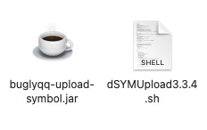
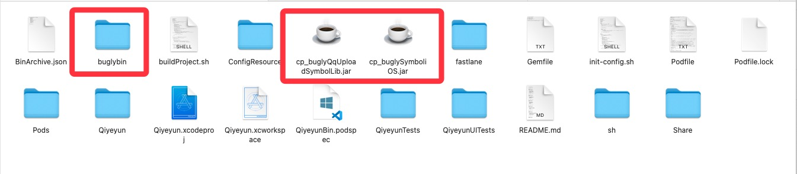
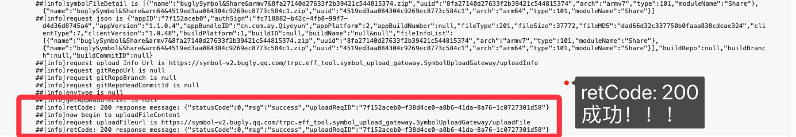
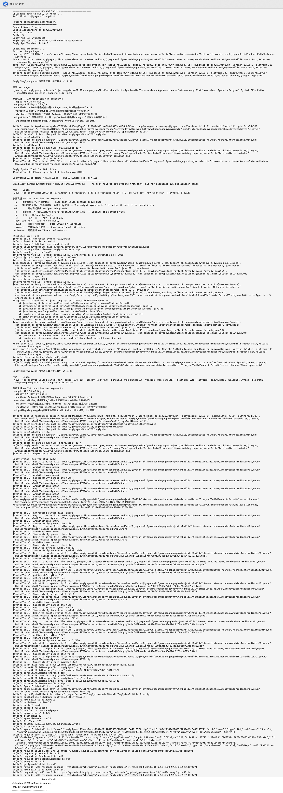
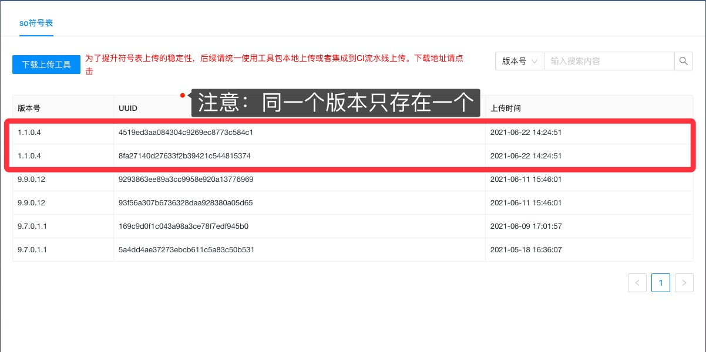

> 2021.06.11 符号表上传工具更新方式完全改变


[Bugly iOS 符号表配置](https://bugly.qq.com/docs/user-guide/symbol-configuration-ios/#xcode-sh)

[符号表工具 '3.3.4'_下载](https://bugly.qq.com/v2/sdkDownload?id=15343657-638a-4569-a220-8689b090be65)


# 手动上传dSYM到Bugly

```shell
# 执行命令：
java -jar buglyqq-upload-symbol.jar -appid <APP ID> 
                                    -appkey<APP KEY>
                                    -bundleid <App BundleID>
                                    -version <App Version>
                                    -platform <App Platform>
                                    -inputSymbol <Original Symbol File Path>
                                    -inputMapping <mapping file>
 
 # 参数说明 -- Introduction for arguments
 -appid APP ID of Bugly
 -appkey APP Key of Bugly
 -bundleid Android平台对应的是package name/iOS平台是Bundle Id
 -version APP版本，需要和bugly平台上面看到的crash版本号保持对齐
 -platform 平台类型包含三个选项 Android、IOS两个选项，注意大小写要正确
 -inputSymbol 原始符号表[ios是dsym/android平台是debug so]所在文件夹目录地址
 -inputMapping mapping所在文件夹目录地址[Android平台特有，ios忽略]
 
# eg
java -jar buglyqq-upload-symbol.jar
	-appid 7f152acxxx 
	-appkey fc71xxx2-bxxc-4xx8-99x7-d4d36d8xxxxx 
	-bundleid cn.com.ay.Qiyeyun
	-version 9.9.0.12 
	-platform IOS 
	-inputSymbol ./Qiyeyun.app.dSYM
```


# Xcode自动上传dSYM到Bugly

## 1. 导入sh与jar



## 2. .gitignore新增规则：不忽视特定jar

```shell
# Don't ignore
!/sh/Bugly/buglyqq-upload-symbol.jar
```


## 3.Xcode创建RunScript

在Xcode中 -> Build Phases -> RunScript 中新增

```shell
echo "==================== Second Shell ======================="
${SRCROOT}/sh/Bugly/dSYMUpload3.3.4.sh
```


## 4.运行后会生成垃圾文件，请忽视




## 5.日志

### 成功标识



### 完整日志




## 6. Bugly控制台查看




