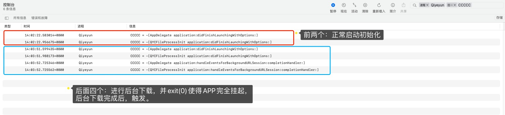

[Apple - Downloading Files in the Background](https://developer.apple.com/documentation/foundation/url_loading_system/downloading_files_in_the_background?language=objc)

https://juejin.cn/post/6844904142255685640


| 场景                                                         | 单文件                                                       | 多文件                                                       | 网络     | 网络切换 |
| ------------------------------------------------------------ | ------------------------------------------------------------ | ------------------------------------------------------------ | -------- | -------- |
| 1.开始下载，进入后台，完全挂起。<br />测试文件：<br />文件一：Swift笔记.pdf   13.4M <br />文件二：OC对象本质.mp4   39.98M<br />文件三：Android.apk   47.02M<br />文件四：01.课程介绍   111.84M | 两个文件分别单独测试：<br />文件一：【成功】<br />文件二：【成功】 | 两个文件同时下载：<br />收到两条通知，点击通知进入；<br />文件下载成功。 | Wifi  4G | 未测     |
| 2.进入后台完全挂起，再进入应用，查看下载进度。<br />反复操作。 | 【成功】                                                     | 【成功】                                                     |          |          |
| 3.进入后台未挂起，下载小文件与大文件。                       |                                                              |                                                              |          |          |
| 4.退后台挂起时未下载完成再进前台                             |                                                              |                                                              |          |          |
| 5.退后台未挂起未下载完成时再进前台                           |                                                              |                                                              |          |          |
| 6.手动杀进程时                                               |                                                              |                                                              |          |          |


# 后台下载场景

## 1.完全挂起

程序崩溃或者`exit(0)`

```objective-c
// 在退入后台时，直接exit
- (void)applicationDidEnterBackground:(UIApplication *)application {
    exit(0);
}
```


### 操作步骤

由于组件化，使用 `TDFModule` 管理组件生命周期

* AppDelegate.m

* QYCFileProcessInit.m

```objective-c
// AppDelegate.m
- (BOOL)application:(UIApplication *)application didFinishLaunchingWithOptions:(NSDictionary *)launchOptions {
    NSLog(@"AAAAA = %s", __func__);
	return YES;
}

// 当APP处于后台下载状态时，需要处理下载完成后的数据的回调
- (void)application:(UIApplication *)application handleEventsForBackgroundURLSession:(NSString *)identifier completionHandler:(void (^)(void))completionHandler {
    NSLog(@"AAAAA = %s", __func__);
    completionHandler();
}
```

```objective-c
// QYCFileProcessInit.m
- (BOOL)application:(UIApplication *)application didFinishLaunchingWithOptions:(NSDictionary *)launchOptions {
    NSLog(@"BBBBB = %s", __func__);
	return YES;
}

// 当APP处于后台下载状态时，需要处理下载完成后的数据的回调
- (void)application:(UIApplication *)application handleEventsForBackgroundURLSession:(NSString *)identifier completionHandler:(void (^)(void))completionHandler {
    NSLog(@"BBBBB = %s", __func__);
    completionHandler();
}
```


### 调用顺序




### 结论

* 组件生命周期的 `QYCFileProcessInit` 可以收到文件下载的相关回调。

* 后台下载，完全挂起的调用步骤，如下：

    > 1. 在app完全挂起时，如果仍有background session未完成，当session 的所有task完成下载时（不管成功或失败），系统会先唤起app，并调用 appDelegate 的 `- application:didFinishLaunchingWithOptions:` 方法；
    >
    > 2. 然后调用以下方法通知系统处理完成`- application: handleEventsForBackgroundURLSession:`


### 测试

* 单文件：
* 多文件：


## 2.退后台未挂起时


## 3. 


## 手动杀死进程

用户手动杀进程时，background session 会被系统取消，handleEventsForBackgroundURLSession 不再回调。

当再次唤起app时，会根据 identifier 对应的 session delegate 回调 

```objective-c
// 再次唤起，触发此方法，并报【错误 -999】
- (void)URLSession:(NSURLSession \*)session task:(NSURLSessionTask \*)task didCompleteWithError:(NSError \*)error

2021-07-14 11:47:22.288742+0800 Qiyeyun[48893:4417694] BackgroundDownloadTask <4F60552D-68EE-4EFB-8AAA-A77D3F2EAA05>.<1> 发生错误: 未能完成操作。（NSURLErrorDomain错误-999。）
```


## 切换网络 

重新下载，没有断点续传。

* 前台：成功
* 后台：成功


## 断开、重连网络

已经开启的下载队列，会重新下载，缓存会被移除。未做断点续传。

* 前台：成功
* 后台：成功


