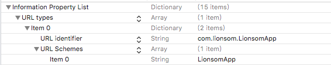
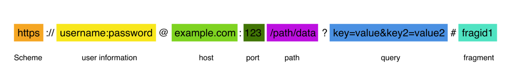

* [Apple Document - About Apple URL Schemes](https://developer.apple.com/library/archive/featuredarticles/iPhoneURLScheme_Reference/Introduction/Introduction.html#//apple_ref/doc/uid/TP40007899)

* [我的简书 - iOS - URL Schema](https://www.jianshu.com/p/137284ebe73d)

* [一缕殇流化隐半边冰霜 - iOS 组件化 —— 路由设计思路分析](https://www.jianshu.com/p/76da56b3bd55)


# 方式一：URL Schemes


## 一、URL Schemes

[About Apple URL Schemes](https://developer.apple.com/library/archive/featuredarticles/iPhoneURLScheme_Reference/Introduction/Introduction.html#//apple_ref/doc/uid/TP40007899)

### 注册Schemes

在Info.plist中进行配置URL Identifier，一个字符串对象。该字符串是你自定义的 `URL Schemes` 的名字。建议采用反转域名的方法保证该名字的唯一性，比如 `com.yourCompany.yourApp`



### 接收Schemes并处理

```objective-c
- (BOOL)application:(UIApplication *)app openURL:(NSURL *)url options:(NSDictionary<UIApplicationOpenURLOptionsKey,id> *)options {
    NSLog(@"从哪个app跳转而来 Bundle ID: %@", options[UIApplicationOpenURLOptionsSourceApplicationKey]);    
    NSLog(@"URL scheme:%@", [url scheme]);
    NSLog(@"URL query:%@", [url query]);
    // 允许打开
    return YES;
}
```

### 调用APP的生命周期

* **如果待调用的App已经运行了，那么它的生命周期如下：**


* **如果待调用的App在后台，那么它的生命周期如下：**


## 二、调用自定义 URL Scheme

### 2.1、从 Safari 中调用自定义 URL Scheme


### 2.2、从另一个 iPhone 应用中调用自定义 URL Scheme

```objective-c
- (void)btnCallBack {
    NSURL *URL = [NSURL URLWithString:@"LionsomApp://"];
    if (@available(iOS 10.0, *)) {
        [[UIApplication sharedApplication] openURL:URL options:@{} completionHandler:^(BOOL success) {
            NSLog(@"iOS10 - 跳转成功！！！");
        }];
    } else {
        // Fallback on earlier versions
        NSLog(@"iOS9 - 跳转成功！！！");
        [[UIApplication sharedApplication]  openURL:URL];
    }
}
```


## 三、通过自定义 URL Scheme 向应用传递参数



第一步：在模拟器`safari`中输入：
```c
LionsomApp://?token=123abc&registered=1
```

第二步：跳转到应用中获取参数：


# 方式二：Universal Links

[Apple Document - Support Universal Links](https://developer.apple.com/library/archive/documentation/General/Conceptual/AppSearch/UniversalLinks.html)

[Supporting universal links in your app](https://developer.apple.com/documentation/xcode/supporting-universal-links-in-your-app/)

[官方检验Universal Links](https://search.developer.apple.com/appsearch-validation-tool/)


https://www.jianshu.com/p/f1c97d0d0d22

## 简介

iOS 9.0新增加了一项功能是Universal Links，使用这个功能可以使我们的 **App通过HTTP链接来启动App**。

* 1.如果安装过App，不管在微信里面http链接还是在Safari浏览器，还是其他第三方浏览器，都可以打开App。
* 2.如果没有安装过App，就会打开网页。


## 具体设置

1. App需要开启 `Associated Domains` 服务，并设置 `Domains`，注意必须要 `applinks：` 开头

    

    ```c
    // Universal Links
    QYC_universalLinks = applinks:www.qycloud.com.cn
    ```

2. 域名必须要支持HTTPS

3. 上传内容是Json格式的文件，文件名为 `apple-app-site-association` 到自己域名的 `根目录` 下，或者 `.well-known` 目录下。iOS自动会去读取这个文件。具体的文件内容请查看[官方文档](https://link.jianshu.com/?t=https://developer.apple.com/library/content/documentation/General/Conceptual/AppSearch/UniversalLinks.html)。

    ```c
    {
      "applinks": {
        "details": [
          {
            "paths": [
              "*"
            ],
            "appID": "6JHY626E93.cn.com.ay.Qiyeyun"
          },
          {
            "paths": [
              "*"
            ],
            "appID": "T2A427WHT5.cn.com.ay.Qiyeyun"
          },
          {
            "paths": [
              "*"
            ],
            "appID": "75A6Q7Q53X.com.tools.51safety"
          },
          {
            "paths": [
              "*"
            ],
            "appID": "9ECP7PKPTE.com.tools.51safety"
          },
          {
            "paths": [
              "*"
            ],
            "appID": "4W4E8TZ8L2.com.njxingong.qycloud"
          }
        ],
        "apps": []
      }
    }
    ```

    


