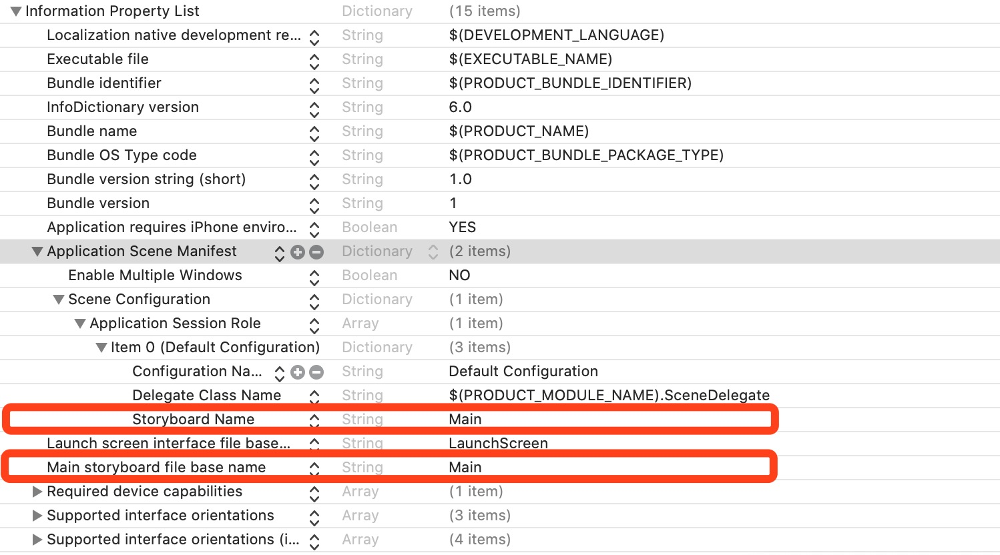

# 第一天：创建项目20200607

* [Xcode 11 之后如何创建纯代码 iOS 工程](https://louyu.site/articles/ios-swift/2020/03/?p=2328/)

## 一、纯代码启动

Xcode 11 中新建 iOS 项目工程时，会有很多变化，最大的变化就是工程中多了文件 SceneDelegate.swift。

### 1、项目文件变化

● AppDelegate.swift 从 Xcode 11 开始负责 App 的启动与终止，并负责与 SceneDelegate 交接，不再管理应用程序的生命周期。

● SceneDelegate.swift 文件接管 Xcode 11 之前 AppDelegate.swift 的功能，负责管理应用程序的生命周期。

虽然 Xcode 11 开始新建的工程使用 SceneDelegate 管理应用的生命周期，但我们还是可以通过删除一些 plist 字段来让 AppDelegate 重新管理应用的生命周期。

### 2、纯代码，移除storyboard

把 Info.plist 中的 ```Application Scene Manifest → Scene Configuration → Application Session Role → Storyboard Name``` 和 ```Main storyboard file base name``` 字段删除。



### 3、是否保留 SceneDelegate 的配置方法

#### 3.1、保留 SceneDelegate

在 Xcode 11 中，AppDelegate 中通过 `application(_:configurationForConnecting:options) `代理回调函数返回一个 `UISceneConfiguration` 实例。当 App 完成启动后，控制权被交接给 `SceneDelegate`，此时函数 `scene(_:willConnectTo:options:)` 会被调用，我们可以通过如下代码设置 window 的根视图控制器：

```swift
func scene(_ scene: UIScene, willConnectTo session: UISceneSession, options connectionOptions: UIScene.ConnectionOptions) {
    
    if let windowScene = scene as? UIWindowScene {
        let window = UIWindow(windowScene: windowScene)
        window.rootViewController = FirstViewController()
        self.window = window
        window.makeKeyAndVisible()
    }
}
```

#### 3.2、不保留 SceneDelegate

首先我们要删除 `SceneDelegate.swift`，然后再删除 `info.plist 的 Application Scene Manifest` 字段。

```swift
var window: UIWindow?

func application(_ application: UIApplication, didFinishLaunchingWithOptions launchOptions: [UIApplication.LaunchOptionsKey: Any]?) -> Bool {
    // Override point for customization after application launch.
    self.window = UIWindow(frame: UIScreen.main.bounds)
    self.window?.rootViewController = FirstViewController()
    self.window?.makeKeyAndVisible()
    return true
}
```

最后再删掉这两个函数：

```swift
func application(_ application: UIApplication, configurationForConnecting connectingSceneSession: UISceneSession, options: UIScene.ConnectionOptions) -> UISceneConfiguration {
}

func application(_ application: UIApplication, didDiscardSceneSessions sceneSessions: Set<UISceneSession>) {
}
```


# 第二天： 20200608

## 1、MARK、TODO、FIXME

* OC

```
#pragma mark - 说明
```

* Swift

```swift
// MARK: - 说明文字,带分割线
// MARK: 说明文字,不带分割线

// TODO: 需要提醒的文字

// FIXME: 需要修改bug的相关说明
```

## 2、输出当前函数、当前行

> Swift 支持全局函数

```swift
func Log<T>(_ message:T, file:String = #file, function:String = #function, line:Int = #line) {
    #if DEBUG
    // 获取文件名
    let fileName = (file as NSString).lastPathComponent
    // 打印日志内容
    print("\(fileName) \(line) \(function) \(message)")
    #endif
}
```

## 3、Category VS EXtension

* [How to create swift class for category?](https://stackoverflow.com/questions/24142829/how-to-create-swift-class-for-category)

#### 3.1、UIColor 扩展

* [How to access extension of UIColor in Swift?](https://stackoverflow.com/questions/29648348/how-to-access-extension-of-uicolor-in-swift)

* [How to Create a UIColor in Swift](https://www.codingexplorer.com/create-uicolor-swift/)


## 4、全局常量 Constants

* [Global constants file in Swift](https://stackoverflow.com/questions/26252233/global-constants-file-in-swift)


## 5、单例 Singleton

* [Using a dispatch_once singleton model in Swift](https://stackoverflow.com/questions/24024549/using-a-dispatch-once-singleton-model-in-swift)


## 6、#ifdef in Swift

* [#ifdef replacement in the Swift language](https://stackoverflow.com/questions/24003291/ifdef-replacement-in-the-swift-language)

* OC

```swift
#ifdef DEBUG
    // Debug-only code
#endif
```

* Swift

```swift
#if DEBUG

#elseif AAA

#else
```

## 7、convenience

* [Swift: Convenience initializers - Self used before self.init call](https://stackoverflow.com/questions/37095435/swift-convenience-initializers-self-used-before-self-init-call)

* [swift convenience init and generic class](https://stackoverflow.com/questions/44066573/swift-convenience-init-and-generic-class)


## 8、push

* [『簡易說明Xcode』顯示下一個畫面方法（由程式觸發的方式 — push）]([https://medium.com/%E5%BD%BC%E5%BE%97%E6%BD%98%E7%9A%84-swift-ios-app-%E9%96%8B%E7%99%BC%E6%95%99%E5%AE%A4/%E7%B0%A1%E6%98%93%E8%AA%AA%E6%98%8Excode%E4%B8%AD%E7%9A%84%E9%A1%AF%E7%A4%BA%E4%B8%8B%E4%B8%80%E5%80%8B%E7%95%AB%E9%9D%A2%E6%96%B9%E6%B3%95-%E7%94%B1%E7%A8%8B%E5%BC%8F%E8%A7%B8%E7%99%BC%E7%9A%84%E6%96%B9%E5%BC%8F-push-e0da619641f7](https://medium.com/彼得潘的-swift-ios-app-開發教室/簡易說明xcode中的顯示下一個畫面方法-由程式觸發的方式-push-e0da619641f7))


# Customizing Your App’s Navigation Bar

* [Customizing Your App’s Navigation Bar](https://developer.apple.com/documentation/uikit/uinavigationcontroller/customizing_your_app_s_navigation_bar)


* [Changing navigation bar color in Swift](https://stackoverflow.com/questions/24687238/changing-navigation-bar-color-in-swift)