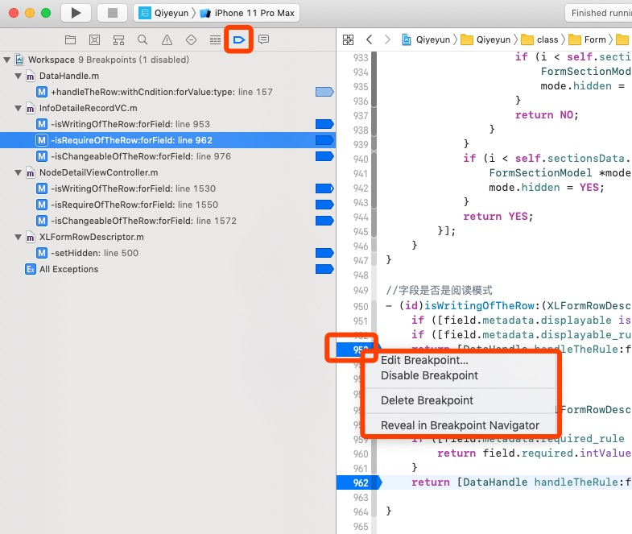
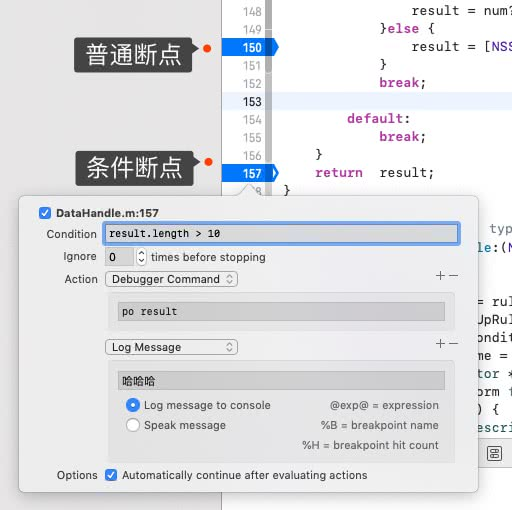

[TOC]

## 一、断点

### 1.1、普通断点

### 1.2、全局断点

### 1.3、条件断点

### 1.4、全局条件断点

## 二、Console(lldb 命令)

### 三、使用断点处理Masonry布局警告

[iOS 使用符号断点定位警告约束警告-[LayoutConstraints] Unable to simultaneously satisfy constrai](https://juejin.im/post/5b0f94916fb9a00a11563b04)