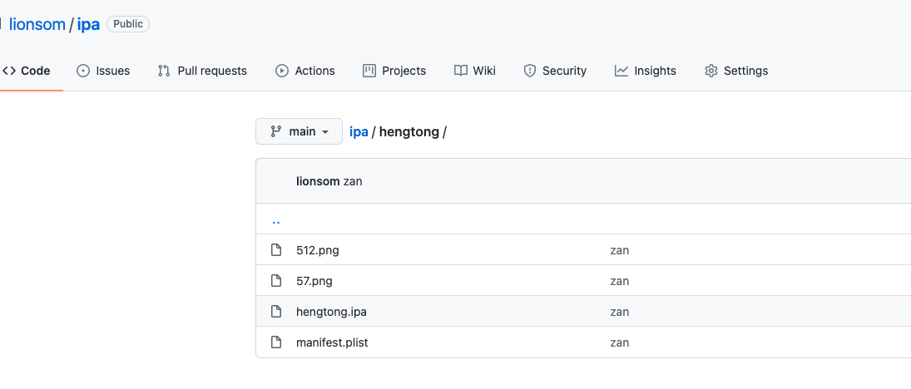
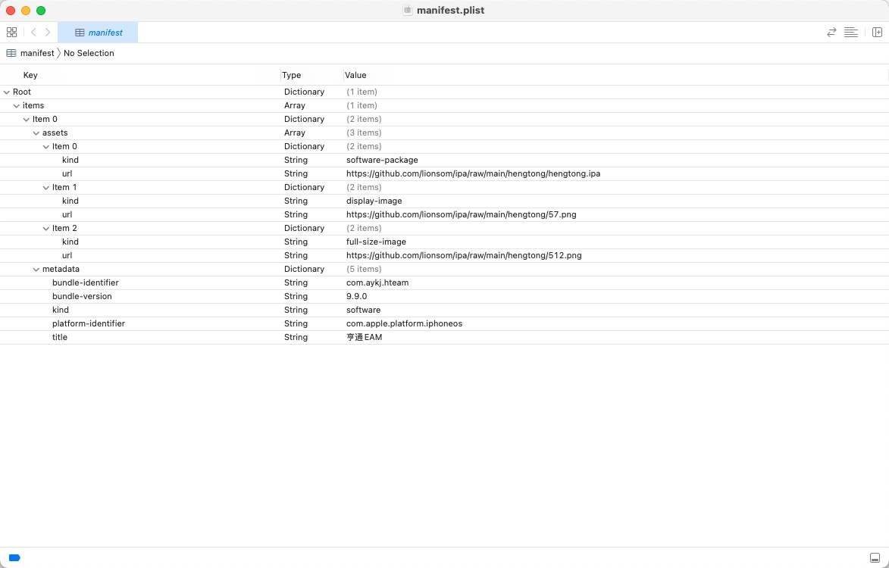
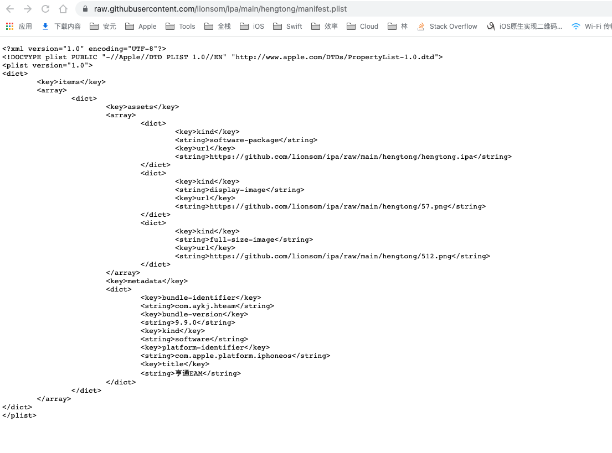

# 一.需求

- 大批量的app内测。
- 针对app审核难过包，可以考虑企业签名暂时代替appstore发布(网上资料说是有封开发者账号的风险)。

# 二.原理

- OTA:`iOS4`新加的一项技术，可以让开发者脱离AppStore，从指定的服务器下载安装应用。
- 以`https://itms-services://?action=download-manifest&url=https://192.168.1.xxx/manifest.plist`开头的链接，Safari会自动去读取`manifest.plist`中的信息，进行下载，安装等操作。

# 三.准备工作

- 三种开发者账号:
    - 个人账号:`99$`/`appstore上架`/`设备上限100`
    - 公司账号:`99$`/`appstore上架`/`设备上限100`
    - 企业账号:`299$` /`不能appstore上架`/`不限制设备(没有验证过)`
- 打包模式:
    - `App Store Deployment`: `需要添加UUID`/`上架appstore`
    - `Ad Hoc Deployment`: `需要添加UUID`/`内部测试`/`distribution证书`
    - `Enterprise Deployment`: `不需要添加UUID`/`企业内部应用`/`企业证书`
    - `Development Deployment`: `需要添加UUID`/`开发调试`/`developer证书`
- ipa包:
    - 如果只是方便内部测试的分发，用`个人/公司账号`/`发布到Ad Hoc Deployment/Development Deployment`打出来的`ipa`
    - 如果是企业内部应用/绕开苹果审核而发布的应用，就必须用`企业账号`/`发布到Enterprise Deployment`打出来的`ipa`
- `manifest.plist`
- https协议服务器(`iOS7.1以前的版本支持http协议`)

# 四、itms-services Github分发

仓库：https://github.com/lionsom/ipa

最后的分发链接：[itms-services:///?action=download-manifest&url=https://raw.githubusercontent.com/lionsom/ipa/main/hengtong/manifest.plist](itms-services:///?action=download-manifest&url=https://raw.githubusercontent.com/lionsom/ipa/main/hengtong/manifest.plist)

