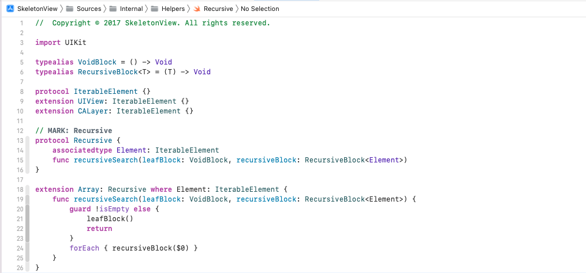

[SkeletonView](https://github.com/Juanpe/SkeletonView)

[SkeletonView 骨架屏源码解析](https://www.jianshu.com/p/ee5c47acd88f)

iOS实现Skeleton效果的第三方库有很多，当然也可以自己创建一个，而骨架屏最核心的就是占位和属性动画。在实现方面，本文介绍几种主流的实现方式：

## SkeletonView

**实现原理**

对UIView进行扩展，增加skeletonable、skeletonLayer等属性。调用showSkeleton方法，对属性skeletonable为true的视图进行遍历，找到其最上层的、skeletonable为true的子View，然后创建skeletonLayer添加到上面，构成骨架图，动效效果亦是在skeletonLayer层。需要隐藏效果时，调用hideSkeleton，同样进行遍历，移除skeletonLayer。

简单的说，在显示占位的时候，将tableView的代理设置为通过某个对象，这个对象根据cell的Idenfier创建cell并添加占位显示。关闭显示占位的时候，将代理tableView的代理切回ViewController，正常显示。

**特点**

1、不需手动写占位控件，不需处理圆角等问题，占位效果与实际控件布局一致。

2、缺点是有的控件是自适应大小，在未获得数据之前，控件位置是错误的，导致占位效果有问题。

## Somo

同样是扩展UIView，添加属性somoContainer，表示占位视图的容器视图，其中每个占位区域都是一个SomoView。对于想要显示占位效果的View，需实现协议，在协议方法中返回SomoView列表。将这些SomoView添加到somoContainer，并显示。

**特点**

1、避免了上述自适应控件无数据时大小不正确的问题。

2、需要手工指定每个占位区域，且每个占位区域是UIView级别，不是CALayer。¡¡

## TABAnimated 

除此之外，TABAnimated也是一个被使用的比较多的，同样TABAnimated也是扩展的UIView。

## SkeletonView源码解析

### 递归方法

> 当Array没有元素（count == 0）的时候，调用**leafBlock**，否则对每个元素调用**recursiveBlock**。
>
> 对**View**和**Layer**来说，这个检索可以方便的处理Subview（SubLayer）树。

### 添加骨骼视图的要点

骨骼视图本质上是为View添加相同形状的mask，然后在Mask上添加动画。那么，其本质就是如下问题：

1. 找到需要添加骨骼视图的View
2. 根据View生成具有相同形状的骨骼Mask视图
3. 对骨骼Mask视图进行插入，更新和删除

其中，为UIView，UITableView，UICollectionView添加的方法并不一致。让我们先看下UIView上的情况。

