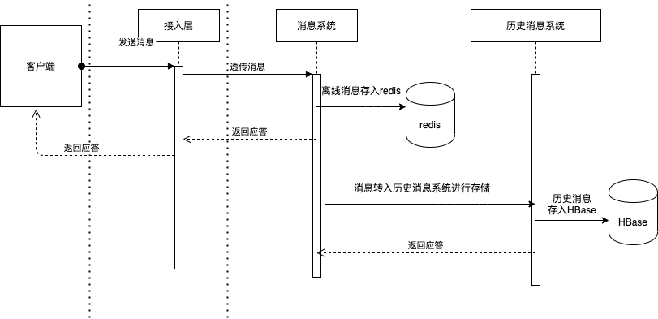
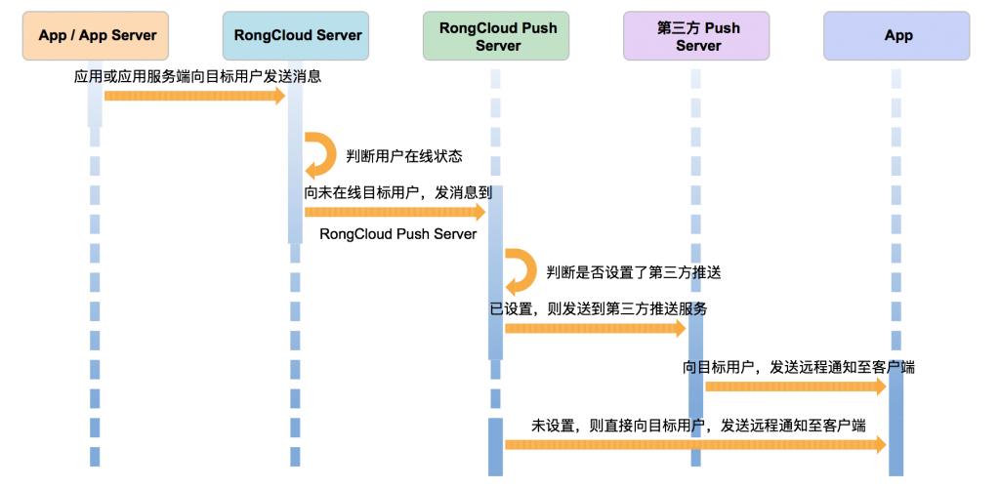
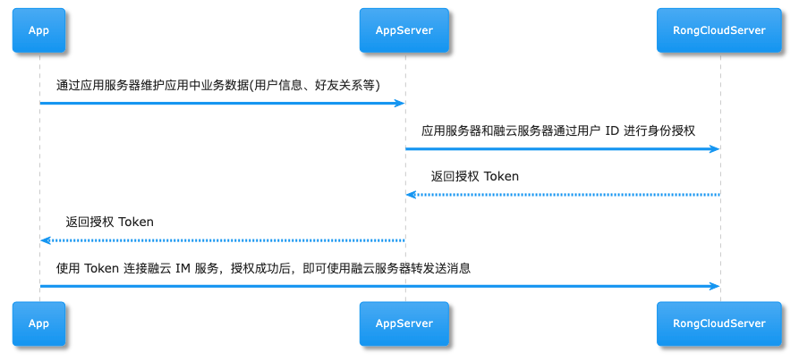
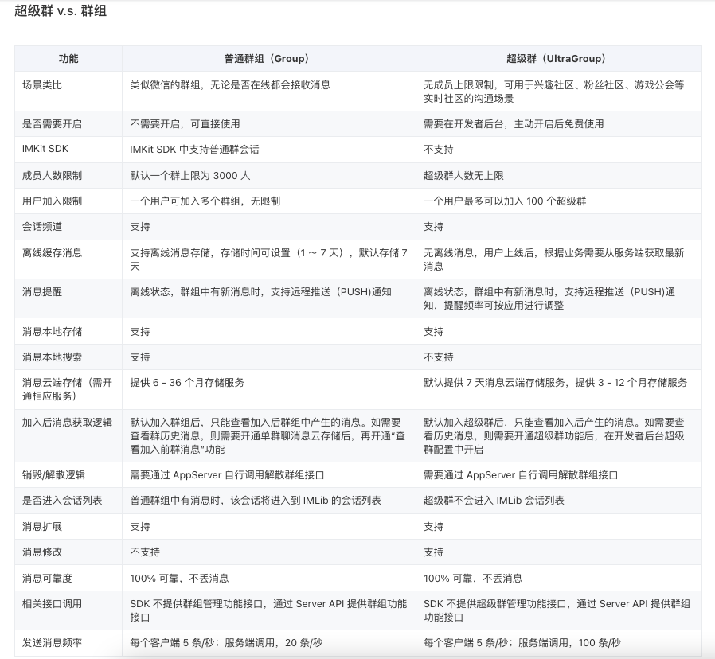
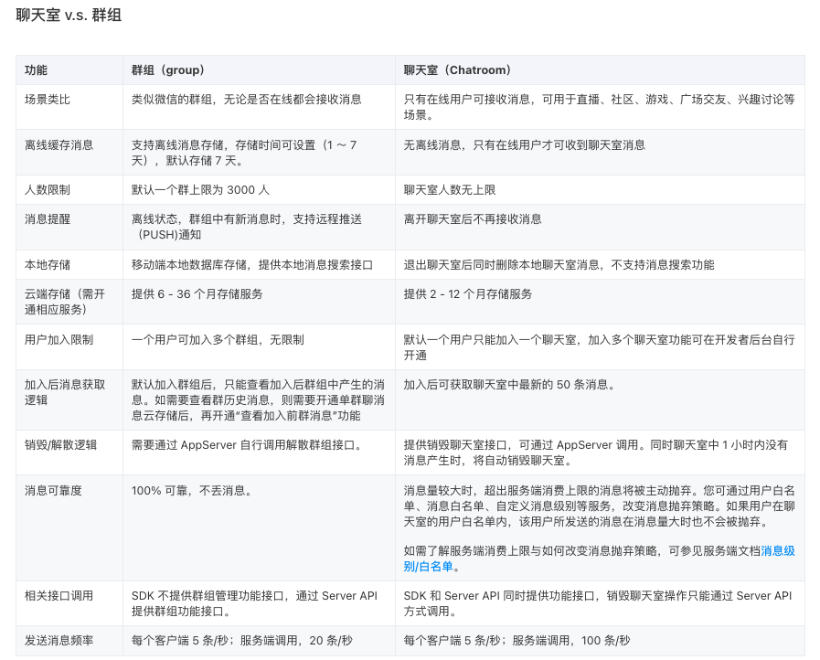

# iOS接入融云

新手引导：[https://support.rongcloud.cn/ks/MTA2NA==](https://support.rongcloud.cn/ks/MTA2NA==?type=email&tp=109&mark=1&fromrcu=322387)  

IM 快速集成：https://doc.rongcloud.cn/im/Android/5.X/ui/quick_integration 

音视频 快速集成：https://doc.rongcloud.cn/call/Android/5.X/callkit/import

Demo 体验：[https://www.rongcloud.cn/downloads/demo](https://www.rongcloud.cn/downloads/demo?type=email&tp=109&mark=2&fromrcu=322387)     

SDK 下载：[https://www.rongcloud.cn/downloads](https://www.rongcloud.cn/downloads?type=email&tp=109&mark=3&fromrcu=322387)   

* [客户端 SDK 体系](https://doc.rongcloud.cn/rcloud/-/-/client-library/overview)

- **SealTalk 应用**

    Android 端和 iOS 端的 SealTalk 应用集成了 IMLib 的基础通信能力。

    [下载 SealTalk 应用](https://www.rongcloud.cn/devcenter?type=demo) · [SealTalk Android 源码](https://github.com/sealtalk/sealtalk-android) · [SealTalk iOS 源码](https://github.com/rongcloud/sealtalk-ios)

- **开发者文档**

    5.X IMLib 快速上手：[Android](https://doc.rongcloud.cn/im/Android/5.X/noui/quick_integration) · [iOS](https://doc.rongcloud.cn/im/IOS/5.X/noui/quick_integration)

    4.X IMLib 快速上手：[Android](https://doc.rongcloud.cn/im/Android/4.X/noui/guide/quick/include/android) · [iOS](https://doc.rongcloud.cn/im/IOS/4.X/noui/guide/quick/include/ios) · [Web](https://doc.rongcloud.cn/im/Web/4.X/guide/quick/include/web) · [uni-app](https://doc.rongcloud.cn/im/uni-app/4.X/guide/quick/include/web) · [Flutter](https://doc.rongcloud.cn/im/Flutter/4.X/guide/quick/include/flutter) · [小程序](https://doc.rongcloud.cn/im/mini/4.X/guide/quick/include/mini)

- **API 参考文档**

    [IMLib 5.X Javadoc](https://www.rongcloud.cn/docs/api/android/imlib_v5/) · [IMLib 5.X Appledoc](https://www.rongcloud.cn/docs/api/ios/im_v5/imlib/html/)

# 融云IM整体架构

* [即时通讯网](http://www.52im.net/forum-103-1.html)
* [bilibili - 一套典型的IM通信协议设计详解，百万并发级别的IM通信协议](https://www.bilibili.com/video/BV1vB4y187DT/?from=search&vd_source=dc55c355e9f5b6174832aacfb5d8b6aa)
* [群聊系统的架构设计](https://donggeitnote.com/2022/01/08/im-architecture/)

* [阿里钉钉技术分享：企业级IM王者——钉钉在后端架构上的过人之处](https://xie.infoq.cn/link?target=http%3A%2F%2Fwww.52im.net%2Fthread-2848-1-1.html)

* [融云技术分享：全面揭秘亿级 IM 消息的可靠投递机制](https://www.163.com/dy/article/HFHV4LLO0518Q0L3.html)

* [兼具高效与易用，融云 IM 即时通讯长连接协议设计思路](https://zhuanlan.zhihu.com/p/557314852)

* [融云官网 - 技术干货](https://www.rongcloud.cn/blog/?paged=17&cat=61)
    * [【技术实践】IM 消息数据存储结构设计](https://www.rongcloud.cn/blog/?p=5104)
    * [【融云分析】 IM 即时通讯之链路保活](https://www.rongcloud.cn/blog/?p=2420)
    * [【融云分析】当我们在谈通讯安全时，我们在谈些什么](https://www.rongcloud.cn/blog/?p=2452)
* [融云segmentfault](https://segmentfault.com/u/rongyunrongcloud/articles)

## 融云整体的消息发送以及存储的流程

​		用户发送消息到服务器端后，首先会进入到消息系统中，消息系统会对消息进行分发以及存储。对于在线的接收方，会选择直接推送消息，但是遇到接收方不在线或者是消息推送失败的情况下，也会有另外的消息获取方式，接收方会主动向服务器拉取未收到的消息，但是接收方何时来服务器拉取消息以及从哪里拉取是未知的，所以消息存入到离线库的意义也就在这里。

​		消息系统存储离线的过程中，为了不影响整个系统的更为平稳，融云使用了消息队列，消息是异步存入到离线库中的。

​		在分发完消息后，消息服务会同步一份消息数据到历史消息服务中，历史消息服务会对消息进行落地存储。对于新的同步设备，会有消息漫游的需求，这也是历史消息的主要作用。在历史消息库中，客户端可以拉取任意会话的全量历史消息。

## 离线消息以及历史消息存储区别

离线消息我们存储介质选用的是 **Redis**

历史消息我们选用的是 **HBase**

## 客户端拉取消息

​		离线消息的获取针对的是自己的整个离线消息，包括所有的会话。离线消息的获取是自上而下的方式，一次获取200条。在客户端拉取离线消息的信令中，需要带上当前客户端缓存的消息的最大时间戳，上面的图我们应该知道，离线消息我们存储的是一个线性结构，Server 会根据这个时间戳向下查找离线消息，重装或者新安装 App 时，客户端可以传0上来，Server 也会缓存客户端拉取到的最后一条消息的时间戳，然后根据业务场景，客户端类型等因素来决定从哪里开始拉取，如果没有拉取完 Server 会在拉取消息的应答中带相应的标记位，告诉客户端继续拉取，客户端循环拉取，直到所有离线消息拉完。

​		历史消息的获取针对的是单一会话，在拉取过程中需要带上来对方的 ID(如果是单聊的话就是对方的 UserID，如果是群，则是群组ID以及当前会话的最前面消息的时间戳，Server 会定位到这个人的这个会话然后一次获取20条，采用的是自下而上的方式，即从最后面往前翻。只要有消息，客户端可以一直向前翻，手动触发获取会话的历史消息。

## IM 即时通讯之链路保活

* **消息链路保活机制**
    * 复合连接机制
    * 重连机制

* **推送链路保活机制**
    * iOS 手机有 APNS 来达到以上效果
    * Android官方推送系统 FCM 在国内基本不可用
        * 安卓系统上进程管理的两大机制：
            * LMK 机制：英文是Low Memory Killer, 基于 Linux 的内存管理机制衍生而来。
            * 安卓原生的权限管理机制（AppOps）
        * 基于以上两种机制，推送链路的保活也可分为两大类：
            * 进程保活：它的思路是根据 LMK 机制提高进程优先级，降低被杀的几率。
            * 进程拉活的策略和安卓系统的 AppOps 机制有关

# 融云官网提炼

## [产品概述](https://doc.rongcloud.cn/rcloud/-/-/instant-messaging)

即时通讯产品[单聊](https://www.rongcloud.cn/product/single-chat)、[群聊](https://www.rongcloud.cn/product/group-chat)、[超级群](https://www.rongcloud.cn/product/ultragroup)、[聊天室](https://www.rongcloud.cn/product/chatroom)

- 客户端 IM 界面组件 SDK，即 [IMKit](https://doc.rongcloud.cn/rcloud/-/-/client-library/imkit)。界面可定制。
- 客户端 IM 基础通讯能力库 SDK，即 [IMLib](https://doc.rongcloud.cn/rcloud/-/-/client-library/imlib)。

### 基本业务流程

**流程图解析**

1. App 需要同 App Server 之间进行信息交互，如：获取用户数据、用户好友关系，融云不维护 App 的用户系统和好友关系；
2. App Server 只需要和 RongCloud Server 进行身份授权，不需要提交详细用户资料及好友关系；
3. 开发者可根据自身的业务情况选择在应用加载或需要使用 IM 服务时进行授权；
4. App 发送消息需要经过 RongCloud Server 转发给目标终端设备，因为目标用户的离线、通知等逻辑决定了消息必须经由服务器进行一次转发。

**关于用户信息、好友关系、群组关系的说明**

融云只提供通讯服务。应用开发者应由客户端向应用服务器获取用户信息、好友关系和群组关系数据。

客户需要在应用服务器维护管理用户信息、群组关系等，并同步用户 ID、群组关系至融云。融云利用同步获取的信息发送消息。

在发送消息时，融云得到接收消息的用户、群组、聊天室 ID 后即可发送。消息发送过程中默认不会做任何权限校验。融云提供用户黑名单、用户白名单服务，可防止越过好友关系进行消息收发。

## 单聊业务

1. 用户 A 在端上注册登录，请求应用服务器的注册接口。应用服务器接收并管理用户信息。应用服务器同步用户 ID 至融云服务器，从融云获取用户身份验证令牌（Token），将 Token 存储到应用服务器，并返回 Token 至客户端。
2. 用户 A 在客户端上完成注册请求后，将获取的 Token 传入 SDK。SDK 负责连接融云服务器，进行初始化。
3. 用户 A 从应用服务器获取好友列表等信息，或者从其他业务场景里获取会话对象的 ID，直接发送单聊消息。
4. 如果需要「添加好友」功能，请通过应用服务器的申请和通过接口来实现。应用服务器存储维护好友关系数据。好友关系建立与销毁可使用系统消息通知用户。

## 群聊业务

1. 用户 A 在客户端需要加入群组（主动或者被动），应请求应用服务器。应用服务器更新群关系后，必须实时同步至融云服务端。
2. 用户 A 从应用服务器加载群列表，并根据需要加载群成员等信息，用于界面显示。
3. 如需通知所有群成员，可在服务器端发送群消息。
4. 退群的逻辑与上述过程类似。对于退群（或被退群）的用户 A，可以通过系统消息进行单独提醒。
5. 群成员变更必须实时同步至融云服务器，以帮助融云正确分发群组消息。

## 超级群业务

超级群会话业务基于 IMLib 开发，无成员上限限制。

1. 用户 A 在客户端需要加入群组（主动或者被动），应请求应用服务器。应用服务器更新群关系后，必须实时同步至融云服务端。
2. 用户 A 从应用服务器加载群列表，并根据需要加载群成员等信息，用于界面显示。
3. 如需通知所有群成员，可在服务器端发送群消息。
4. 退群的逻辑与上述过程类似。对于退群（或被退群）的用户 A，可以通过系统消息进行单独提醒。
5. 群成员变更必须实时同步至融云服务器，以帮助融云正确分发群组消息。

## 聊天室业务

聊天室会话的业务与群组会话类似。聊天室会话业务可以基于 IMKit 或 IMLib 开发。

> IMKit 不提供开箱即用的聊天室 UI 界面组件。

