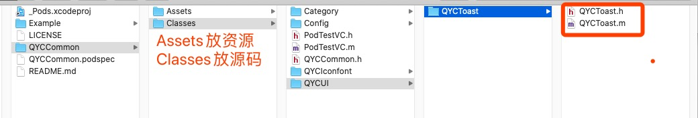
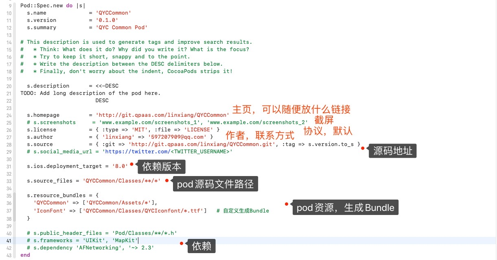
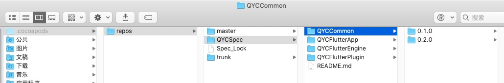
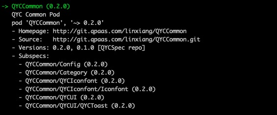
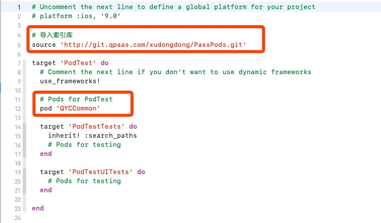
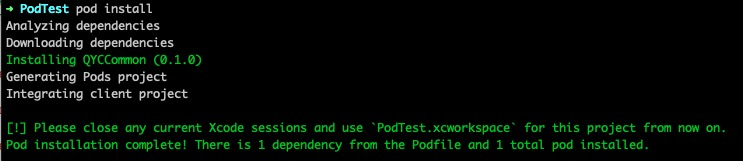
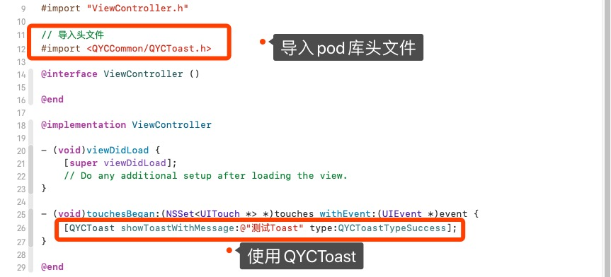
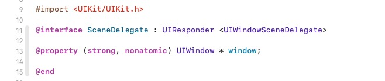

# 一、将项目中QYCToast抽离

按照《01.gitlab搭建私有pod》中的步骤创建了一个本地代码库，将项目中的QYCToast拖动到指定目录下




进入Example项目，`pod install` 本地安装，就可以在项目中看到


当我们编译时，发现QYCToast中报错，原来是找不到 iconfont 字体库，具体解决看《03.Pod资源》


根据编译过程中发现的各种报错，我们需要导入各种基础方法。


每个pod都需要维护一个 `xxx.podspec` 文件




开启本地验证

```
➜  pod lib lint --allow-warnings

// 前往本地仓库路径下，直接验证QYCCommon.podspec文件
➜  pod lib lint QYCCommon.podspec
```


将代码推到远程仓库

```
➜  git remote add origin http://xxxxxxxx/xxx
```


打tag，并推送，不然远程验证找不到对应版本

```
➜  QYCQRCode git:(master) ✗ git tag 1.0.0
➜  QYCQRCode git:(master) ✗ git push --tag
Total 0 (delta 0), reused 0 (delta 0)
To http://git.qpaas.com/linxiang/QYCCommon.git
 * [new tag]         1.0.0 -> 1.0.0
```


验证远程

```
pod spec lint --allow-warnings
```


本地创建repo关联远程索引库，已经存在索引库

```
➜  pod repo add QYCSpec http://git.qpaas.com/xudongdong/PassPods.git
Cloning spec repo `QYCSpec` from `http://git.qpaas.com/xudongdong/PassPods.git`
```

查看

```
➜  pod repo
```


将本地的 QYCCommon.podspec 文件推到 索引库 中

```
➜  pod repo push QYCSpec QYCCommon.podspec --allow-warnings
```


成功后，本地索引库 




远程索引库


更新索引库

```
➜  pod repo update QYCSpec
```


pod search QYCCommon 成功



```
➜  pod search QYCCommon

-> QYCCommon (0.1.0)     
   QYC Common Pod										/// .podspec 中的summary
   pod 'QYCCommon', '~> 0.1.0'			/// 安装推荐
   - Homepage: http://git.qpaas.com/xudongdong/PassPods				/// .podspec 中 homepage
   - Source:   http://git.qpaas.com/linxiang/QYCCommon.git		/// .podspec 中 source
   - Versions: 0.1.0 [QYCSpec repo]						/// .podspec 中 verson  &&  所属repo
```


# 四、在原项目中导入

## 问题一：导入成功后直接编译，失败！！


### 【原因】

> ```
> // 导入pod头文件
> #import <QYCCommon/QYCToast.h>
> 
> // 导入源码头文件
> #import "QYCToast.h"
> ```
>
> 项目源文件中的QYCToast依旧存在，与pod中的QYCToast编译冲突。
>
> 所以如上：
>
> 如果只调用pod中的`QYCToast` 是可以编译通过，因为头文件路径已明确，
>
> 如果调用源码中的`QYCToast`，`#import "QYCToast.h"`  则会产生与pod中的`QYCToast`编译冲突。


###【解决方案】

> 删除项目中已经剥离的源文件，编译通过！！


## 问题二：在pod库中文件进行了分层，导入后文件在同一目录下了？？？？


### 【原因】

在 `QYCCommon.podspec` ，文件引入，`**/*` 是一个正则，表示下面所有的文件

```
  s.source_files = 'QYCCommon/Classes/**/*'
```


### 【解决方案】

在 `QYCCommon.podspec` 中

```
 # 总领的头文件
  s.source_files = 'QYCCommon/Classes/QYCCommon.h'
  s.public_header_files = 'QYCCommon/Classes/QYCCommon.h'
  
  
  # 文件分层
  s.subspec 'Config' do |ss|
    # Config下所有的.h和.m文件
    ss.source_files = 'QYCCommon/Classes/Config/*.{h,m}'
  end
  
  s.subspec 'QYCIconfont' do |ss|
    # QYCIconfont下所有的文件，不包括文件夹
    ss.source_files = 'QYCCommon/Classes/QYCIconfont/*'

    ss.subspec 'Iconfont' do |sss|
      # Iconfont下所有的.h和.m文件
      sss.source_files = 'QYCCommon/Classes/QYCIconfont/Iconfont/*.{h,m}'
    end
  end
  
  s.subspec 'QYCUI' do |ss|
      ss.subspec 'QYCToast' do |sss|
        # QYCToast下所有的.h和.m文件
        sss.source_files = 'QYCCommon/Classes/QYCUI/QYCToast/*.{h,m}'
        sss.dependency 'QYCCommon/Config'
        sss.dependency 'QYCCommon/Category'
        sss.dependency 'QYCCommon/QYCIconfont'
      end
  end
```


# 五、创建新项目导入

## 1. 编辑 Podfile



## 2. pod install 成功




## 3. 调用 QYCToast



## 4. 崩溃


## 5. 【原因】

> ```
> -[AppDelegate window]: unrecognized selector sent to instance 0x6000037d8190
> ```
>
> 由于新建项目中出现了SecneDelegate，以前存在于AppDelegate中的window被放到了SceneDelegate中，
>
> 所以QYCToast中调用了 `[AppDelegate window]` 找不到该方法，导致崩溃！！！





## 6. 【解决方案】

### 6.1. 项目修改，移除SecneDelegate

将项目中的SecneDelegate移除，并将window手动迁移到AppDelegate中，即可。


### 6.2. 修改pod

暂未尝试


