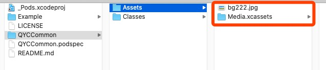
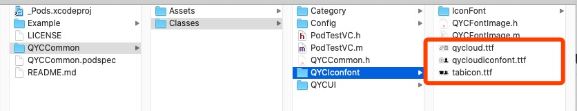
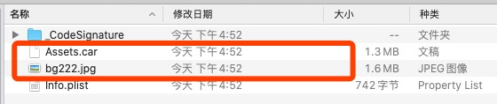

[关于 Pod 库的资源引用 resource_bundles or resources](https://juejin.im/post/6844903559931117581#heading-8)

[iOS 组件化开发（三）：加载资源文件](https://juejin.im/post/6844903588020355086)

[给 Pod 添加资源文件](http://blog.xianqu.org/2015/08/pod-resources/)


# Pod库中的资源文件


## 一、resources or resource_bundles

新版本的 `.podspec` 文件中，已经没有了 `resources` 选项，应该是不支持了！！！

这里我们只讨论 `resource_bundles`


## 二、resource_bundles 具体使用

### 1、在 `.podspec` 中配置 `resource_bundles`


QYCCommon.Bundle 中有 `.xcassets` 和 `jpg` 两中文件；

IconFont.Bundle 中的是字体库的资源文件。






### 2、本地Example项目 `pod install`


显示包内容，查看资源


### 3、Pod中加载资源

#### 3.0、获取 `NSBundle`

```
// 方式一：
NSString *IconFontBudlePath = [[NSBundle bundleForClass:[self class]].resourcePath 
											               	stringByAppendingPathComponent:@"/IconFont.bundle"];
NSBundle *resource_bundle1 = [NSBundle bundleWithPath:bundlePath];
        
// 方式二：
NSBundle *bundle = [NSBundle bundleForClass:[self class]];
NSURL *IconFontBudleURL = [bundle URLForResource:@"IconFont" withExtension:@"bundle"];
NSBundle *IconFontBudle = [NSBundle bundleWithURL:IconFontBudleURL];
```


#### 3.1、加载 `.jpg` 文件

使用 `imageNamed:` ，图片加载不出来！！！Why????

```
UIImage *image = [UIImage imageNamed:@"bg222.jpg"];
```

原来：`load from main bundle`


先获取资源所属Bundle，然后在获取图片资源。

```
NSBundle *bundle = [NSBundle bundleForClass:[self class]];   /// 这里的self为当前任意调用类
NSURL *commonBudleURL = [bundle URLForResource:@"QYCCommon" withExtension:@"bundle"];
NSBundle *commonBudle = [NSBundle bundleWithURL:commonBudleURL];

UIImage *image = [UIImage imageNamed:@"bg222.jpg" inBundle:commonBudle compatibleWithTraitCollection:nil];
```


#### 3.2、加载 `.xcassets` 中的图片资源

Bundle 里可以有一个 `.xcassets`。Xcode 最后会把它们编译成 `Assets.car` 文件。



同上，先获取资源所属Bundle，然后在获取图片资源。

```
NSBundle *bundle = [NSBundle bundleForClass:[self class]];
NSURL *commonBudleURL = [bundle URLForResource:@"QYCCommon" withExtension:@"bundle"];
NSBundle *commonBudle = [NSBundle bundleWithURL:commonBudleURL];

UIImage *image2 = [UIImage imageNamed:@"mybg" inBundle:commonBudle compatibleWithTraitCollection:nil];
```


#### 3.3、获取 iconfont 字体库

同上，先获取资源所属Bundle，然后在获取字体库路径。

```
NSString *bundlePath1 = [[NSBundle bundleForClass:[self class]].resourcePath stringByAppendingPathComponent:@"/IconFont.bundle"];
NSBundle *resource_bundle1 = [NSBundle bundleWithPath:bundlePath1];
NSURL *fontFileUrl1 = [resource_bundle1 URLForResource:@"fontname" withExtension:@"ttf"];
```


