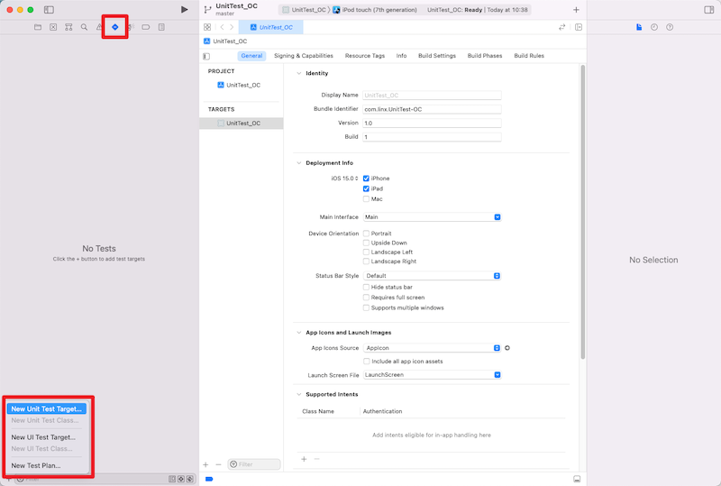
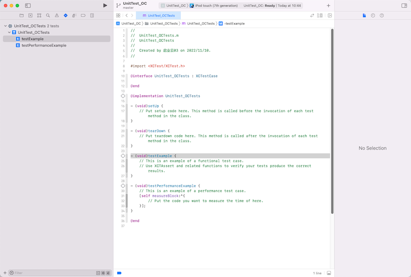

# XCTest - Unit Test

参考：

* [iOS Unit Testing and UI Testing Tutorial](https://www.kodeco.com/21020457-ios-unit-testing-and-ui-testing-tutorial)

* [iOS 单元测试之XCTest详解](https://blog.csdn.net/hello_hwc/article/details/46671053)


## OC工程实操

### 1、新建 Unit Test Target






### 2、文件介绍

```objective-c
//
//  UnitTest_OCTests.m
//  UnitTest_OCTests
//
//  Created by 启业云03 on 2022/11/10.
//

#import <XCTest/XCTest.h>

@interface UnitTest_OCTests : XCTestCase

@end

@implementation UnitTest_OCTests

- (void)setUp {
    // Put setup code here. This method is called before the invocation of each test method in the class.
}

- (void)tearDown {
    // Put teardown code here. This method is called after the invocation of each test method in the class.
}

- (void)testExample {
    // This is an example of a functional test case.
    // Use XCTAssert and related functions to verify your tests produce the correct results.
}

- (void)testPerformanceExample {
    // This is an example of a performance test case.
    [self measureBlock:^{
        // Put the code you want to measure the time of here.
    }];
}

@end
```


**测试用例的命名**

XCTest中所有的测试用例的命名都是以test开头的。例如上文中的

```objective-c
- (void)testExample {
    // This is an example of a functional test case.
    XCTAssert(YES, @"Pass");
}
```


**setUp和tearDown**

* Setup 是在所有测试用例运行之前运行的函数，在这个测试用例里进行一些通用的初始化工作

* tearDown 是在所有的测试用例都执行完毕后执行的


