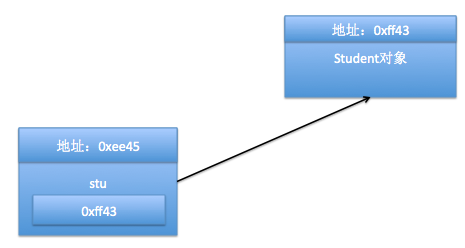
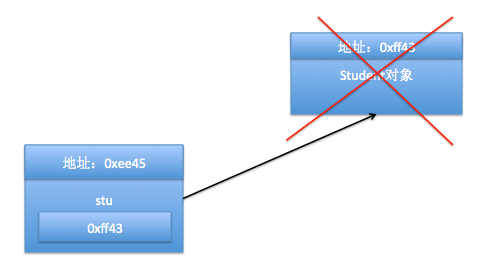
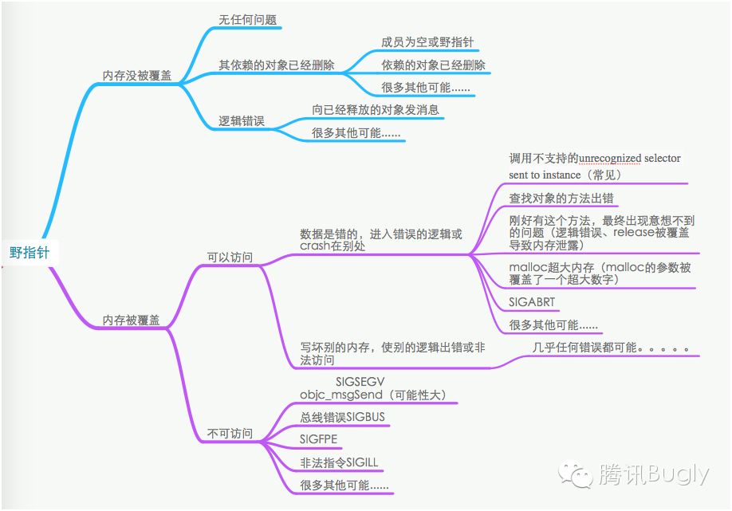
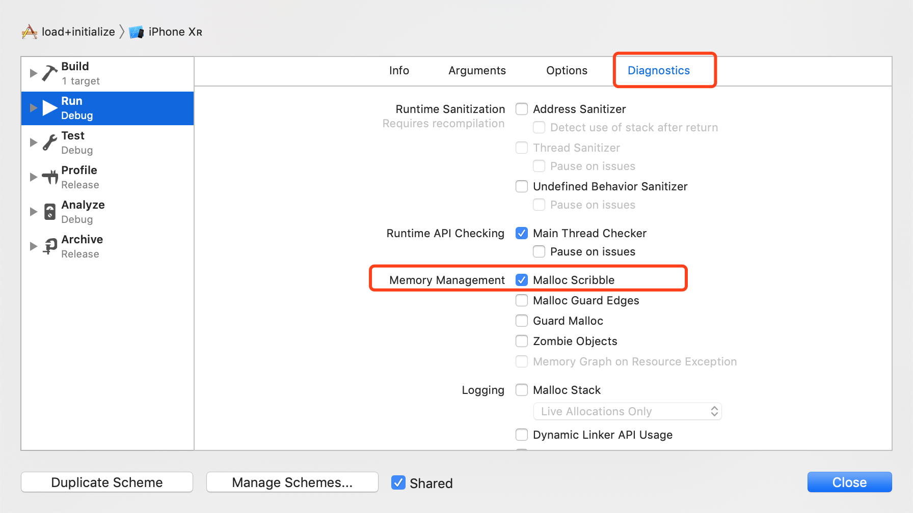
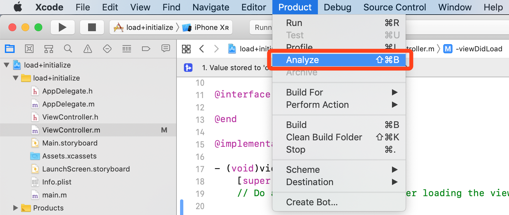
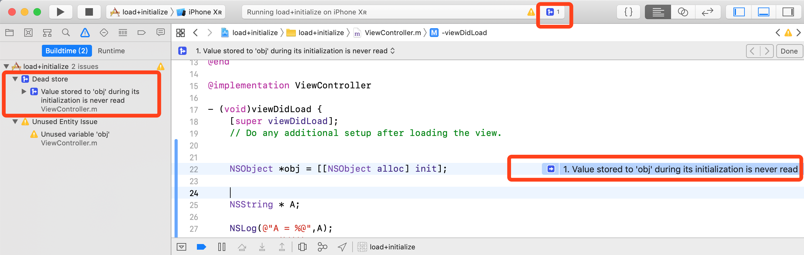
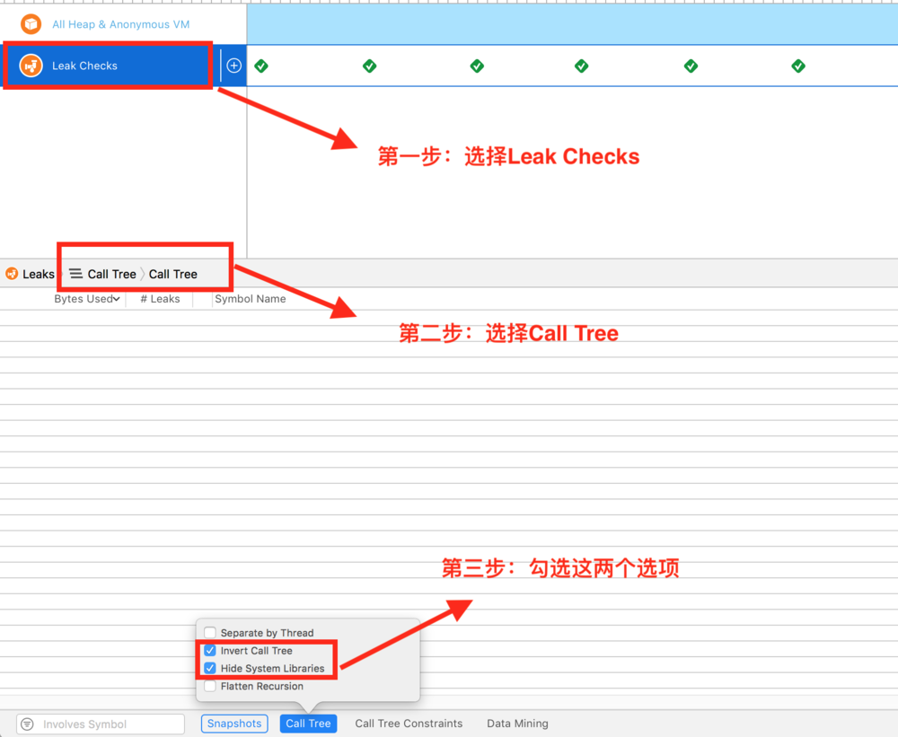
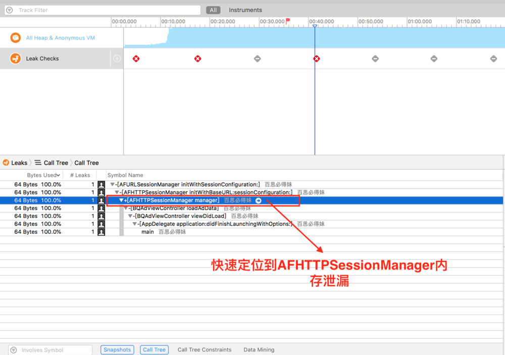

# 性能优化&调试

* [一、iOS异常&调试]()
	* [1.1、什么是空指针、野指针？如何产生野指针？举例](#1.1)
	* [1.2、如何产生野指针？举例](#1.2)
	* [1.3、野指针的定位与调试](#1.3)
	* [1.4、僵尸对象、野指针](#1.4)
	* [1.5、调试僵尸对象（Zombie Objects）](#1.5)
	* [1.6、什么是内存泄漏？什么是内存溢出？](#1.6)
	* [1.7、iOS中有哪些内存泄漏？](#1.7)
	* [1.8、开发项目时你是怎么检查内存泄露？](#1.8)
	* [1.9、retain cycle有哪些？如何避免retain cycle？](#1.9)
	* [1.10、错误类型：BAD_ACCESS、EXC_BAD_ACCESS、SIGSEGV、SIGBUS、EXC_ARITHMETIC、SIGILL、SIGABRT、看门狗超时。]()
	* [1.11、LLDB日常调试]()

* [二、APP优化]()
 	* [1.10、如何高性能的给 UIImageView 加个圆角？](#1.10)
	* [1.11、如何去优化UITableVIew？](#1.11)
	* [1.12、如何对定位和分析项⽬中影响性能的地⽅？以及如何进⾏性能优化？](#1.12)
	* [1.13、iOS APP优化之冷启动优化](#1.13)
	* [1.14、iOS APP优化之UI渲染优化](#1.14)
	* [1.15、iOS APP优化之内存优化](#1.15)
	* [1.16、iOS APP优化之网络优化](#1.16)
	* [1.17、iOS APP优化之包瘦身](#1.17)
	* [1.18、iOS APP优化之耗电优化](#1.18)
	
	
* [二、监控、数据采集](#二)
	* [2.1、实现卡顿的监控](#2.1)
	* [2.2、如何实现对一个网络请求的数据收集，如：成功率、请求耗时、流量等](#2.2)
	* [2.3、数据采集，如：启动、页面事件、用户点击、ScrollView滑动事件等](#2.3)


> **优秀文档**
>
> [腾讯Bugly的专栏](https://blog.csdn.net/tencent_bugly)
> 
> [如何定位Obj-C野指针随机Crash(一)：先提高野指针Crash率](http://blog.csdn.net/tencent_bugly/article/details/46277055)
> [如何定位Obj-C野指针随机Crash(二)：让非必现Crash变成必现](https://blog.csdn.net/Tencent_Bugly/article/details/46374401)
> [如何定位Obj-C野指针随机Crash(三)：加点黑科技让Crash自报家门](https://blog.csdn.net/Tencent_Bugly/article/details/46545155)
> 
> [戴铭 - 深入剖析 iOS 性能优化](https://ming1016.github.io/2017/06/20/deeply-ios-performance-optimization/)
> 
> [移动端监控体系之技术原理剖析](https://www.jianshu.com/p/8123fc17fe0e)
> [iOS无埋点数据SDK实践之路](https://www.jianshu.com/p/69ce01e15042)
> [iOS 无痕埋点解决方案—— AOP 篇（1）](https://www.jianshu.com/p/2c68896aeb9b)


<h2 id="1.1">1.1、什么是空指针、野指针？</h2>

[【Objective-C】09-空指针和野指针](https://www.cnblogs.com/mjios/archive/2013/04/22/3034788.html)

* 空指针：
 
	1> 没有存储任何内存地址的指针就称为空指针(NULL指针)

	2> 空指针就是被赋值为0的指针，在没有被具体初始化之前，其值为0。

	```
		Student *s1 = NULL;
		Student *s2 = nil;
	```

* 野指针：

	"野指针"不是NULL指针，是指向"垃圾"内存（不可用内存）的指针。野指针是非常危险的。向野指针发送消息会导致崩溃。野指针错误形式在Xcode中通常表现为：Thread 1：EXC_BAD_ACCESS，因为你访问了一块已经不属于你的内存。

* 野指针，有指向，而空指针无指向，为NULL


<h2 id="1.2">1.2、如何产生野指针？举例</h2>

> 1. 指针变量未初始化
> 
> 	任何指针变量刚被创建时不会自动成为NULL指针，它的缺省值是随机的，它会乱指一气。所以，指针变量在创建的同时应当被初始化，要么将指针设置为NULL，要么让它指向合法的内存。
> 
> 2. 指针释放后之后未置空
> 
> 	有时指针在free或delete后未赋值 NULL，便会使人以为是合法的。别看free和delete的名字（尤其是delete），它们只是把指针所指的内存给释放掉，但并没有把指针本身干掉。此时指针指向的就是“垃圾”内存。释放后的指针应立即将指针置为NULL，防止产生“野指针”。
> 
> 3. 指针操作超越变量作用域
> 
> 	不要返回指向栈内存的指针或引用，因为栈内存在函数结束时会被释放。


**示例一：`指针变量未初始化`**

```
	NSString * A; 
	NSLog(@"A = %@",A);
   NSLog(@"A的地址 = %p",A);
	
// 输出
	A = (null)
	A的地址 = 0x0
```

> 由于这个指针变量没有被初始化所以没有指向任何位置，因此系统规定它指向一个特定的默认内存地址，这个特定的内存地址一般是0x0，内存地址中没有存放任何东西，打印出来时(null)，这个指针也被称为空指针。

**示例二：`指针释放后之后未置空`**

assign可以用来修饰OC对象，会造成野指针。
unsafe_unretained声明一个弱引用，但不会自动置为nil，会出现野指针。

**示例三：指针操作超越变量作用域**

自定义Student类，在main函数中添加下列代码

```
1 Student *stu = [[Student alloc] init];
2 
3 [stu setAge:10];
4 
5 [stu release];
6 
7 [stu setAge:10];
```

运行程序，你会发现`[stu setAge:10];`报错了，是个野指针错误！

**分析一下报错原因**

1> 执行完第1行代码后，内存中有个指针变量stu，指向了Student对象
`Student *stu = [[Student alloc] init];`



假设Student对象的地址为0xff43，指针变量stu的地址为0xee45，stu中存储的是Student对象的地址0xff43。即指针变量stu指向了这个Student对象。

2> 接下来是第3行代码: `[stu setAge:10];`

这行代码的意思是：给stu所指向的Student对象发送一条setAge:消息，即调用这个Student对象的setAge:方法。目前来说，这个Student对象仍存在于内存中，所以这句代码没有任何问题。

3> 接下来是第5行代码: `[stu release];`

这行代码的意思是：给stu指向的Student对象发送一条release消息。在这里，Student对象接收到release消息后，会马上被销毁，所占用的内存会被回收。



Student对象被销毁了，地址为0xff43的内存就变成了"垃圾内存"，然而，指针变量stu仍然指向这一块内存，这时候，stu就称为了**野指针！**

4> 最后执行了第7行代码: `[stu setAge:10];`

这句代码的意思仍然是： 给stu所指向的Student对象发送一条setAge:消息。但是在执行完第5行代码后，Student对象已经被销毁了，它所占用的内存已经是垃圾内存，如果你还去访问这一块内存，那就会报野指针错误。这块内存已经不可用了，也不属于你了，你还去访问它，肯定是不合法的。所以，这行代码报错了！

5> 如果修改下代码： 

```
1 Student *stu = [[Student alloc] init];
2 
3 [stu setAge:10];
4 
5 [stu release];
6 
7 stu = nil;   // stu变成了空指针，stu就不再指向任何内存了
8 
9 [stu setAge:10];
```
 
 
 
因为stu是个空指针，没有指向任何对象，因此第9行的setAge:消息是发不出去的，不会造成任何影响。当然，肯定也不会报错。


<h2 id="1.3">1.3、野指针的定位与调试</h2>

> [如何定位Obj-C野指针随机Crash(一)：先提高野指针Crash率](http://blog.csdn.net/tencent_bugly/article/details/46277055)
> [如何定位Obj-C野指针随机Crash(二)：让非必现Crash变成必现](https://blog.csdn.net/Tencent_Bugly/article/details/46374401)
> [如何定位Obj-C野指针随机Crash(三)：加点黑科技让Crash自报家门](https://blog.csdn.net/Tencent_Bugly/article/details/46545155)

> [iOS实录15：浅谈iOS Crash（二）](http://www.cocoachina.com/articles/19849)

**1、概述野指针**

野指针是指向一个已删除的对象 或 未申请访问受限内存区域的指针。而这里的野指针主要是对象释放后，指针未置空导致的野指针。该类Crash发生比较随机，找出来比较费劲，比较常见的做法是，在开发阶段，提高这类Crash的复现率，尽可能得将其发现并解决。

向OC对象发出release消息，只是标记对象占用的那块内存可以被释放，系统并没有立即收回内存；如果此时还向该对象发送其他消息，可能会发生Crash，也可能没有问题。下图是 访问野指针（指向已删除对象的指针）可能发生的情况。




随机性强

尽管大公司已经有各种单元、行为、自动化以及人工化测试，尽量的去模拟用户的使用场景，但野指针异常总是能巧妙的避开测试，在线上大发神威。原因绝不仅仅在于测试无法覆盖所有的使用场景

难以定位

NSException是高抽象层级上的封装，这意味着它可以提供更多的错误信息给我们参考。而野指针几乎出自于C语言层面，往往我们能获得的只有系统栈信息，单单是定位错误代码位置已经很难了，更不要说去重现修复


> **开发阶段野指针解决思路**
> 
> 从上图可以知道，野指针造成的Crash的随机性比较大，但是被随机填入的数据是不可访问的情况下，Crash是必现的。我们的思路是：想办法给 野指针指向的内存填写不可访问的数据，让随机的Crash变成必现的Crash。


**2、设置Malloc Scribble**

Xcode提供的Malloc Scribble，可以将对象释放后在内存上填上不可访问的数据，将随机发生变成不随机发生的事情，选中 `Product->Scheme->Edit Scheme ->Diagnostics ->勾选 Malloc Scribble项`，结果如下：



设置了Enable Scribble，在对象申请内存后在申请的内存上填0xaa，内存释放后在释放的内存上填0x55；如果内存未被初始化就被访问，或者释放后被访问，Crash必现。

说明：该方法必须连接Xcode运行代码才发现，不适合测试人员使用。可以基于fishhook  ，选择hook对象释放的接口（C的free函数），达到和设置Enable Scribble一样的效果。具体参考[如何定位Obj-C野指针随机Crash(一)：先提高野指针Crash率](http://blog.csdn.net/tencent_bugly/article/details/46277055)


**3、代码中的注意事项**

检查使用 assgin或 unsafe_unretained 修饰指向OC对象的指针 和 Core Foundation等底层操作。


<h2 id="1.4">1.4、僵尸对象、野指针</h2>

僵尸对象： 已经被释放的对象（xcode 中默认不实时检查僵尸对象）
野指针： 指向僵尸对象（不可用的内存）的指针

```
1 Student *stu = [[Student alloc] init];
2 
3 [stu setAge:10];
4 
5 [stu release];
6 
7 [stu setAge:10];
```


<h2 id="1.5">1.5、调试僵尸对象（Zombie Objects）</h2>

僵尸对象：已经被释放掉的对象。一般来说，访问已经释放的对象或向它发消息会引起错误。因为指针指向的内存块认为你无权访问或它无法执行该消息，这时候内核会抛出一个异常（ EXC ），表明你不能访问该存储区域（BAD ACCESS）。（EXC_BAD_ACCESS类型错误）

**使用NSZombieEnabled调试**

启用这项调试功能之后，运行期系统会把所有已经回收的实例转化为特殊的”僵尸对象“，而不是真正回收他们。这种对象所在的核心内存无法重用，因此不可能遭到复写。僵尸对象收到消息之后，会抛出异常，其中准确说明了发送过来的消息，并描述了回收之前的那个对象。僵尸对象是调试内存管理问题的最佳方式。

> Product -> Scheme -> Edit Scheme -> Diagnostics -> 勾选Zombie Objects 项，如下图：


> Product -> Scheme -> Edit Scheme -> Arguments设置NSZombieEnabled、MallocStackLoggingNoCompact两个变量，且值均为YES。如下图：


<h2 id="1.6">1.6、什么是内存泄漏？什么是内存溢出？</h2>

[内存泄漏（Memory Leak）](https://baike.baidu.com/item/内存泄漏/6181425?fr=aladdin)是指程序中己动态分配的堆内存由于某种原因程序 **未释放或无法释放，造成系统内存的浪费**，导致程序运行速度减慢甚至系统崩溃等严重后果。


[内存溢出（out of memory）](https://baike.baidu.com/item/内存溢出/1430777?fr=aladdin)：是指程序在申请内存时，没有足够的内存空间供其使用。通俗理解就是**内存不够用了**，通常在运行大型应用或游戏时，应用或游戏所需要的内存远远超出了你主机内安装的内存所承受大小，就叫内存溢出。最终导致机器重启或者程序crash。


<h2 id="1.7">1.7、iOS中有哪些内存泄漏？</h2>

1. AFNetworking未创建成单例使用；
2. NSTimer/CADisplayLink循环引用, `self.timer = [NSTimer scheduledTimerWithTimeInterval:1 target:self selector:@selector(startTimer) userInfo:nil repeats:YES];`；
3. delegate循环引用, 使用strong/retain修饰符很大概率出现循环引用，所以推荐使用weak；
4. Block循环引用；
5. KVO与通知，在 dealloc 时需要对监听进行释放。

	```
	[[NSNotificationCenter defaultCenter] removeObserver:self]; 
	[self removeObserver:self forKeyPath:@"" context:nil];
	```
	> 关于通知，iOS9.0后我们才不用移除也不会有异常,而在9.0之前我们还是要手动移除的。我们都知道在 iOS 开发中我们会经常用到NSNotificationCenter用于对象间通信方式，特别是在针对一对多和跨层通信的时候,而在观察者注册时，通知中心并没有对观察者对象做 retain 处理，而是对观察者对象进行 `unsafe_unretained` 引用,而`unsafe_unretained` 与 `weak` 的区别是当被引用的对象释放时不会自动置为nil,也就是成了野指针,而 `weak` 会当被引用的对象释放时自动置为nil,所以也就导致了我们在iOS9.0之前没有手动移除通知的时候对象被释放掉而通知中心就成了野指针,所有造成了崩溃问题,然后在iOS9.0之后通知中心对观察者做了弱引用。
	
6. 非OC对象需要自己手动释放，注意CF、CG对象的创建和释放。Core Foundation、Core Graphics等框架中的参数仍然需要手动管理内存，Core Foundation是一组C语言接口；
7. 大次数循环内存暴涨问题


<h2 id="1.8">1.8、开发项目时你是怎么检查内存泄露？</h2>

**第一种：静态分析方法（Analyze）**

> Xcode --> Product --> Analyze



完成后




**第二种：动态分析方法（Instrument工具库里的Leaks）**







**第三种：MLeaksFinder**

**[MLeaksFinder](https://github.com/Zepo/MLeaksFinder)** 是微信阅读团队为了简化内存泄漏排查工作，推出的第三方工具，也是我们当前项目中内存泄漏的工具之一。

特点：集成简单，主要检查UI方面（UIView 和 UIViewController）的泄漏。

原理：不入侵开发代码，通过hook 掉 UIViewController 和 UINavigationController 的 pop 跟 dismiss 方法，检查ViewController对象被 pop 或 dismiss 一小段时间后，看看该ViewController对象的 view，view 的 subviews 等等是否还存在。

实现：为基类 NSObject 添加一个方法 -willDealloc 方法，利用weak指针指向自己，并在一小段时间(3秒)后，再次检测该weak指针是否有效，有效则内存泄漏。

集成：通过Cocoapods引入或直接把代码拖进项目，很方便。发生内存泄漏，会弹出警告框，提示发生内存泄漏的位置。

说明：详细内容请参考：MLeaksFinder：[精准 iOS 内存泄露检测工具](http://wereadteam.github.io/2016/02/22/MLeaksFinder/)和 [MLeaksFinder 新特性](http://wereadteam.github.io/2016/07/20/MLeaksFinder2/)


<h2 id="1.9">1.9、retain cycle有哪些？如何避免retain cycle？</h2>

**问：retain cycle有哪些？**

1. NSTimer/CADisplayLink循环引用, `self.timer = [NSTimer scheduledTimerWithTimeInterval:1 target:self selector:@selector(startTimer) userInfo:nil repeats:YES];`；
2. delegate循环引用, 使用strong/retain修饰符很大概率出现循环引用，所以推荐使用weak；
3. Block循环引用；


**问：如何避免retain cycle？**

* NSTimer -- [NSTimer循环引用解决方案](https://www.jianshu.com/p/aaf7b13864d9)

	1. **__weak修饰self方法是无效的**，想法是对的，但是做法是无效的。因为无论是weak还是strong修饰，在NSTimer中都会重新生成一个新的强引用指针指向self，导致循环引用的。
	2. 及时关闭定时器，调用 `- (void)invalidate;`；
	3. WeakProxy：创建一个继承NSProxy的子类WeakProxy，并实现消息转发的相关方法。
	4. 将timer放入block中。


* Block
	
	1. `__weak typeof(self) weakSelf = self;
__strong typeof(self) strongSelf = weakSelf;`;
	2. [@weakify, @strongify](https://www.jianshu.com/p/3d6c4416db5e)


* Delegate
	
	1. MRC只能用assign修饰；
	2. ARC最好使用weak修饰，属性所指的对象遭到摧毁时，属性也会被清空(nil out)，如果使用assign，会产生野指针。


<h2 id="1.10">1.10、如何高性能的给 UIImageView 加个圆角？</h2>

[iOS Quart2D绘图之UIGraphicsBeginImageContextWithOptions基础。](https://www.jianshu.com/p/4e22c6ac114d)

**不好的解决方案**

使用下面的方式会强制Core Animation提前渲染屏幕的离屏绘制, 而离屏绘制就会给性能带来负面影响，会有卡顿的现象出现

```
self.view.layer.cornerRadius = 5;
self.view.layer.masksToBounds = YES;
```
**正确的解决方案：使用绘图技术**

```
- (UIImage *)circleImage {
    // NO代表透明
    UIGraphicsBeginImageContextWithOptions(self.size, NO, 0.0);
    // 获得上下文
    CGContextRef ctx = UIGraphicsGetCurrentContext();
    // 添加一个圆
    CGRect rect = CGRectMake(0, 0, self.size.width, self.size.height);
    CGContextAddEllipseInRect(ctx, rect);
    // 裁剪
    CGContextClip(ctx);
    // 将图片画上去
    [self drawInRect:rect];
    UIImage *image = UIGraphicsGetImageFromCurrentImageContext();
    // 关闭上下文
    UIGraphicsEndImageContext();
    return image;
}
```

**正确的解决方案：贝塞尔曲线"切割"图片**

给UIImageView 添加了的圆角，其实也是通过绘图技术来实现的

```
	UIImageView *imageView = [[UIImageView alloc] initWithFrame:CGRectMake(0, 0, 100, 100)];
	imageView.center = CGPointMake(200, 300);
	UIImage *anotherImage = [UIImage imageNamed:@"image"];
	UIGraphicsBeginImageContextWithOptions(imageView.bounds.size, NO, 1.0);
	[[UIBezierPath bezierPathWithRoundedRect:imageView.bounds
	                       cornerRadius:50] addClip];
	[anotherImage drawInRect:imageView.bounds];
	imageView.image = UIGraphicsGetImageFromCurrentImageContext();
	UIGraphicsEndImageContext();
	[self.view addSubview:imageView];
```

<h2 id="1.11">1.11、如何去优化UITableVIew？</h2>

1. 使用cell的重用机制，注册重用标识符；
2. 缓存cell高度；
3. 进行局部更新，而不是全局更新TableView；
4. 使用不透明视图，不要使用ClearColor，无背景色，透明度也不要设置为0，因为渲染耗时比较长；
5. 不要阻塞主线程，耗时任务放到子线程；
6. 加载网络图片使用异步加载，并缓存；尽量不要设置圆角，采用带圆角的图片；
7. 减少重新布局，不要动态添加视图；
8. 实现一些必要用到的代理方法，没有必要的则不用实现；
9. 不要做多余的绘制工作。在实现drawRect:的时候，它的rect参数就是需要绘制的区域，这个区域之外的不需要进行绘制。例如上例中，就可以用CGRectIntersectsRect、CGRectIntersection或CGRectContainsRect判断是否需要绘制image和text，然后再调用绘制方法；
10. 预渲染图像。当新的图像出现时，仍然会有短暂的停顿现象。解决的办法就是在bitmap context里先将其画一遍，导出成UIImage对象，然后再绘制到屏幕；


<h2 id="1.12">1.12、如何对定位和分析项⽬中影响性能的地⽅？以及如何进⾏性能优化？</h2>

[检测iOS的APP性能的一些方法](https://www.jianshu.com/p/802cb5210dc4)

1. Time Profiler

* Time Profiler帮助我们分析代码的执行时间，找出导致程序变慢的原因，告诉我们“时间都去哪儿了？”。
* Time Profiler分析原理：它按照固定的时间间隔来跟踪每一个线程的堆栈信息，通过统计比较时间间隔之间的堆栈状态，来推算某个方法执行了多久，并获得一个近似值。其实从根本上来说与我们的原始分析方法异曲同工，只不过其将各个方法消耗的时间统计起来。

2. Allocations

instrument工具跟踪应用的内存分配情况。

3. Leak

Instruments Leak 调试内存泄露是必备技能。


<h2 id="1.13">1.13、iOS APP冷启动优化</h2>

[极客时间 - iOS开发高手课 02 | App 启动速度怎么做优化与监控？](https://time.geekbang.org/column/article/85331)

[美团外卖iOS App冷启动治理](https://tech.meituan.com/2018/12/06/waimai-ios-optimizing-startup.html)


[sunnyxx -- iOS 程序 main 函数之前发生了什么](http://blog.sunnyxx.com/2014/08/30/objc-pre-main/)


<h2 id="1.14">1.14、iOS APP优化之UI渲染优化</h2>


<h2 id="1.15">1.15、iOS APP优化之内存优化</h2>

* 减少内存泄露
* 降低内存使用峰值


<h2 id="1.16">1.16、iOS APP优化之网络优化</h2>

<h2 id="1.17">1.17、iOS APP优化之包瘦身</h2>

[极客时间 - iOS开发高手课 10 | 包大小：如何从资源和代码层面实现全方位瘦身？](https://time.geekbang.org/column/article/88573)

<h2 id="1.18">1.18、iOS APP优化之耗电优化</h2>

**耗电的主要来源**

* CPU处理，Processing
* 网络，Networking
* 定位，Location
* 图像，Graphics

**耗电优化**

尽可能降低CPU、GPU功耗
少用定时器
优化I/O操作
尽量不要频繁写入小数据，最好批量一次性写入
读写大量重要数据时，考虑用dispatch_io，其提供了基于GCD的异步操作文件I/O的API。用dispatch_io系统会优化磁盘访问
数据量比较大的，建议使用数据库（比如SQLite、CoreData）


<h1 id="二">二、监控、数据采集</h1>

<h2 id="2.1">2.1、实现卡顿的监控</h2>

[iOS版微信界面卡顿监测方案](http://www.52im.net/thread-136-1-1.html)

<h2 id="2.2">2.2、如何实现对一个网络请求的数据收集，如：成功率、请求耗时、流量等</h2>


[移动端监控体系之技术原理剖析](https://www.jianshu.com/p/8123fc17fe0e)


<h2 id="2.3">2.3、数据采集，如：启动、页面事件、用户点击、ScrollView滑动事件等</h2>


[iOS无埋点数据SDK实践之路](https://www.jianshu.com/p/69ce01e15042)


