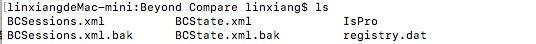
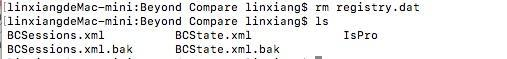

### 参考文档
[Beyond Compare for Mac 无限试用方法](https://www.seidea.com/2017/03/23/beyond-compare-for-mac-无限试用方法/)
[Beyond Compare Download](https://www.scootersoftware.com/download.php)

### 原理：

> `BCompare` 是应用程序启动的程序，只要在在启动的时候**删除 registry.dat**(`Library/Application Support/Beyond Compare/registry.dat`)注册信息就好了。

* #### registry.dat所在目录：`Library/Application Support/Beyond Compare`

* #### 移除 registry.dat：`rm registry.dat`

* #### 重启程序即可

