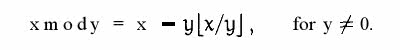

### 文档

[原码, 反码, 补码 详解](https://www.cnblogs.com/zhangziqiu/archive/2011/03/30/ComputerCode.html)

[原码、反码、补码的产生、应用以及优缺点有哪些？](https://www.zhihu.com/question/20159860)

[计算机数学小书1-原码，反码和补码](https://zhuanlan.zhihu.com/p/36036038)

https://segmentfault.com/a/1190000009589361


###  1. 机器数

1. 机器数是一个数在计算机中的二进制表示形式。

2. 机器数带符号，最高位存放，正数为0，负数为1。

```
		十进制数+3，计算机字长为8位的话，转换二进制为00000011
		十进制数-3，计算机字长为8位的话，转换二进制为10000011
		上述这两个二进制就是机器数。
```


### 2. 真值

1. 由于符号位的存在，机器数不等于真值；

2. 将带符号位的机器数对应的真正数值称为机器数的真值。

```
		-3是真值，它的机器数是10000011（其形式值为131【十进制】）
```


> **对于一个数，计算机要使用一定的编码方式进行存储。原码、反码、补码是机器存储一个具体数字的编码方式。**


### 3. 原码

1. 原码是符号位加上真值的绝对值，即第一位为符号位，其余位表示值；

```
		十进制数+1原码为 00000001
		十进制数-1原码为 10000001
```

2. 因为第一位是符号位，所以8位二进制的取值范围为：

```
		[11111111,01111111]
		即
		[-127,127]
```

3. 原码是人脑最容易理解和计算的表示方式；

4. 无符号数用原码。


### 4. 反码

1. 正数的反码是其本身；

2. 负数的反码是其原码基础上，符号位不变，其余各位取反；

```
		[+1] = [00000001]【原】 = [00000001]【反】
		[-1] = [10000001]【原】 = [11111110]【反】
```

3. 反码不容易被人脑直接看出真值，通常需要转换成原码。


### 5. 补码

1. 正数的补码是其本身；
2. 负数的补码是其原码的基础上，符号位不变，其余各位取反，最后+1；

```
		[+1] = [00000001]【原】 = [00000001]【反】 = [00000001]【补】
		[-1] = [10000001]【原】 = [11111110]【反】 = [11111111]【补】
```

3. 补码不容易被人脑直接看出真值，通常需要转换成原码；

4. 计算机中，有符号数采用补码。


### 6. 为什么有反码、补码？

意义：为了让符号位参与运算，以简化基础电路设计。

既然原码才是被人脑直接识别并用于计算表示方式，为何还会有反码和补码呢？首先，因为人脑可以知道第一位是符号位，在计算的时候我们会根据符号位，选择对真值区域的加减。

但是对于计算机，加减乘数已经是最基础的运算，要设计的尽量简单。计算机辨别"符号位"显然会让计算机的基础电路设计变得十分复杂！于是人们想出了将符号位也参与运算的方法。我们知道，根据运算法则减去一个正数等于加上一个负数，即：1 - 1 = 1 + (-1) = 0 ，所以机器可以只有加法而没有减法，这样计算机运算的设计就更简单了。


**若机器码采用原码来计算，会是这样的结果：**

```
1 - 1 = 1 + （-1）= [0000 0001]【原】+[1000 0001]【原】
								 = [1000 0010]【原】
								 = -2 【十进制】
// 为了解决原码做减法的问题, 出现了反码。
```

**若机器码采用反码来计算，会是这样的结果：**

```
1 - 1 = 1 + （-1）= [0000 0001]【原】+[1000 0001]【原】
		  		    	 = [0000 0001]【反】+[1111 1110]【反】
		  		    	 = [1111 1111]【反】
		  		    	 = [1000 0000]【原】
		  		    	 = -0 【十进制】
// 明显错误，0应该是唯一的，不能让[0000 0000]【+0】[1000 0000]【-0】都来表示0。
// 于是补码的出现, 解决了0的符号以及两个编码的问题。
```

**若机器码采用补码来计算，会是这样的结果：**

```
1 - 1 = 1 + （-1）= [0000 0001]【原】+[1000 0001]【原】
								 = [0000 0001]【反】+[1111 1110]【反】
								 = [0000 0001]【补】+[1111 1111]【补】
								 = [0000 0000]【补】
								 = [0000 0000]【原】
								 = 0 【十进制】
// 这样保证了0的唯一性。

还有一个额外的好处，若用原码、反码，取值范围都只限与[-127,127]，但用补码是[-128,127]能多表示一个数-128。

（-1）+（-127）= [1000 0001]【原】+[1111 1111]【原】
							= [1111 1110]【反】+ [1000 0000]【反】
							= [1111 1111]【补】+[1000 0001]【补】
							= [1000 0000]【补】
							= -0 【十进制】
// 注意：-128在限定为8位时没有原码和反码，不信？那你将[1000 0000]【补】往原码进行转换，会得出[0000 0000]【原】,这明显错误!
    
若机器采用补码表示有符号数，对于编程中常用32位的int类型，表数范围可以是 [-2(31) , 2(31)-1] ，而不是原码的表数范围 [-2(31)-1 , 2(31)-1]
```


### 7. 如何将二进制补码还原为原码？

* 方法一：我们可以按原路返回，就是将计算机中存储的二进制补码减1，然后取反，再得到原码，换成相应负数即可，不过这样有点麻烦，因为涉及到了减法操作。

* 方法二：将负数的补码先取反，然后加1，最高位置换为1即可。

  > 对于-10，在计算机中存储为
  >
  > ​		1111 0110 【补】
  >
  > 先取反，得
  >
  > ​		0000 1001
  >
  > 再加1，得
  >
  > ​		0000 1010
  >
  > 最高位变1，即
  >
  > ​		1000 1010 【原】
  >
  > 结果是“-10”


### 8. 背后的数学  [详情](https://www.cnblogs.com/zhangziqiu/archive/2011/03/30/ComputerCode.html)

#### 8.1、钟表

计算机巧妙地把符号位参与运算，并且将减法变成了加法，背后蕴含了怎样的数学原理呢？

将钟表想象成是一个1位的12进制数。如果当前时间是6点，我希望将时间设置成4点，需要怎么做呢？我们可以：

```
1. 往回拨2个小时: 6 - 2 = 4

2. 往前拨10个小时: (6 + 10) mod 12 = 4

3. 往前拨10+12=22个小时: (6+22) mod 12 =4
```

2 3方法中的mod是指取模操作，16 mod 12 =4，即用16除以12后的余数是4.

所以钟表往回拨(减法)的结果可以用往前拨(加法)替代！


#### 8.2、同余

> 两个整数a，b，若它们除以整数m所得的余数相等，则称a，b对于模m同余
>
> 记作 a ≡ b (mod m)
>
> 读作 a 与 b 关于模 m 同余。

举例说明:

```
4 mod 12 = 4

16 mod 12 = 4

28 mod 12 = 4

所以4, 16, 28关于模 12 同余.
```


#### 8.3、负数取模




